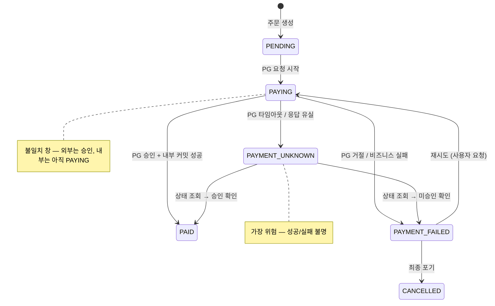

# 외부 시스템 연동 설계 분석 스킬

## 원칙

> "외부 시스템은 항상 지연되고, 실패하고, 중복 실행되고, 성공했지만 응답이 유실될 수 있다."

- 이 스킬은 설계를 **생성하지 않는다**. 이미 존재하는(또는 계획된) 설계를 **검증**하고, 리스크를 **드러내고**, 개선 **선택지**를 제시한다.
- 기능 명세나 호출 순서를 요약하지 않는다. **"무엇이 실패할 수 있는가"** 를 중심으로 읽는다.
- 설계를 비판하지 않는다. 리스크를 드러내고, 각 선택지의 **트레이드오프**를 명시한다.
- 코드 레벨 수정안을 직접 제시하지 않는다. **책임, 경계, 상태 일관성**을 중심으로 분석한다.

### 불확실성 전제

모든 분석은 다음 4가지 불확실성이 **항상 존재한다**는 전제에서 시작한다:

| 불확실성 | 설명 | 실무 사례 |
|----------|------|-----------|
| **지연** | 평소 200ms 응답이 10초 이상 걸릴 수 있다 | PG사 정산 시간대 지연, Black Friday 과부하 |
| **실패** | 5xx, 커넥션 거부, DNS 장애 등 | PG 서버 점검, 인증서 만료 |
| **중복 실행** | 네트워크 재시도, 사용자 더블클릭 | 결제 2회 승인, 재고 2회 차감 |
| **응답 유실** | 요청은 성공했으나 응답을 받지 못함 | PG 승인 완료 but 타임아웃으로 클라이언트 실패 처리 |

분석 시작 시 현재 설계가 위 4가지 각각을 어떻게 다루는지 정리한다.
다루지 않는 항목은 **명시적으로 "미처리"** 로 표기한다.

```markdown
### 불확실성 대응 현황

| 불확실성 | 현재 대응 | 미처리 리스크 |
|----------|-----------|---------------|
| 지연 | [타임아웃 설정 여부] | [커넥션 풀 고갈 가능성] |
| 실패 | [재시도/폴백 여부] | [실패 시 상태 정합성] |
| 중복 실행 | [멱등키 여부] | [이중 결제/차감 가능성] |
| 응답 유실 | [상태 조회 API 여부] | [유령 트랜잭션 발생 가능성] |
```

### 톤 가이드

| DO | DON'T |
|----|-------|
| 리스크를 드러내는 리뷰 톤 | 설계를 비판하는 심사 톤 |
| "~할 수 있습니다" (가능성 제시) | "~해야 합니다" (지시) |
| 선택지 + 트레이드오프 | 단일 정답 제시 |
| 책임, 경계, 상태 일관성 중심 | 코드 레벨 수정안 직접 제시 |
| 외부 시스템은 항상 불신 | 외부 시스템이 정상이라는 가정 |
| 실무 사례와 근거 기반 | 이론적 원칙만 나열 |

---

## 7가지 분석 관점

> 순서에 구애받지 않는다. 분석 대상의 특성에 따라 관점의 깊이와 우선순위를 조절한다.
> 다만 모든 관점을 최소 1회는 점검한다.

| # | 관점 | 핵심 질문 |
|---|------|-----------|
| 1 | 기능의 경계와 장애/불확실성 관점의 분석 | 외부 호출이 내부 자원(트랜잭션, 커넥션 풀)을 어디까지 점유하는가? |
| 2 | 상태 불일치와 유령 트랜잭션 | 외부는 성공, 내부는 실패일 때 어떻게 되는가? |
| 3 | 멱등성과 이중 실행 | 같은 요청이 2번 실행되면 어떻게 되는가? |
| 4 | 장애 전파와 자원 고갈 | 외부 하나 느려지면 전체가 죽는가? |
| 5 | 장애 분류와 회복 전략 매칭 | 재시도해도 되는 실패와 하면 안 되는 실패를 구분하는가? |
| 6 | 관측성과 장애 감지 속도 | 지금 장애인지 알 수 있는가? |
| 7 | 보안 기본 원칙 | 민감정보가 로그에 남지 않는가? |

---

### 1️⃣ 기능의 경계와 장애/불확실성 관점의 분석

> 외부 호출이 내부 자원(트랜잭션, DB 커넥션 풀, 스레드 풀)을 어디까지 점유하는가?
> 기능의 경계가 불명확하면 외부 장애가 내부 자원을 고갈시킨다.

#### 왜 이것이 가장 먼저인가

PG 응답 3초 × 동시 50요청 = HikariCP 풀(10) 고갈 → 결제뿐 아니라 **상품 조회, 로그인까지 전부 마비**.
외부 시스템 하나의 지연이 전체 서비스를 죽이는 가장 흔한 실무 장애 패턴이다.

#### 검증 질문

| 질문 | 왜 중요한가 |
|------|------------|
| 외부 호출이 `@Transactional` 내부에 있는가? | 내부 → 외부 호출 동안 DB 커넥션 점유 |
| HikariCP 풀 사이즈 대비 동시 외부 호출 수는? | 풀 사이즈 10인데 동시 외부 호출 50이면 40은 대기 → 타임아웃 |
| 외부 호출 실패 시 내부 상태는 롤백되는가? | 트랜잭션 안이면 롤백, 밖이면 커밋된 채로 남음 |
| 내부 커밋 후 외부 호출 실패 시 보상 트랜잭션이 있는가? | 없으면 주문은 생성됐는데 결제는 안 된 상태 방치 |
| 외부 성공 후 내부 커밋 실패 시 상태 정합성은? | 돈은 빠졌는데 주문이 없는 유령 결제 발생 |

#### 실무 패턴 비교

```
A. 외부 호출이 트랜잭션 내부 (많은 프로젝트의 기본 상태)

@Transactional
fun placeOrder(cmd) {
    val order = orderService.create(cmd)          // INSERT
    val payment = pgClient.requestPayment(order)  // ← 외부 호출 (DB 커넥션 점유 중)
    order.completePayment(payment.txId)            // UPDATE
}

위험: PG 3초 지연 × 동시 50건 = HikariCP(10) 고갈 → 전체 서비스 마비


B. 외부 호출을 트랜잭션 밖으로 분리

fun placeOrder(cmd) {
    val order = createOrderTx(cmd)                 // Tx1: INSERT + COMMIT → 커넥션 반환
    val payment = pgClient.requestPayment(order)   // 트랜잭션 밖 — 커넥션 없음
    completePaymentTx(order.id, payment.txId)      // Tx2: UPDATE + COMMIT
}

장점: 커넥션 점유 최소화
리스크: payment 성공 후 Tx2 실패 → 불일치 상태
대응: 상태 기반 복구 (PENDING → PAID 전이) + 미완료 건 처리 배치
```

#### 분석 결과 형식

```markdown
### 트랜잭션 경계 분석

| 구간 | 트랜잭션 | 커넥션 점유 | 외부 호출 | 리스크 |
|------|----------|------------|-----------|--------|
| 주문 생성 | Tx1 | O | X | 낮음 |
| PG 결제 | - | X | O | 응답 유실 |
| 결제 완료 처리 | Tx2 | O | X | Tx2 실패 시 불일치 |
```

---

### 2️⃣ 상태 불일치와 유령 트랜잭션

> PG는 승인했는데 내부 커밋 실패 → **돈은 빠졌지만 주문이 없다**.
> 고객 CS 폭주, 수동 환불 처리, 정산 불일치의 근본 원인이다.

#### 왜 이것이 위험한가

외부 시스템과 내부 시스템은 **분리된 생명주기**를 가진다.
하나의 트랜잭션으로 묶을 수 없으므로, 두 상태가 **어긋나는 시간 창(불일치 창)** 이 반드시 존재한다.
이 창을 인지하지 못하면, 장애 발생 시 "왜 데이터가 맞지 않는지" 원인 파악 자체가 어렵다.

#### 상태 분리 원칙

내부와 외부의 상태를 별도 축으로 정리한다. 불일치 창을 명시한다.

```markdown
### 상태 매핑

| 시점 | 내부 상태 (Order) | 외부 상태 (PG) | 정합성 |
|------|------------------|----------------|--------|
| 주문 생성 직후 | PENDING | - | O |
| PG 요청 중 | PAYING | 승인 대기 | O |
| PG 승인 완료 | PAYING | 승인 완료 | ✗ 불일치 창 |
| 내부 상태 갱신 | PAID | 승인 완료 | O |
| PG 승인 but 내부 실패 | PAYING | 승인 완료 | ✗ 유령 결제 |
```

#### 상태 다이어그램

분석 시 반드시 내부 상태 전이 다이어그램을 포함한다:



#### 복구 전략 매핑

```markdown
### 불일치 복구 전략

| 불일치 상태 | 원인 | 복구 방법 | 자동/수동 |
|------------|------|-----------|-----------|
| 내부 PAYING, 외부 승인완료 | 내부 커밋 실패 | 상태 조회 배치 → PAID 전이 | 자동 (배치) |
| 내부 PAYING, 외부 상태 불명 | 응답 유실 | PG 상태 조회 API 호출 | 자동 (스케줄러) |
| 내부 PAID, 외부 취소됨 | PG측 자동 취소 | 웹훅 수신 → REFUNDED 전이 | 자동 (웹훅) |
| 내부 PENDING, 외부 승인완료 | 상태 갱신 누락 | 정산 대사(reconciliation) | 수동 (운영) |
```

---

### 3️⃣ 멱등성과 이중 실행

> 재시도/더블클릭이 **이중 결제**를 만든다.
> 환불 처리 비용 + 고객 신뢰도 하락 + 정산 불일치의 직접 원인이다.

#### 왜 이것이 위험한가

네트워크는 at-most-once를 보장하지 않는다. 모든 외부 호출은 **최소 1번, 최대 N번** 실행될 수 있다.
PG에 동일 결제 요청이 2번 도달하면, 멱등키가 없으면 **2번 승인**된다.
기술적으로 정상 동작이지만 비즈니스적으로는 사고다.

#### 검증 질문

| 질문 | 왜 중요한가 |
|------|------------|
| 외부 API 호출 시 고유 멱등키를 전달하는가? | 없으면 재시도 = 이중 실행 |
| 재시도 시 동일 멱등키를 재사용하는가? | 새 키를 생성하면 멱등키 의미 없음 |
| 동일 주문에 대해 결제가 2번 실행될 경우 DB 레벨에서 방지하는가? | UNIQUE 제약 or 상태 체크 없으면 이중 INSERT |
| 프론트엔드 더블클릭/새로고침 시 동일 요청 2회 도달 가능성은? | 서버 사이드 멱등 처리 없으면 2건 생성 |
| Retry 대상 외부 호출이 멱등한가? | 비멱등 호출 재시도 = 장애의 원인 |

#### 멱등성 분석 형식

```markdown
### 멱등성 분석

| 외부 호출 | 멱등 지원 | 키 전략 | 미보장 시 리스크 |
|-----------|-----------|---------|-----------------|
| PG 결제 승인 | O (PG측 지원) | orderId 기반 | 이중 결제 |
| PG 결제 취소 | O (txId 기반) | 원 거래 txId | 이중 환불 |
| 재고 차감 (외부) | X | - | 이중 차감 → 음수 재고 |
| 알림 발송 | X | - | 중복 알림 (UX 저하) |
```

#### 멱등키 생성 전략

| 전략 | 예시 | 장점 | 단점 |
|------|------|------|------|
| 비즈니스 키 기반 | `order-{orderId}` | 단순, 자연스러운 키 | 동일 주문 재결제 시 충돌 |
| 비즈니스 키 + 시도 횟수 | `order-{orderId}-attempt-{n}` | 재시도 구분 가능 | 시도 횟수 관리 필요 |
| UUID (서버 생성) | `uuid-v4` | 충돌 없음 | 재시도 시 동일 키 보장 어려움 |
| 요청 해시 | `hash(orderId + amount)` | 동일 요청 식별 | 해시 충돌 가능성 (극히 낮음) |

**권장**: 비즈니스 키(orderId) + 버전/시도 조합. PG사가 멱등키를 지원하면 반드시 사용한다.

---

### 4️⃣ 장애 전파와 자원 고갈

> PG 하나 느려짐 → 스레드 풀 점유 → **결제 외 모든 API 응답 불가**.
> Cascading failure — 외부 장애가 내부 전체 장애로 확산되는 패턴이다.

#### 왜 이것이 위험한가

외부 시스템이 "죽은 것"이 아니라 **"느린 것"** 이 더 위험하다.
완전히 죽으면 즉시 에러가 반환되지만, 느리면 **스레드/커넥션이 점유된 채 대기**한다.
이 대기가 누적되면 상품 조회, 로그인 등 외부 시스템과 무관한 기능까지 영향받는다.

#### 장애 전파 경로

```
PG 응답 지연 (3초 → 30초)
  → 결제 요청 스레드 대기
  → Tomcat 스레드 풀 점유 (200/200)
  → 상품 조회 요청도 대기열 진입
  → 전체 API 응답 불가
  → 프론트엔드 타임아웃 → 사용자 재시도 → 더 많은 요청 → 악순환
```

#### 방어 레이어 (Resilience Stack)

장애 전파를 막는 방어 레이어를 **순서대로** 검증한다:

```
호출 → [Timeout] → [Retry] → [Circuit Breaker] → [Fallback]
```

| 레이어 | 역할 | 없으면 어떻게 되는가 |
|--------|------|---------------------|
| **Timeout** | 개별 요청의 최대 대기 시간 제한 | 스레드가 무기한 점유 → 풀 고갈 |
| **Retry** | 일시적 실패에서 재시도로 복구 | 복구 가능한 실패도 즉시 에러 반환 |
| **Circuit Breaker** | 반복 실패 시 호출 자체를 차단 | 죽은 서버에 계속 요청 → CPU/네트워크 낭비 |
| **Fallback** | 차단 시 대체 응답 제공 | 사용자에게 500 에러만 반환 |

#### Resilience 설정 검증 체크리스트

```markdown
### Resilience 설정 검증

| 항목 | 설정값 | 검증 포인트 |
|------|--------|------------|
| Connection Timeout | [N]ms | 커넥션 맺기 실패를 빠르게 감지하는가? (보통 1~3초) |
| Read Timeout | [N]ms | 응답 대기 상한이 비즈니스 SLA에 맞는가? (보통 3~5초) |
| Retry max-attempts | [N]회 | (시도 횟수 × 타임아웃) < 사용자 체감 한계인가? |
| Retry wait-duration | [N]s | Exponential backoff를 적용하는가? |
| Retry retry-exceptions | [목록] | 영구적 실패(400, 비즈니스 에러)는 제외했는가? |
| CB sliding-window-size | [N] | 판단 샘플이 충분한가? (너무 작으면 오탐) |
| CB failure-rate-threshold | [N]% | 너무 민감하거나 둔하지 않은가? |
| CB wait-duration-in-open-state | [N]s | Open 유지 시간이 외부 복구 시간과 맞는가? |
| CB slow-call-duration-threshold | [N]s | 느린 호출도 실패로 카운트하는가? |
| Fallback | [전략] | 사용자에게 의미 있는 응답을 주는가? |
```

#### 순서 검증

반드시 확인해야 하는 상호작용:

- Retry는 Timeout **안에서** 동작하는가, **밖에서** 동작하는가?
  - 안: 전체 타임아웃 내에서 재시도 (총 시간 제한)
  - 밖: 각 시도마다 독립 타임아웃 (총 시간 = 시도 수 × 타임아웃)
- Circuit Breaker는 Retry **이후**의 최종 실패를 카운트하는가?
  - Retry 전에 카운트하면 실제 실패보다 과도하게 OPEN됨
- `(max-attempts × read-timeout) + (max-attempts - 1) × wait-duration` < 사용자 체감 한계인가?

---

### 5️⃣ 장애 분류와 회복 전략 매칭

> 재시도하면 살아나는 실패 vs 재시도하면 **이중 과금**되는 실패.
> 구분하지 못하면 재시도 자체가 장애의 원인이 된다.

#### 왜 이것이 위험한가

모든 실패를 동일하게 처리하면:
- **일시적 실패**(503)를 재시도하지 않아 복구 기회를 놓기거나
- **영구적 실패**(카드 정지)를 재시도해서 불필요한 부하를 주거나
- **모호한 실패**(타임아웃)를 재시도해서 이중 결제를 만든다

#### 장애 분류 체계 (Failure Taxonomy)

| 분류 | 예시 | 특성 | 올바른 대응 |
|------|------|------|------------|
| **일시적 (Transient)** | 503, 커넥션 리셋, DNS 일시 장애 | 재시도로 복구 가능 | Retry (backoff) |
| **영구적 (Permanent)** | 400, 잔액 부족, 카드 정지, 인증 실패 | 재시도 무의미 | 즉시 실패 반환, 재시도 금지 |
| **모호한 (Ambiguous)** | Read timeout, 502 Bad Gateway | 성공/실패 불명 — 가장 위험 | **상태 조회 우선**, 멱등키 확보 후 재시도 |
| **부분 (Partial)** | 다건 중 일부만 성공 | 전체 롤백 or 부분 커밋 결정 필요 | 보상 트랜잭션 or 부분 완료 처리 |

#### 필수 장애 시나리오 (최소 3가지)

각 시나리오에 대해 다음을 분석한다:

```markdown
### 장애 시나리오: [시나리오명]

**상황**: [언제, 어떤 조건에서 발생하는가]
**분류**: 일시적 / 영구적 / 모호한 / 부분

| 항목 | 분석 |
|------|------|
| 데이터 정합성 | [내부/외부 상태가 일치하는가] |
| 상태 불일치 | [어떤 불일치가 발생하는가] |
| 사용자 영향 | [사용자에게 어떻게 보이는가] |
| 복구 가능성 | [자동 복구 / 수동 개입 / 복구 불가] |

**현재 설계의 대응**: [있음/없음 + 설명]
```

#### 최소 필수 시나리오 목록

1. **외부 호출 타임아웃** — 모호한 실패. 성공/실패 불명 상태에서의 복구
2. **외부 성공 → 내부 실패** — 유령 트랜잭션. 돈은 빠졌는데 주문은 없음
3. **외부 시스템 장기 장애** — 수분~수시간 지속 시 서비스 전체 영향
4. (권장) **부분 성공** — 다건 처리 중 일부만 성공
5. (권장) **응답 지연 누적** — 점진적 성능 저하 → 커넥션 풀 고갈

#### 회복 전략 매핑

```markdown
### 회복 전략 매핑

| 장애 분류 | 1차 대응 | 2차 대응 | 최종 대응 |
|-----------|----------|----------|-----------|
| 일시적 | Retry (max 3, exponential backoff) | Circuit Breaker OPEN | Fallback 응답 |
| 영구적 | 즉시 실패 반환 (재시도 금지) | - | 사용자 안내 |
| 모호한 | 상태 조회 API 호출 | 멱등키 확보 후 재시도 | 수동 대사 |
| 부분 | 성공 건 커밋 + 실패 건 재시도 | 보상 트랜잭션 | 운영 대시보드 알림 |
```

---

### 6️⃣ 관측성과 장애 감지 속도

> Circuit Breaker가 OPEN인지 모르면 **대응 시작 자체가 늦다**.
> 장애는 방지할 수 없다. **감지 → 대응까지의 시간(MTTR)** 이 시스템 신뢰성을 결정한다.

#### 왜 이것이 위험한가

Resilience 패턴을 적용해도, **현재 상태를 볼 수 없으면** 운영 대응이 불가능하다.
Circuit Breaker가 OPEN되어 결제가 전부 실패하는데 아무도 모르면, 매출 손실은 시간에 비례한다.

#### 관측성 체크리스트

| 항목 | 검증 질문 | 실무 기준 |
|------|----------|-----------|
| **구조화 로그** | 외부 호출의 요청/응답을 구조화 로그로 남기는가? | requestId, orderId, 외부 txId, 소요시간, 상태코드 |
| **메트릭** | 성공률, 응답시간(P50/P95/P99), 에러율을 수집하는가? | Prometheus/Micrometer 히스토그램 |
| **분산 추적** | 내부 → 외부 호출 간 traceId가 연결되는가? | OpenTelemetry, X-Request-Id 전파 |
| **알림 임계치** | 에러율 N% 초과, P99 지연 N초 초과 시 알림이 발생하는가? | PagerDuty, Slack alert |
| **대시보드** | CB 상태(CLOSED/OPEN/HALF_OPEN)를 실시간 확인 가능한가? | Grafana + Actuator endpoint |
| **감사 로그** | 결제 등 민감 외부 호출의 전체 이력을 추적 가능한가? | 누가, 언제, 어떤 요청, 어떤 응답 |

#### 실무 알림 기준 예시

```markdown
### 알림 설정 기준

| 지표 | WARNING | CRITICAL | 근거 |
|------|---------|----------|------|
| PG 에러율 | > 5% (5분간) | > 20% (3분간) | 평상시 에러율 < 1% 기준 |
| PG P99 응답시간 | > 3초 | > 10초 | SLA 기준 응답시간 5초 |
| CB 상태 | HALF_OPEN 진입 | OPEN 진입 | 결제 기능 중단 의미 |
| HikariCP 대기 | > 50% 풀 사용 | > 80% 풀 사용 | 풀 고갈 임박 |
```

---

### 7️⃣ 보안 기본 원칙

> API Key 평문 로깅, 민감정보 로그 노출 → 실무에서는 **보안 사고**로 직결된다.
> 보안은 기능이 아니라 **전제 조건**이다.

#### 왜 이것이 위험한가

외부 시스템 연동은 API Key, 사용자 개인정보, 결제 토큰 등 **민감 데이터가 오가는 경로**다.
개발 단계에서 디버깅용으로 요청/응답을 통째로 로깅하다가 민감정보가 남는 것은 매우 흔한 실수다.
실무에서는 이런 로그가 외부 유출되거나, 내부 감사에서 발견되면 즉시 대응이 필요하다.

#### 보안 체크리스트

| 영역 | 검증 항목 | 실무 기준 |
|------|----------|-----------|
| **통신 암호화** | 외부 API 호출이 TLS 1.2+ 로 암호화되는가? | HTTPS 강제, 평문 HTTP 차단 |
| **인증 정보 관리** | API Key, Secret이 코드/설정 파일에 평문 저장되지 않는가? | 환경변수, Vault, K8s Secret 등 분리 |
| **민감정보 마스킹** | 로그에 카드번호, 개인정보, 토큰이 평문으로 남지 않는가? | 카드번호 뒤 4자리만, 이름/전화번호 마스킹 |
| **토큰화** | 민감 데이터를 직접 다루지 않고 외부 시스템의 토큰을 사용하는가? | 카드 정보는 PG 토큰으로 대체 |
| **감사 추적** | 외부 호출 관련 상태 변경이 추적 가능한 로그로 기록되는가? | 누가, 언제, 어떤 요청, 어떤 결과 |
| **접근 제어** | 외부 API 키에 대한 접근 권한이 최소 권한 원칙을 따르는가? | 필요한 서비스/담당자만 접근 |
| **인증서 관리** | API 인증서의 만료일 모니터링이 있는가? | 만료 전 알림 설정 |
| **데이터 보존** | 외부 호출 로그의 보존 기간과 삭제 정책이 정의되어 있는가? | 비즈니스 요구에 맞는 보존 기간 설정 |

#### 분석 결과 형식

```markdown
### 보안 & 컴플라이언스 현황

| 항목 | 상태 | 비고 |
|------|------|------|
| TLS 1.2+ | ✅ 적용 | HTTPS 강제 |
| API Key 관리 | ⚠️ 개선 필요 | application.yml 평문 → Vault 전환 권장 |
| PII 로그 마스킹 | ❌ 미적용 | 카드번호 평문 로깅 발견 |
| 감사 추적 | ⚠️ 부분 적용 | 상태 변경 로그 있으나 immutable 아님 |
```

---

## 선택지 제시 형식

분석 완료 후 현재 구조의 **장점과 리스크를 분리**한 뒤, 대안을 선택지로 제공한다.

```markdown
### 현재 구조 평가

**장점**:
- [현재 구조가 잘 다루고 있는 점]

**리스크**:
- [현재 구조에서 발생 가능한 문제]

---

### 선택지

| 선택지 | 설명 | 복잡도 | 운영 부담 | 적합한 상황 |
|--------|------|--------|-----------|------------|
| A. 현행 유지 + Resilience 강화 | 동기 호출 유지, Timeout/Retry/CB 적용 | 낮음 | 낮음 | 트래픽 낮고 외부 시스템 안정적 |
| B. 상태 기반 단계 분리 | PENDING → PAYING → PAID 전이, 트랜잭션 분리 | 중간 | 중간 | 커넥션 풀 고갈 리스크 있을 때 |
| C. 비동기 이벤트 전환 | 이벤트 발행 → 별도 워커 처리 | 높음 | 높음 | 대규모 트래픽, 장애 격리 필요 |

### 선택지별 상세

#### A. 현행 유지 + Resilience 강화
- **리스크 수용**: 외부 지연 시 커넥션 풀 고갈 가능성
- **완화 조치**: Timeout + Circuit Breaker로 최대 피해 범위 제한
- **적합**: 소~중 규모, 외부 호출 1~2개

#### B. 상태 기반 단계 분리
- **핵심 변경**: 외부 호출 전후로 트랜잭션 분리, 상태 머신으로 진행 관리
- **추가 필요**: 미완료 건 처리 배치(스케줄러), 상태 조회 API 연동
- **적합**: 결제, 배송 등 외부 호출이 핵심 흐름에 포함될 때

#### C. 비동기 이벤트 전환
- **핵심 변경**: ApplicationEvent 또는 메시지 큐 기반 비동기 처리
- **추가 필요**: Outbox 패턴, 소비자 멱등성, 최종 일관성 허용
- **적합**: 대규모 트래픽, 도메인 간 결합 제거가 목표일 때
```

---

## 산출물 구조

분석 결과는 다음 구조로 정리한다:

```markdown
# 외부 연동 설계 분석: [기능명]

## 1. 분석 대상
- 기능 설명, 관련 외부 시스템, 현재 설계 개요

## 2. 불확실성 대응 현황
- 지연 / 실패 / 중복 / 응답 유실 각각의 대응 상태

## 3. 기능의 경계와 장애/불확실성 관점의 분석
- 트랜잭션 경계, 커넥션 점유 구간, 외부 호출 위치, 실패 시 상태 분석

## 4. 상태 불일치와 유령 트랜잭션
- 내부/외부 상태 매핑, 불일치 창, 복구 전략
- 상태 다이어그램 (Mermaid)

## 5. 멱등성과 이중 실행
- 멱등키 전략, 내부 중복 방지, 사용자 중복 요청 대응

## 6. 장애 전파와 자원 고갈
- Resilience Stack 검증 (Timeout → Retry → CB → Fallback)
- 설정값 검증

## 7. 장애 시나리오와 회복 전략
- 최소 3가지 장애 시나리오 + 분류별 회복 전략 매핑

## 8. 관측성과 장애 감지
- 로그, 메트릭, 분산 추적, 알림 체크리스트

## 9. 보안 기본 원칙
- 통신 암호화, 인증정보 관리, 민감정보 마스킹, 감사 추적

## 10. 선택지와 권장
- 현재 구조 장점/리스크
- 대안 선택지 (복잡도, 운영 부담, 적합 상황)
```

---

## 최종 체크리스트

분석 완료 시 다음이 모두 포함되어야 한다:

- [ ] **불확실성 4가지** (지연/실패/중복/응답유실)에 대한 현재 대응 정리
- [ ] **기능 경계** — 트랜잭션 범위, 커넥션 점유, 외부 호출 위치, 실패 시 상태
- [ ] **상태 전이 다이어그램** — 내부/외부 상태 매핑, 불일치 창 명시
- [ ] **멱등성** — 멱등키 전략, 중복 방지 메커니즘
- [ ] **장애 전파 방어** — Timeout → Retry → CB → Fallback 순서 검증
- [ ] **장애 시나리오 3가지 이상** — 분류 + 정합성/불일치/복구 분석
- [ ] **관측성** — 로그, 메트릭, 추적, 알림
- [ ] **보안 기본 원칙** — 통신 암호화, 인증정보 관리, 민감정보 마스킹, 감사 추적
- [ ] **선택지 제시** — 정답 없이 트레이드오프 기반 선택지
- [ ] **톤 준수** — 비판이 아닌 리뷰, 지시가 아닌 선택지

---

**철학**: "외부 시스템은 신뢰하지 않는다. 장애는 방지가 아니라 대응의 문제다. 설계의 견고함은 정상 흐름이 아니라 실패 흐름에서 증명된다."
