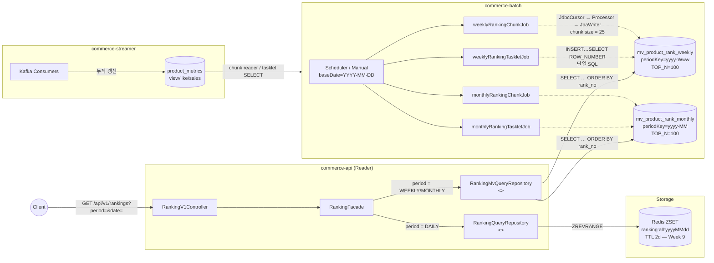
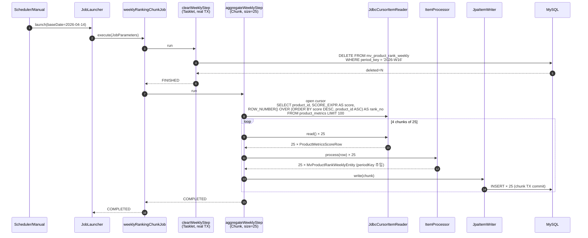
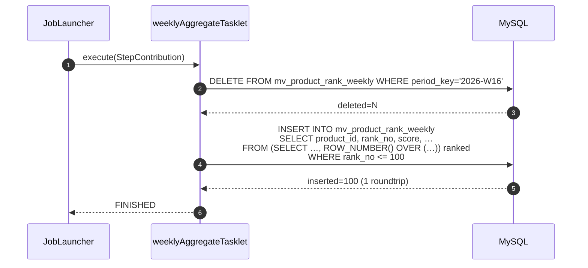
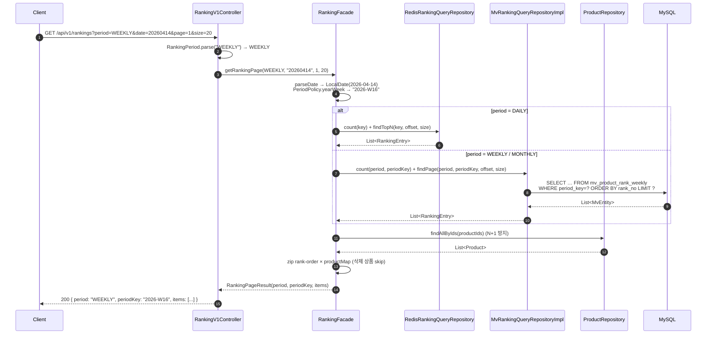
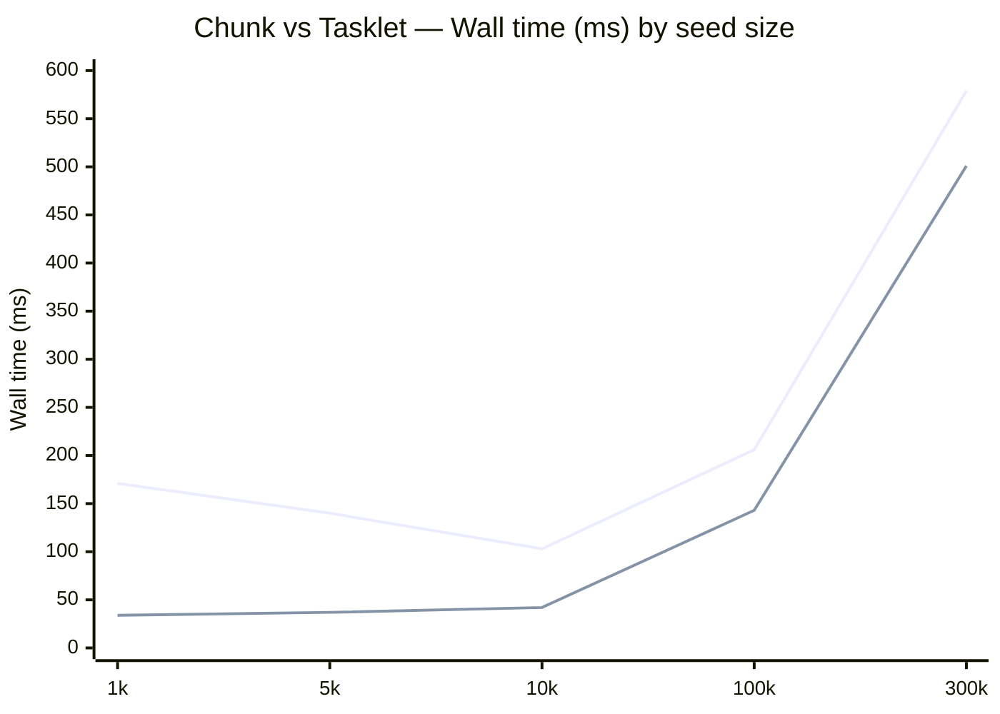
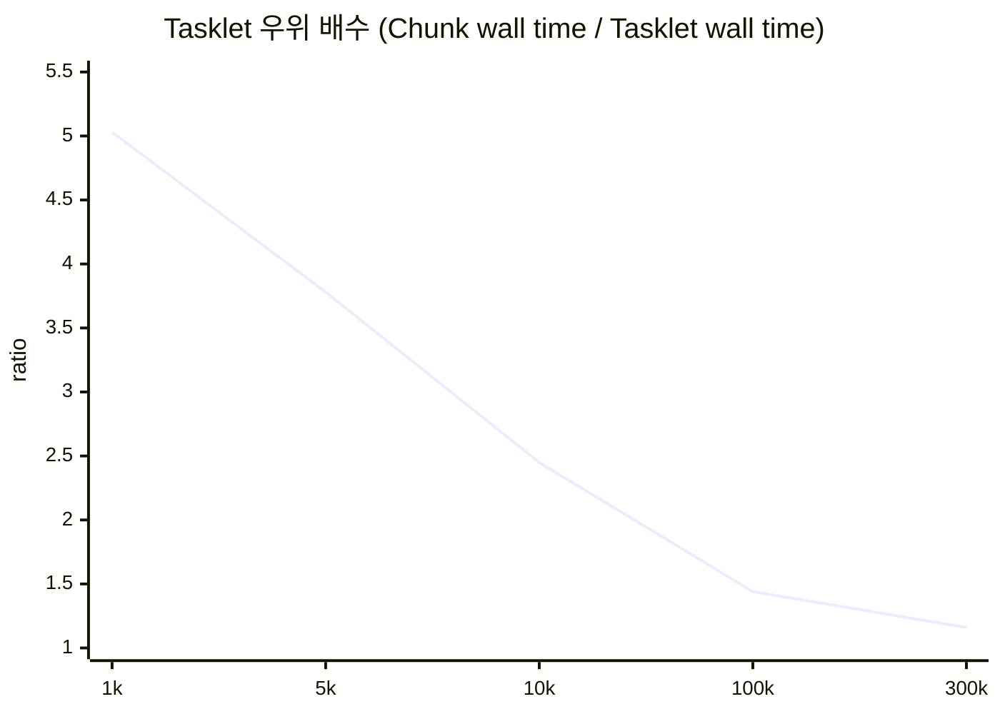
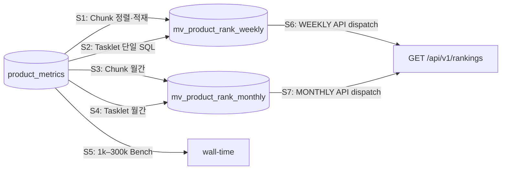

## 📌 Summary

- 배경: Week 9 의 실시간 DAILY ZSET 만으로는 **주간/월간** 랭킹이 비어 있음. 누적 카운터(`product_metrics`)에서 TOP-100 을 결정적으로 뽑아 MV 테이블로 적재할 배치가 필요함. 동시에 "Spring Batch 의 Chunk-Oriented Processing 과 Tasklet 가 같은 결과를 만들 때 어떤 트레이드오프를 갖는가?" 를 실측으로 정리하는 것이 학습 목표.
- 목표:
    - Spring Batch 로 주간/월간 MV 테이블(`mv_product_rank_weekly|monthly`) 적재
    - 같은 산출물을 만드는 **두 변형**(Chunk + Tasklet) 을 모두 구현해 wall-time 으로 비교
    - 랭킹 조회 API 를 `period=DAILY|WEEKLY|MONTHLY` 로 확장 — DAILY 는 Redis, WEEKLY/MONTHLY 는 MV
    - 이벤트-드리븐 대안을 의사코드 + 트레이드오프로 문서화 (3-way 비교)
- 결과:
    - Chunk + Tasklet 변형 각 2개 (주간/월간) → **Job 4종**, E2E 4 컨텍스트 모두 GREEN
    - 벤치마크 1k → 300k 5 단계: **Tasklet 우위 5.0× → 1.16× 로 수렴** — "큰 데이터셋에서는 격차가 사라짐" 을 실측으로 확인
    - API: `RankingPeriod` enum + Facade 분기로 DAILY(Redis) / WEEKLY·MONTHLY(MV) dispatch — port 분리 구조 유지
    - week-10 노트: 클래스/시퀀스 다이어그램 + 3-way 비교 + 이벤트-드리븐 의사코드 포함


## 🏗️ System Architecture



**범례**
- Week 9 의 `product_metrics` 누적 카운터는 그대로 두고, batch 가 **read-only** 로 집계해 MV 테이블에 snapshot 으로 적재
- 같은 산출물(`mv_product_rank_*`) 을 만드는 두 Job (Chunk / Tasklet) 이 공존 — 배포 시 cron 스케줄로 한 변형만 트리거
- API 는 storage-specific port 두 개를 가지고 Facade 가 `RankingPeriod` enum 으로 dispatch


## 🔁 System Flow

### 1. Chunk-Oriented Job — clear → aggregate (chunk size = 25)



### 2. Tasklet Job — 단일 INSERT…SELECT



### 3. API 조회 — Facade 가 period 로 dispatch




## 🧭 Context & Decision

### 문제 정의
- 현재 동작/제약: Week 9 에서 도입한 실시간 DAILY ZSET 은 **이벤트가 발생하는 시점에만 갱신** 되며 TTL 2일 후 사라짐. 주간/월간 랭킹은 의미상 "한 주/한 달의 누적 합" 이라 ZINCRBY-only 로 유지하면 drift 위험 + 메모리 비용 누적.
- 문제(또는 리스크): RDB 에서 매 요청마다 `GROUP BY + ORDER BY + LIMIT 100` 을 돌리는 것은 데이터셋이 커질수록 P95 가 망가짐. 한편 ZSET 으로 실시간 누적하는 방식도 가중치 변경/이벤트 재처리/장기 보관에서 약점.
- 성공 기준(완료 정의):
    - 동일 baseDate 로 두 번 돌려도 결과 snapshot 동일 (멱등성)
    - rank 1..N 연속 + score 단조 감소 + productId tie-break (결정적 출력)
    - DAILY 경로(Week 9) 는 그대로 유지 — 회귀 0
    - Chunk / Tasklet 두 변형이 **bit-for-bit 동일한 TOP-100 ID 리스트** 생성

### 선택지와 결정

#### ① Storage 전략: Redis ZSET 로 통일 vs MV 테이블로 분리

- 고려한 대안:
    - A: 모든 기간을 ZSET 으로 — DAILY ZSET 외에 WEEKLY/MONTHLY ZSET 을 추가, ZINCRBY 만 늘림
    - B: WEEKLY/MONTHLY 는 별도 MV 테이블 (Spring Batch 적재) — DAILY 는 그대로 ZSET
- 최종 결정: **B (storage 분리)**
- 트레이드오프: A 는 latency 가 짧지만 ① 가중치 변경 시 과거 점수 재계산 불가, ② Redis 메모리 = `daily × 7 × 2 (주간) + monthly × 31 (월간)` 누적, ③ TTL 만료 후 과거 기간 조회 불가. B 는 배치 주기 만큼 latency 가 있지만 **재현성** + **백업 가능성** + **장기 보관** 이 RDB 수준.
- 근거: "어제까지 집계된 주간/월간 랭킹" 의 정확성·재현성 > latency. DAILY 의 실시간성과 본질적으로 다른 SLA.

#### ② Job 구현 패러다임: Chunk-Oriented 로 통일 vs Tasklet 도 같이

- 고려한 대안:
    - A: 요구사항대로 Chunk-Oriented 만 — Spring Batch 의 표준 패턴 학습 목적
    - B: Chunk + Tasklet 두 변형을 모두 구현해 같은 결과를 다른 방식으로 만들고 비교
- 최종 결정: **B (둘 다 구현)** — Nice-to-Have 로 추가
- 이유: Chunk vs Tasklet 의 트레이드오프는 글로 읽으면 추상적이라 와닿지 않음. 같은 산출물을 두 가지로 만들어 보면 **회복 모델 / 관측 가능성 / wall-time** 의 차이가 코드와 숫자로 드러남. 학습 효과가 크고, 운영 시 어느 쪽을 켤지 cron 으로 토글 가능.
- 트레이드오프: 코드량 ~1.5배. 두 변형이 결과 정합성을 유지해야 하므로 `RankingScorePolicy.SCORE_EXPR` (SQL) / `score()` (Kotlin) 를 단일 클래스에 묶어 drift 차단.

#### ③ Rank 부여 위치: SQL `ROW_NUMBER()` vs Processor `AtomicInteger`

- 고려한 대안:
    - A: Processor 에서 카운터 증가
    - B: Reader 단계의 SQL 에서 `ROW_NUMBER() OVER (ORDER BY score DESC, product_id ASC)` 로 부여
- 최종 결정: **B**
- 이유: Chunk retry/skip 발생 시 Processor 카운터는 중복 rank 를 만든다. SQL 에서 부여하면 reader 가 다시 열려도 결정적. Tie-break(`product_id ASC`) 까지 SQL 에 고정 — Kotlin 비교 로직과의 drift 가능성 0.

#### ④ Step 분리: clear + aggregate 를 한 Step 으로 vs 두 Step

- 고려한 대안:
    - A: 한 Step 안에서 DELETE + INSERT 처리
    - B: `clearWeeklyStep` (Tasklet) + `aggregateWeeklyStep` (Chunk) 분리
- 최종 결정: **B (분리)** — 단, Tasklet 변형은 SQL 1발이라 본질적으로 한 Step
- 이유: Chunk 변형은 chunk-level TX 가 필요해 clear 와 분리해야 TX 경계가 명확. Spring Batch 메타테이블에 어떤 step 에서 멎었는지 정확히 남음 (운영성).
- 함정: 초기엔 clear step 에 `ResourcelessTransactionManager` 를 썼는데 `@Modifying` JPA 쿼리는 실제 TX 를 요구함 → `TransactionRequiredException`. **ResourcelessTxManager 는 JPA/JDBC 를 안 건드리는 in-memory tasklet 에만 안전**. clear step 도 주입 `PlatformTransactionManager` 사용으로 수정.

#### ⑤ API 의 Port 설계: 한 인터페이스 vs 두 인터페이스

- 고려한 대안:
    - A: `RankingQueryRepository` 한 개로 통일 — `key: String` 으로 추상화
    - B: `RankingQueryRepository`(Redis) / `RankingMvQueryRepository`(MV) 분리, Facade 가 분기
- 최종 결정: **B**
- 이유: storage 가 근본적으로 다름 (ZSET vs RDB indexed table). 한 인터페이스로 묶으려면 storage-specific 디테일이 추상화 누수로 새어 나옴. **dispatch 책임은 Facade 에 두고 port 는 각자 단일 저장소에 최적화** — Facade 의 분기는 `when (period)` 한 줄.


## 🏗️ Design Overview

### 변경 범위
- 영향 받는 모듈: `commerce-batch` (신규 Job 4종 + 인프라), `commerce-api` (랭킹 read 경로 확장)
- 신규 추가: 위 4종 Job, MV 엔티티(양 모듈 mirror), `RankingPeriod` enum + parser, `RankingMvQueryRepository` port + adapter, Facade dispatch
- 제거/대체: 없음 (Week 9 DAILY 경로 그대로 유지)

### 주요 컴포넌트 책임

**commerce-batch**

| 컴포넌트 | 책임 |
|---|---|
| `PeriodPolicy` | `yyyy-Www` (ISO-8601) / `yyyy-MM` 포매터 |
| `RankingScorePolicy` | `SCORE_EXPR` (SQL 표현) + `score()` (Kotlin 표현) — 동일 공식, drift 0 |
| `WeeklyRankingChunkJobConfig` / `MonthlyRankingChunkJobConfig` | clearStep(Tasklet, real TX) + aggregateStep(Chunk size=25) |
| `WeeklyRankingTaskletJobConfig` / `MonthlyRankingTaskletJobConfig` | 단일 SQL `INSERT … SELECT ROW_NUMBER()` |
| `ProductMetricsScoreRowMapper` | JdbcCursor 의 row → DTO 매핑 |
| `MvProductRank{Weekly,Monthly}Entity` | MV write 측 JPA 매핑 (`period_key` / `rank_no` 컬럼명) |
| `ProductMetricsEntity` | streamer 쪽 엔티티 mirror — test 시 ddl-auto=create 용 |

**commerce-api**

| 컴포넌트 | 책임 |
|---|---|
| `RankingPeriod` (enum) | DAILY/WEEKLY/MONTHLY + `parse(raw)` (null/blank → DAILY, case-insensitive, 미정의값 BAD_REQUEST) |
| `PeriodPolicy` | batch 측과 포맷 싱크 (cross-module invariant 주석 명시) |
| `RankingMvQueryRepository` (port) | `findPage / count / findRank` — period + periodKey 기반 |
| `MvRankingQueryRepositoryImpl` | Adapter — `when (period)` 분기로 Weekly/Monthly JPA repo 호출 |
| `RankingFacade` | `loadEntries(period, …)` 가 DAILY → Redis port / WEEKLY·MONTHLY → MV port 로 dispatch, 이후 product/brand 조립은 공통 |
| `RankingV1Controller` | `period` 쿼리 파라미터 수신 + `RankingPeriod.parse()` |


## 📊 Chunk vs Tasklet 실측 비교

### 측정 조건
- Host: macOS (Darwin 25.3.0), JVM 21.0.10
- DB: TestContainers MySQL 8.0 (local Docker)
- TOP_N=100, chunk size=25
- Seed: `ProductMetricsSeeder.seedRandom(count, seed=42L)` — 결정적 분포
- Wall time = `jobLauncherTestUtils.launchJob()` 호출 전후 `System.nanoTime()` (Job launch 만, seed 시간 제외)
- raw log: `bench/results/ranking-job-benchmark-2026-04-16T21-39-37.txt`
- 50k 이상 seed 는 `ProductMetricsSeeder` 가 `JdbcTemplate.batchUpdate(chunk=1000)` 로 fallback (saveAll 의 Hibernate batch_size 미설정 비용 회피)

### Wall Time 표

| Seed | Chunk (ms) | Tasklet (ms) | Tasklet 우위 |
|------:|-----------:|-------------:|:-----------:|
| 1,000   | 171 | 34  | **5.0×** |
| 5,000   | 140 | 37  | **3.8×** |
| 10,000  | 103 | 42  | **2.5×** |
| 100,000 | 206 | 143 | **1.4×** |
| 300,000 | 579 | 501 | **1.16×** |

### 그래프 — 두 변형의 wall-time 곡선



> 위 차트의 **위쪽 선이 Chunk**, **아래쪽 선이 Tasklet**. 1k~10k 에서는 Chunk 가 JIT/cache warm-up 으로 오히려 줄어드는 듯 보이지만, 100k 이후로는 Reader 의 SORT 비용이 dominant 해지며 가파르게 증가. Tasklet 은 데이터셋 크기에 직접 비례해 증가 — 절대값은 더 빠르지만 곡선 자체가 더 가파름.

### 그래프 — Tasklet 우위 (Chunk / Tasklet 비)



> 데이터셋이 커질수록 Tasklet 의 우위가 **빠르게 수렴** — 1k 에서 5× → 10k 2.5× → 100k 1.4× → 300k 1.16×. 수백만 row + score 인덱스 부재 환경에서는 **역전 가능**.

### 해석

- **Chunk 는 1k~10k 구간에서 seed 가 늘어도 오히려 wall time 이 줄어드는 듯** 보이지만 이는 첫 측정의 JIT/cache warm-up 비용이 dominant 한 탓. 100k 부터는 Reader 의 `ORDER BY score DESC LIMIT 100` (filesort, no index) 가 본격적으로 비용을 지배하며 비례 증가 (1k → 300k 기준 ×3.4).
- **Tasklet** 은 단일 `INSERT…SELECT ROW_NUMBER() OVER (ORDER BY)` 의 정렬·번호 매김 비용이 데이터셋 크기에 직접 비례. 1k → 300k 에서 **×14.7** 의 가파른 곡선이지만 절대값은 여전히 chunk 보다 빠름.
- **격차가 데이터셋 크기에 따라 수렴하는 것이 핵심 관찰** — 작은 데이터셋 (1k~10k) 에서는 Tasklet 이 압도적이지만 (5×), 100k 부근에서는 1.4×, 300k 에서는 1.16× 로 줄어듦. 둘 다 sub-second 범위 안에 머무는 것은 TOP_N=100 이 결과 cardinality 를 고정하고 LIMIT push-down 이 작동하기 때문.
- **공통점**: "100 rows 적재" 자체는 동일. 차이의 본질은 **선택·삭제·정렬·적재** 를 JVM 이 나눠 하느냐 (Chunk: 4 chunks × 25, 각자 TX) DB 가 통째로 하느냐 (Tasklet: 1 SQL).

### 정합성 검증
- `RankingScorePolicy.SCORE_EXPR` (SQL) 과 `score()` (Kotlin) 가 동일 공식 → 두 변형이 같은 TOP-100 ID 리스트 생성
- E2E 에서 두 변형 모두 `rank 1..100 연속 + score 단조 감소 + productId tie-break` 검증
- JVM↔MySQL Double precision drift 는 `Offset.offset(1e-9)` 로 흡수


## 📖 3-way 비교: Tasklet / Chunk / Event-Driven

| 기준 | Tasklet (배치) | Chunk (배치) | Event-Driven (실시간, 미구현) |
|---|---|---|---|
| 실행 트리거 | cron / manual | cron / manual | Kafka event stream |
| Latency (이벤트 → 랭킹 반영) | ~주기 (하루/주간) | ~주기 | 수 초 |
| Throughput (1회 집계) | 1 roundtrip (가장 빠름) | N × chunk (느림) | 누적 ZINCRBY |
| **Wall time @10k / @100k / @300k** | **42 / 143 / 501 ms** | 103 / 206 / 579 ms | n/a (스트리밍) |
| 회복 모델 | Step 전체 재실행 | Chunk-level 재실행 (retry/skip) | consumer offset lag + DLQ |
| 중간 상태 관측 | 어려움 (거의 block) | Step metrics (chunk 단위) | consumer lag, throughput |
| 정합성 보장 | 배치 시점 스냅샷 — 강함 | 동일 | 이벤트 처리 실패 시 drift 위험 |
| 데이터 재구축 | baseDate 재실행 | baseDate 재실행 | 원본 이벤트 replay + TTL |
| 과거 기간 조회 | MV 영구 보관 ✅ | 동일 ✅ | ZSET TTL 후 소실 |
| 구현 복잡도 | 낮음 (SQL 1발) | 중간 (Reader/Processor/Writer) | 높음 (consumer + dedup + 가중치) |
| 운영 부하 | 배치 SLA, lock 시간 감시 | Batch 대시보드 | Kafka consumer lag 경보 |

### 왜 Week 10 은 배치(Chunk + Tasklet) 를 선택했는가?
- **요구사항 부합**: "어제까지 집계된 주간/월간 랭킹" 의 정확성 + 재현성이 latency 보다 우선
- **운영 단순성**: MV 테이블은 RDB 수준 백업/복구 가능. Redis-only 의 장기 랭킹은 drift 추적이 난해
- **혼합 적용의 장점**: DAILY(실시간 ZSET, Week 9) + WEEKLY/MONTHLY(배치 MV, Week 10) — 각 기간 특성에 맞는 저장소
- **확장 여지**: event-driven 주간 ZSET 을 추가해 MV 옆에 캐시처럼 두는 하이브리드도 가능. 현재의 분리된 port 구조는 그 확장도 facade 내부 dispatch 한 줄로 받음


## 🧪 Test Scenarios & Results

### 1. 시스템 설명 (System Description)
Spring Batch 로 `product_metrics` 누적 카운터를 읽어 MV 테이블에 주간/월간 TOP-100 을 적재. 같은 결과를 만드는 Chunk-Oriented 변형과 단일 SQL Tasklet 변형이 공존하며, 각 변형의 정합성과 wall-time 을 E2E + benchmark 로 검증.

### 2. 테스트 가정 (Test Assumptions)
- **로컬 장비**: MacBook Pro 14-inch (Apple M5 Pro, 48GB RAM)
- **인프라**: TestContainers MySQL 8.0 (Docker, ephemeral)
- **JVM**: 21.0.10
- **Seed 분포**: `ProductMetricsSeeder.seedRandom(count, seed=42L)` — 같은 seed 로 항상 동일 분포 재현
- **베이스라인**: TOP_N=100, chunk size=25
- **네트워크**: 로컬 루프백 (TestContainers)

### 3. 테스트 범위 및 시나리오



| 시나리오 | 테스트 클래스 | 검증 포인트 |
|---|---|---|
| **S1**: Chunk Weekly | `WeeklyRankingChunkJobE2ETest` (4) | TOP 100 정렬·rank 연속성 / 재실행 idempotent / 50개 모두 적재 / score policy 일치 |
| **S2**: Tasklet Weekly | `WeeklyRankingTaskletJobE2ETest` (2) | 단일 SQL 정렬 + 멱등성 (snapshot 동일) |
| **S3**: Chunk Monthly | `MonthlyRankingChunkJobE2ETest` (2) | yyyy-MM periodKey 포맷 + 정렬 + rank 연속성 |
| **S4**: Tasklet Monthly | `MonthlyRankingTaskletJobE2ETest` (1) | 월간 적재 기본 동작 |
| **S5**: Wall time Bench | `WeeklyRankingChunk/TaskletJobBenchmark` | 1k / 5k / 10k / 100k / 300k seed × 2 변형 |
| **S6**: API DAILY 회귀 | `RankingFacadeTest` (8) | Week 9 의 ZSET 경로 무회귀 (모든 호출에 `period=DAILY` 추가) |
| **S7**: API WEEKLY/MONTHLY | `RankingFacadeMvTest` (7) | MV 시드 → facade → 정렬·periodKey·page 2·삭제상품 skip + `RankingPeriod.parse()` 엣지 케이스 |

### 4. 테스트 결과

#### Job E2E
- **모든 4 컨텍스트 GREEN** — 각 컨텍스트는 `@SpringBootTest` + `@SpringBatchTest` + `spring.batch.job.name=...` 로 단일 Job 만 적재 (`@ConditionalOnProperty`)
- **JobInstance 충돌 회피**: `DatabaseCleanUp` 은 JPA 엔티티 테이블만 truncate 하므로 `BATCH_JOB_INSTANCE` 는 테스트 간 유지됨. 같은 `(jobName, jobParameters)` 조합 재사용 시 `JobInstanceAlreadyCompleteException` → 각 테스트가 `addLong("run", System.nanoTime())` 로 고유 discriminator 주입

#### Floating-point drift
- JVM `Double` 연산과 MySQL `Double` 연산의 reduction order 차이로 ULP 레벨 차이 발생 (`1098.6` vs `1098.6000000000001`)
- `score_matches_policy` 검증은 `assertThat(row.score).isCloseTo(expected, Offset.offset(1e-9))` 로 흡수

#### 벤치마크 raw 출력
```text
[BENCH] job=weeklyRankingChunkJob   seed=1000   elapsedMs=171 exit=COMPLETED
[BENCH] job=weeklyRankingChunkJob   seed=5000   elapsedMs=140 exit=COMPLETED
[BENCH] job=weeklyRankingChunkJob   seed=10000  elapsedMs=103 exit=COMPLETED
[BENCH] job=weeklyRankingChunkJob   seed=100000 elapsedMs=206 exit=COMPLETED
[BENCH] job=weeklyRankingChunkJob   seed=300000 elapsedMs=579 exit=COMPLETED

[BENCH] job=weeklyRankingTaskletJob seed=1000   elapsedMs=34  exit=COMPLETED
[BENCH] job=weeklyRankingTaskletJob seed=5000   elapsedMs=37  exit=COMPLETED
[BENCH] job=weeklyRankingTaskletJob seed=10000  elapsedMs=42  exit=COMPLETED
[BENCH] job=weeklyRankingTaskletJob seed=100000 elapsedMs=143 exit=COMPLETED
[BENCH] job=weeklyRankingTaskletJob seed=300000 elapsedMs=501 exit=COMPLETED
```


## 🚩 열린 질문 / 향후 작업

- [ ] `product_metrics` 는 현재 **누적** 카운터라 "지난주 신호" 가 직관과 약간 다름 (누적 합 기준). 순수 주간 델타가 필요하면 daily snapshot 테이블 도입
- [ ] Chunk job 에 skip/retry policy 추가 (현재는 fail-fast). 운영 규모에서 유의미
- [ ] MV 테이블 파티셔닝 — `period_key` 기준 RANGE 파티션으로 과거 데이터 아카이브
- [ ] 주간/월간 ZSET 하이브리드 (event-driven + batch snapshot) 프로토타입
- [ ] Benchmark 샘플 수 증가 (현재 각 seed 1회 측정 — JIT noise) — 평균/표준편차 산출
