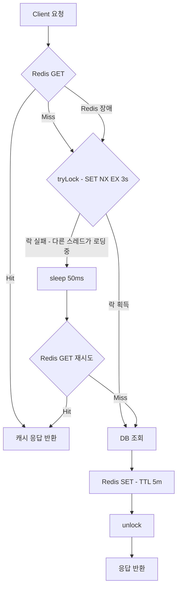
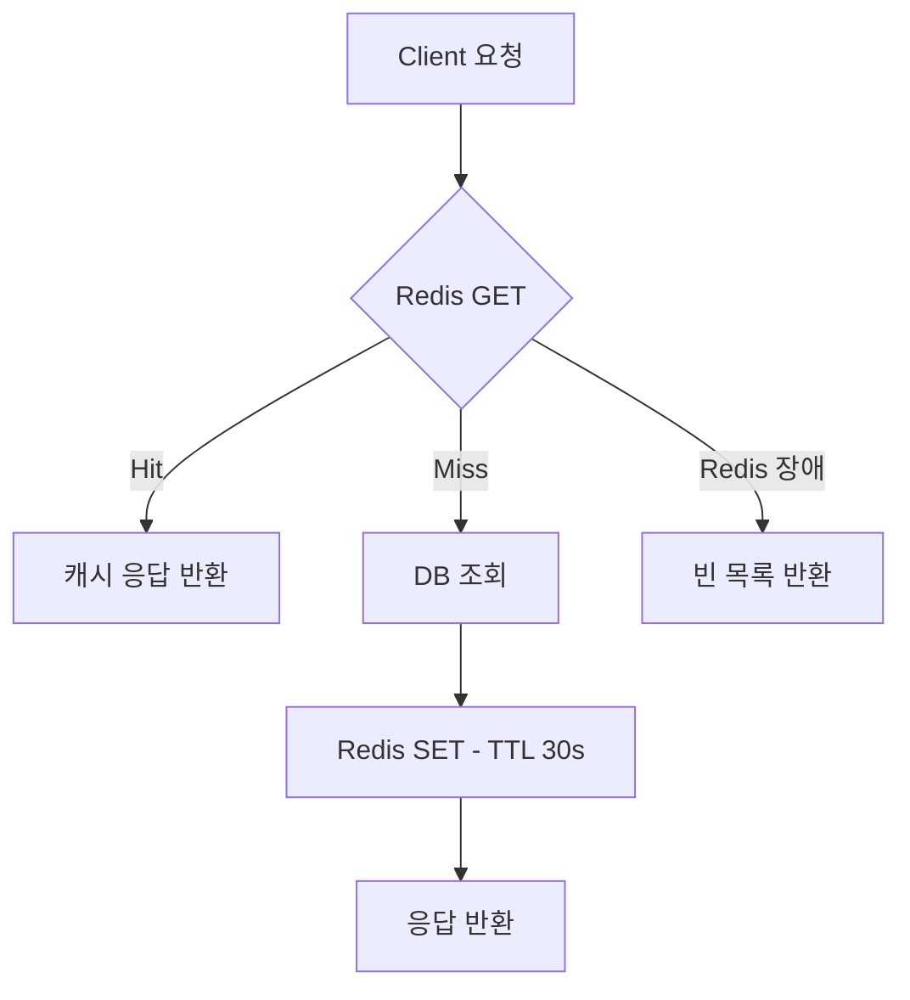
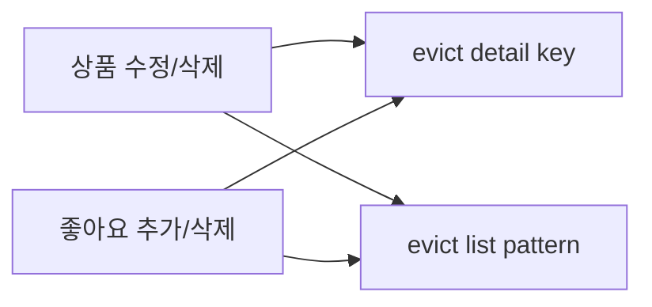
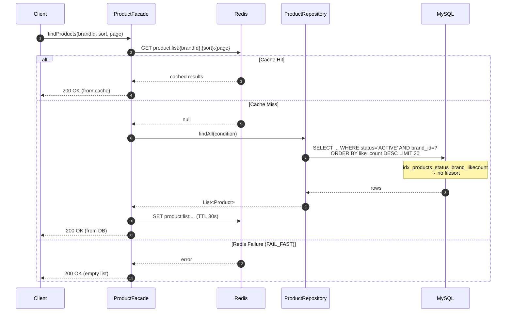
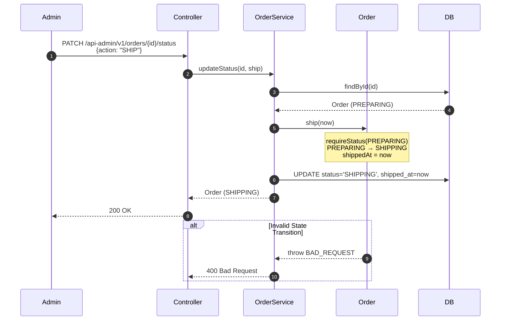

## 📌 Summary

- 배경: 상품 목록/상세 조회가 모든 요청마다 DB에 직접 접근하고, 단일 인덱스만 존재해 filesort가 발생. 좋아요 수 정렬은 매번 likes 테이블 JOIN+GROUP BY. 어드민/판매자 주문 조회 쿼리에 대한 인덱스도 부재.
- 목표: 읽기 성능을 복합 인덱스 + Redis 캐시 + 비정규화 3단계로 최적화하고, 어드민 주문 조회 쿼리를 리스트업하여 인덱스 적용 후 EXPLAIN 전후 비교.
- 결과: 상품 목록 조회 시 복합 인덱스로 filesort 제거, Redis 캐시(TTL 30초)로 대부분 DB 접근 제로. 어드민 주문 쿼리는 Full table scan(9,741 rows) → ref/range(157~990 rows)로 개선.


## 🧭 Context & Decision

### 문제 정의
- 현재 동작/제약: 상품 목록 `WHERE status='ACTIVE' AND brand_id=? ORDER BY like_count DESC` 쿼리에 단일 인덱스만 존재. 좋아요 정렬 시 매번 likes 테이블 GROUP BY. 어드민 주문 조회에 인덱스 없음.
- 문제(또는 리스크): 데이터 증가 시 filesort + full table scan으로 조회 지연. 동일 요청 반복 시에도 매번 DB 접근. 어드민 주문 조회 시 `orders` 테이블 전체 스캔.
- 성공 기준(완료 정의):
  - 상품 목록: brand 필터 쿼리에서 filesort 제거 (EXPLAIN 확인)
  - 캐시: 반복 조회 시 DB 접근 없이 Redis 응답
  - 어드민 주문: `idx_orders_status_created`로 Full scan → ref/range 전환 (EXPLAIN 확인)
  - 모든 기존 테스트 통과 + 신규 테스트 추가

### 선택지와 결정

#### ① 인덱스 전략
- 고려한 대안:
    - A: 단일 인덱스만 유지 (created_at, price, like_count 각각)
    - B: 복합 인덱스로 전환 (status, brand_id, sort_col)
    - C: Hybrid — 단일 인덱스 유지 + 복합 인덱스 추가
- 최종 결정: **C (Hybrid)** — 단일 정렬 인덱스 유지 + 복합 인덱스 3개 추가
- 트레이드오프: 인덱스 3개 추가로 쓰기 비용 증가. 특히 `like_count` 인덱스는 좋아요마다 B-Tree 재정렬. 하지만 읽기 >> 쓰기 비율이므로 이득이 크다.
- 추후 개선 여지: brand 필터 없는 전체 조회에서 복합 인덱스가 filesort 발생 → 캐시(TTL 30초)로 보완 중. 트래픽 증가 시 covering index 검토 가능.

##### 벤치마크 시나리오

`IndexBenchmarkTest`로 3가지 인덱스 전략(Single / Multi / Hybrid)을 동일 데이터에서 EXPLAIN 비교.

**테스트 데이터 (Power-law 분포)**

| 테이블 | 건수 | 분포 특성 |
|---|---|---|
| brands | 50 | — |
| products | 10K | 85% ACTIVE. brand별 멱법칙 (소수 브랜드에 상품 집중) |
| orders | 10K | DELIVERED 55% / SHIPPING·PREPARING·PAID 각 10% / PLACED 5% / CANCELLED 7% / REFUNDED 3% |
| order_items | ~20K | 주문당 1~3개 |
| likes | 10K | user·product 모두 멱법칙 (인기 상품에 좋아요 집중) |

> 멱법칙(Power-law) 분포를 사용한 이유: 실제 서비스에서 소수 브랜드/상품에 트래픽이 집중되는 패턴을 재현하기 위함.

**7-Phase 테스트 흐름**

| Phase | 설명 |
|---|---|
| 1 | 복합 인덱스 DROP → 단일 인덱스만으로 EXPLAIN |
| 2 | 단일 인덱스 DROP → 복합 인덱스 CREATE |
| 3 | 복합 인덱스만으로 EXPLAIN |
| 4 | Single vs Multi 비교표 출력 |
| 5 | 단일 + 복합 모두 적용 (Hybrid) |
| 6 | Hybrid로 EXPLAIN |
| 7 | 3-way 최종 비교표 출력 + `build/index-benchmark-report.txt` 생성 |

##### EXPLAIN 결과: Single vs Multi vs Hybrid

**상품 쿼리 (10K products)**

| Query | Single | Multi | Hybrid | Best |
|---|---|---|---|---|
| LATEST + mega brand | index / 139 | ref / 1,253 | ref / 1,253 | SINGLE |
| LATEST + small brand | ref / 103 (filesort) | ref / 86 | ref / 86 (no filesort) | **HYBRID** |
| LATEST + no brand | index / 20 | ref / 5,098 | index / 40 | SINGLE |
| PRICE_ASC + mega brand | index / 139 | ref / 1,253 | ref / 1,253 | SINGLE |
| PRICE_ASC + no brand | index / 20 | ref / 5,098 | index / 40 | SINGLE |
| POPULAR + mega brand | index / 139 | ref / 1,253 | ref / 1,253 | SINGLE |
| POPULAR + no brand | index / 20 | ref / 5,098 | index / 40 | SINGLE |

> brand 필터 없는 전체 조회는 단일 인덱스가 유리하나, 캐시(TTL 30초)로 보완.

**주문 어드민 쿼리 (10K orders)**

| Query | Single | Multi | Hybrid | Best |
|---|---|---|---|---|
| 상태별 조회 (PREPARING) | ALL / 9,741 | ref / 990 | ref / 990 | **HYBRID** |
| 상태 + 기간 (DELIVERED 30일) | ALL / 9,741 | range / 157 | range / 157 | **HYBRID** |
| 지연 주문 (PAID, >2일 경과) | ALL / 9,741 | range / 987 | range / 987 | **HYBRID** |

> `idx_orders_status_created (status, created_at)` 하나로 3개 어드민 쿼리 커버.

**기존 쿼리 회귀 테스트**

| Query | Single | Hybrid | 변화 |
|---|---|---|---|
| 유저별 주문 (power user) | ref / 611 | ref / 611 | 동일 |
| 유저별 주문 (normal) | ref / 9 | ref / 9 | 동일 |
| 유저별 주문 + 기간 | range / 14 | range / 14 | 동일 |
| 좋아요 by user | ref / 612 | ref / 612 | 동일 |
| 좋아요 by product | ref / 83 | ref / 83 | 동일 |
| 브랜드 cascade delete | ref / 1,466 | ref / 1,466 | 동일 |

**벤치마크 테스트케이스 결과 RAW**

```shell
════════════════════════════════════════════════════════════════════════════════════════════════════════════════════════════════════════════
  COMPARISON: Single-column vs Multi-column indexes
════════════════════════════════════════════════════════════════════════════════════════════════════════════════════════════════════════════
Query                                         | Type   Key(Single)                        Rows | Type   Key(Multi)                         Rows | Verdict
---------------------------------------------------------------------------------------------------------------------------------------------------------
[products] LATEST + mega brand                | index  idx_products_created_at             139 | ref    idx_products_status_brand_crea     1253 | SINGLE wins: 139 vs 1253 rows
[products] LATEST + small brand               | ref    idx_products_brand_id               103 | ref    idx_products_status_brand_crea       86 | MULTI wins: filesort eliminated
[products] LATEST + no brand filter           | index  idx_products_created_at              20 | ref    idx_products_status_brand_crea     5098 | SINGLE wins: no filesort vs filesort
[products] PRICE_ASC + mega brand             | index  idx_products_price                  139 | ref    idx_products_status_brand_pric     1253 | SINGLE wins: 139 vs 1253 rows
[products] PRICE_ASC + no brand filter        | index  idx_products_price                   20 | ref    idx_products_status_brand_crea     5098 | SINGLE wins: no filesort vs filesort
[products] POPULAR + mega brand               | index  idx_products_like_count             139 | ref    idx_products_status_brand_like     1253 | SINGLE wins: 139 vs 1253 rows
[products] POPULAR + no brand filter          | index  idx_products_like_count              20 | ref    idx_products_status_brand_crea     5098 | SINGLE wins: no filesort vs filesort
[orders] by user (power user)                 | ref    idx_orders_user_created             611 | ref    idx_orders_user_created             611 | —
[orders] by user (normal)                     | ref    idx_orders_user_created               9 | ref    idx_orders_user_created               9 | —
[orders] by user + date range                 | range  idx_orders_user_created              14 | range  idx_orders_user_created              14 | —
[likes] by user (power user)                  | ref    UK18fd6srrna88d3mgfb2r1f3ps         612 | ref    UK18fd6srrna88d3mgfb2r1f3ps         612 | —
[likes] by product (popular)                  | ref    idx_likes_product_id                 83 | ref    idx_likes_product_id                 83 | —
[products] by brand_id (cascade)              | ref    idx_products_brand_id              1466 | ref    idx_products_brand_id              1466 | —
[order_items] by order_id                     | ref    idx_order_items_order_id              2 | ref    idx_order_items_order_id              2 | —
[user_coupons] by user_id                     | ALL    NULL                                  1 | ALL    NULL                                  1 | —
[orders] by status (PREPARING)                | ALL    NULL                               9741 | ref    idx_orders_status_created           990 | MULTI wins: Full scan -> Index
[orders] by status + date range (DELIVERED)   | ALL    NULL                               9741 | range  idx_orders_status_created           157 | MULTI wins: Full scan -> Index
[orders] delayed (PAID, older than 2 days)    | ALL    NULL                               9741 | range  idx_orders_status_created           987 | MULTI wins: Full scan -> Index
[order_items] by brand_id                     | index  idx_order_items_order_id             20 | ref    idx_order_items_brand_order        2817 | SINGLE wins: 20 vs 2817 rows

════════════════════════════════════════════════════════════════════════════════════════════════════════════════════════════════════════════════════════════════
  FINAL COMPARISON: Single-column vs Multi-column vs Hybrid
════════════════════════════════════════════════════════════════════════════════════════════════════════════════════════════════════════════════════════════════
Query                                    | Type    Rows(S) | Type    Rows(M) | Type    Rows(H) | Best
-----------------------------------------------------------------------------------------------------
[products] LATEST + mega brand           | index       139 | ref        1253 | ref        1253 | SINGLE
[products] LATEST + small brand          | ref         103 | ref          86 | ref          86 | HYBRID
[products] LATEST + no brand filter      | index        20 | ref        5098 | index        40 | SINGLE
[products] PRICE_ASC + mega brand        | index       139 | ref        1253 | ref        1253 | SINGLE
[products] PRICE_ASC + no brand filter   | index        20 | ref        5098 | index        40 | SINGLE
[products] POPULAR + mega brand          | index       139 | ref        1253 | ref        1253 | SINGLE
[products] POPULAR + no brand filter     | index        20 | ref        5098 | index        40 | SINGLE
[orders] by user (power user)            | ref         611 | ref         611 | ref         611 | HYBRID
[orders] by user (normal)                | ref           9 | ref           9 | ref           9 | HYBRID
[orders] by user + date range            | range        14 | range        14 | range        14 | HYBRID
[likes] by user (power user)             | ref         612 | ref         612 | ref         612 | HYBRID
[likes] by product (popular)             | ref          83 | ref          83 | ref          83 | HYBRID
[products] by brand_id (cascade)         | ref        1466 | ref        1466 | ref        1466 | HYBRID
[order_items] by order_id                | ref           2 | ref           2 | ref           2 | HYBRID
[user_coupons] by user_id                | ALL           1 | ALL           1 | ALL           1 | HYBRID
[orders] by status (PREPARING)           | ALL        9741 | ref         990 | ref         990 | HYBRID
[orders] by status + date range (DELIVER | ALL        9741 | range       157 | range       157 | HYBRID
[orders] delayed (PAID, older than 2 day | ALL        9741 | range       987 | range       987 | HYBRID
[order_items] by brand_id                | index        20 | ref        2817 | ref        2817 | SINGLE
```

##### 벤치마크 결론

- **brand 필터 있는 쿼리**: 복합 인덱스가 filesort 제거 (small brand 케이스)
- **brand 필터 없는 쿼리**: 단일 인덱스가 유리 → 캐시(TTL 30초)로 보완
- **주문 어드민 쿼리**: Full scan(9,741 rows) → ref/range(157~990 rows), **90~98% 스캔 감소**
- **기존 쿼리**: Hybrid 전략에서 회귀 없음 확인

#### ② 캐시 전략
- 고려한 대안:
    - A: Write-through 캐시 (쓰기 시 캐시도 갱신)
    - B: Cache-aside + 이벤트 기반 무효화
- 최종 결정: **B** — Cache-aside + eviction on mutation
- 트레이드오프: 캐시 미스 시 첫 요청은 느리지만, Stampede Prevention(분산 락)으로 동시 DB 접근 1회 제한. 목록 캐시 FAIL_FAST 정책으로 Redis 장애 시 DB thundering herd 방지(빈 목록 반환).

##### 상품 상세 조회 — Stampede Prevention (FALLBACK)



> FALLBACK 정책: Redis 장애 시 `null` 반환 → DB fallback. 핵심 기능(상세 조회)은 항상 응답 보장.

##### 상품 목록 조회 — FAIL_FAST (DB 보호)



> FAIL_FAST 정책: Redis 장애 시 DB 접근 차단 → 빈 목록 반환. Thundering herd 방지.

##### 캐시 무효화 — Eviction on Mutation



> 쓰기 시 관련 캐시 삭제. 다음 읽기 요청에서 DB 조회 후 재캐싱.

#### ③ 좋아요 수 비정규화 vs Materialized View
- 고려한 대안:
    - A: `products.like_count` 비정규화
    - B: `product_summaries` Materialized View
- 최종 결정: **A** — 동기화 지점 2곳(addLike, removeLike)으로 충분. MV는 6곳+ sync 필요.
- 트레이드오프: 네이티브 SQL `like_count = like_count + 1`로 동시성 안전하지만 JPA dirty checking 우회. `GREATEST(like_count - 1, 0)`으로 음수 방지.

#### ④ 주문 상태 전이 위치
- 고려한 대안:
    - A: Service에서 if/else로 상태 전이 검증
    - B: Order 도메인 모델에 상태 전이 메서드
- 최종 결정: **B** — `order.pay()`, `order.ship()` 등 도메인 규칙을 모델에 캡슐화. 서비스는 `updateStatus(id, action)` orchestration만 담당.


## 🏗️ Design Overview

### 변경 범위
- 영향 받는 모듈/도메인: Product, Brand, Like, Order, Redis(신규 모듈)
- 신규 추가:
  - `modules/redis/` — CacheOperator, CachePolicy, Redis 설정
  - `ProductCacheService`, `BrandCacheService` — 상품/브랜드 캐시
  - `DataSeedRunner` — 10만건 테스트 데이터 시드 (멱법칙 분포)
  - `IndexBenchmarkTest` — 단일/복합/하이브리드 인덱스 EXPLAIN 비교 (7-phase)
  - `OrderStatus`, `Order` 상태 전이 — 주문 생명주기 도메인 모델
  - 어드민 주문 API — 상태별/기간별/지연 주문 조회 + 상태 변경
- 제거/대체: N+1 쿼리 → batch fetch (`findAllByIds`)로 대체

### 주요 컴포넌트 책임
- `ProductCacheService`: 상품 상세/목록 Cache-aside + 분산 락(Stampede Prevention)
- `CacheOperator`: Redis 연산 추상화. FALLBACK(장애 시 DB fallback) / FAIL_FAST(빈 응답) 정책 이원화
- `ProductEntity` indexes: `(status, brand_id, created_at/price/like_count)` 복합 인덱스 — 상품 목록 쿼리 filesort 제거
- `OrderEntity` indexes: `(status, created_at)` — 어드민 주문 쿼리 Full scan → range scan
- `Order` domain model: 7개 상태 enum + 6개 전이 메서드 — 도메인 규칙 캡슐화
- `IndexBenchmarkTest`: 3가지 인덱스 전략을 10K 데이터로 EXPLAIN 비교, 리포트 파일 생성


## 🔁 Flow Diagram

### Main Flow — 상품 목록 조회 (Cache + Index)


### Main Flow — 어드민 주문 상태 변경


### 📊 EXPLAIN 벤치마크 결과

> 전체 비교표 및 테스트 시나리오는 **🧭 Context & Decision > ① 인덱스 전략** 참고
