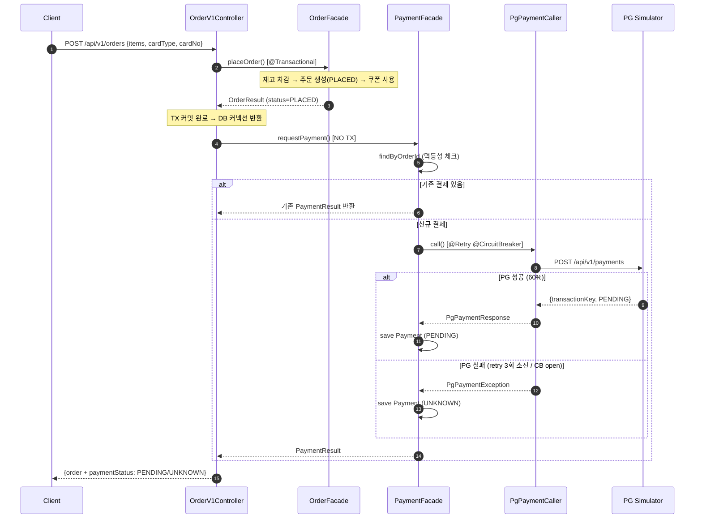
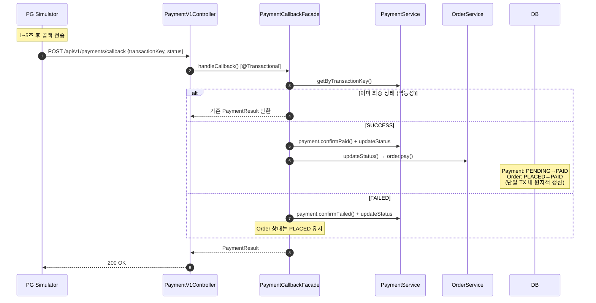
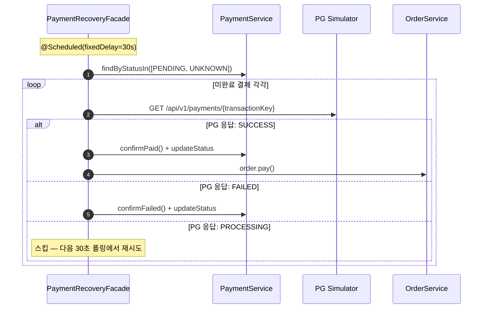
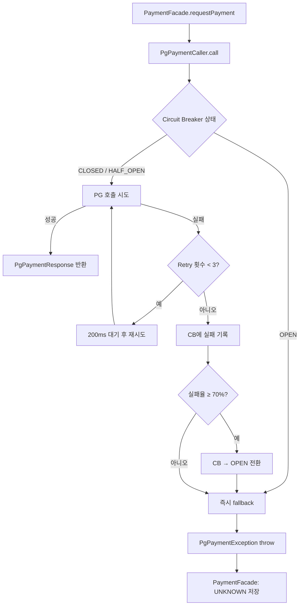

## 📌 Summary

- 배경: 주문 플로우가 `PLACED` 상태에서 끝나고, 결제 단계가 없음. PG(pg-simulator)는 40% 실패율 + 1~5초 처리 지연이 있어 외부 연동 시 장애 전파 위험이 큼.
- 목표: PG 연동을 Resilience4j(Retry + Circuit Breaker)로 보호하고, 콜백 기반 비동기 결제 플로우 + 미완료 결제 복구 스케줄러를 구현한다.
- 결과: `POST /api/v1/orders` 호출 시 주문 생성(TX) → PG 결제 요청(NO TX) 순서로 처리. 콜백 수신 시 Payment + Order 상태를 원자적 갱신. Retry 3회(P(all fail)=6.4%) + CB(70% threshold)로 PG 장애 격리. 멱등성 보장(중복 콜백/결제 무시). k6 벤치마크로 PG 특성(60% 성공률, p95 488ms) 확인.


## 🧭 Context & Decision

### 문제 정의
- 현재 동작/제약: 주문 생성 시 `PLACED` 상태로 저장만 하고 결제 과정이 없음. PG 연동 없이는 실제 결제 플로우를 시뮬레이션할 수 없음.
- 문제(또는 리스크): PG는 40% 실패율 + 1~5초 처리 지연 → 단순 동기 호출 시 (1) DB 커넥션 풀 고갈 (2) 연쇄 장애 전파 (3) 결제 유실 위험.
- 성공 기준(완료 정의):
  - 주문 생성 후 PG 결제 요청이 자동 실행
  - PG 실패 시 Retry 후 UNKNOWN 상태로 저장 (유실 방지)
  - PG 콜백 수신 시 Payment + Order 상태 원자적 갱신
  - 중복 콜백/결제 요청 시 멱등성 보장
  - CB가 정상 운영(40% 실패) 시에는 열리지 않고, 이상 상황(70%+ 실패) 시만 Open
  - 모든 기존 테스트 통과 + 신규 단위 테스트 추가

### 선택지와 결정

#### ① 트랜잭션 경계 전략

- 고려한 대안:
  - A: OrderFacade 안에서 주문 + 결제를 하나의 @Transactional로 처리
  - B: Controller에서 OrderFacade(@Transactional) → PaymentFacade(NO TX) 순차 호출
- 최종 결정: **B** — Controller 오케스트레이션
- 트레이드오프: 주문은 PLACED인데 결제가 UNKNOWN인 상태가 발생 가능 → Recovery 스케줄러(30초 폴링)로 보완
- 이유: A 방식은 PG 호출(1~5초) 동안 DB 커넥션을 점유. 동시 200건 × 5초 = 1,000 커넥션-초 → 커넥션 풀 고갈 위험. B 방식은 주문 TX 완료 후 커넥션 반환, PG 호출은 커넥션 없이 진행.

#### ② Resilience4j 설정값

- 고려한 대안:
  - A: Retry 2회 + CB threshold 50%
  - B: Retry 3회 + CB threshold 70%
  - C: Retry 5회 + CB threshold 80%
- 최종 결정: **B**
- 이유: PG 기본 실패율 40% → CB threshold가 50%면 정상 운영에서도 CB Open 위험. 70%면 기본 실패율과 30%p 여유. Retry 3회면 P(all fail) = 0.4³ = 6.4%로 충분.
- 추후 개선 여지: 실 운영 모니터링 후 waitDuration(현재 200ms)과 slidingWindowSize(현재 10) 튜닝 가능

#### ③ PG 클라이언트 아키텍처 (DIP)

- 고려한 대안:
  - A: Application 레이어에서 RestClient 직접 사용
  - B: Domain 레이어에 포트 인터페이스, Infrastructure에 구현체
- 최종 결정: **B** — DIP 준수
- 이유: PG 변경(다른 PG사 전환, Mock 교체) 시 infrastructure만 수정. 도메인/애플리케이션 레이어는 영향 없음.

#### ④ Resilience4j AOP 프록시 분리

- 고려한 대안:
  - A: PaymentFacade 내 private 메서드에 @Retry/@CircuitBreaker
  - B: PgPaymentCaller 별도 @Component로 분리
- 최종 결정: **B** — 별도 Bean
- 이유: Spring AOP는 프록시 기반 → 같은 클래스 내 self-invocation은 프록시를 경유하지 않아 @Retry/@CircuitBreaker 미적용. 별도 Bean으로 분리해야 AOP 정상 동작.

#### ⑤ 멱등성 전략

- 고려한 대안:
  - A: 요청마다 항상 PG 호출 (중복 허용)
  - B: orderId 기준 기존 결제 확인 후 PG 호출 (멱등)
- 최종 결정: **B** — DB 레벨 + 애플리케이션 레벨 이중 보장
- 이유: `payments.order_id` UNIQUE 인덱스로 DB 레벨 보장 + `findByOrderId()` 확인으로 불필요한 PG 호출 방지. 콜백도 `isTerminal()` 체크로 중복 처리 방지.


## 🏗️ Design Overview

### 변경 범위
- 영향 받는 모듈/도메인: Order (기존), Payment (신규)
- 신규 추가:
  - `domain/payment/` — Payment 도메인 모델, PaymentStatus, CardType, PaymentRepository, PaymentService, PgPaymentClient 포트
  - `infrastructure/payment/` — PaymentEntity(JPA), PaymentRepositoryImpl, PgPaymentClientImpl(RestClient), PgClientConfig
  - `application/payment/` — PaymentFacade, PaymentCallbackFacade, PgPaymentCaller(Resilience4j), PaymentRecoveryFacade
  - `interfaces/api/payment/` — PaymentV1Controller(콜백), PaymentAdminV1Controller(관리자)
  - `k6/pg-benchmark.js` — PG 시뮬레이터 부하 테스트
- 제거/대체: 없음 (기존 Order 플로우에 결제 단계 추가만)

### 주요 컴포넌트 책임
- `Payment`: 결제 도메인 모델. 상태 머신(PENDING→PAID/FAILED, UNKNOWN→PAID/FAILED) 소유. 도메인 규칙 캡슐화.
- `PgPaymentCaller`: @Retry(3회) + @CircuitBreaker(70%) AOP 프록시. PG 호출 실패 시 fallback으로 PgPaymentException throw.
- `PaymentFacade`: PG 결제 요청 오케스트레이션(NO TX). 멱등성 체크 → PG 호출 → PENDING/UNKNOWN 결제 저장.
- `PaymentCallbackFacade`: PG 콜백 처리(@Transactional). Payment + Order 상태 원자적 갱신. 멱등성(terminal 체크).
- `PaymentRecoveryFacade`: @Scheduled(30초). PENDING/UNKNOWN 결제를 PG 폴링으로 최종 상태 확인.
- `OrderV1Controller`: 주문 생성(TX 완료) → 결제 요청(NO TX) 순차 호출. 트랜잭션 경계 분리의 오케스트레이션 포인트.


## 🔁 Flow Diagram

### Main Flow — 주문 생성 + PG 결제 요청



### Callback Flow — PG 결제 결과 콜백



### Recovery Flow — 미완료 결제 복구



### Resilience4j 동작 플로우




## 📊 k6 PG Simulator 벤치마크

### 테스트 시나리오

PG 시뮬레이터의 성능 특성과 장애 패턴을 파악하기 위해 k6 부하 테스트를 수행했다.

| Phase | 시나리오 | 설정 |
|-------|----------|------|
| 1 | 결제 요청 부하 | ramping-vus: 1→10→30→50 VUs, 100초간 |
| 2 | 상태 조회 부하 | constant-vus: 10 VUs, 30초간 (Phase 1 종료 후) |

**Threshold 설정**:
- `http_req_duration`: p(95) < 3,000ms
- `http_req_failed`: rate < 50% (PG 기본 실패율 40% 감안)

### 벤치마크 결과

```
총 요청 수:    6,811건 (49.5 req/s)
총 반복 수:    6,731건 (48.9 iter/s)
최대 동시 VU:  50
```

### 벤치마크 결과 RAW

```
============================================================
PG Simulator Benchmark — 2026-03-18T13:17:21.673Z
============================================================

총 요청 수:    6,811건 (49.5 req/s)
총 반복 수:    6,731건 (48.9 iter/s)
최대 동시 VU:  50

     ✗ status is 200
      ↳  60% — ✓ 3998 / ✗ 2587
     ✗ has transactionKey
      ↳  60% — ✓ 3998 / ✗ 2587
     ✓ status check 200

     checks.........................: 60.95% ✓ 8076      ✗ 5174
     data_received..................: 1.7 MB 12 kB/s
     data_sent......................: 2.1 MB 16 kB/s
     http_req_blocked...............: avg=115.24µs min=1µs      med=6µs      max=5.2ms    p(90)=312µs    p(95)=363µs
     http_req_connecting............: avg=86.61µs  min=0s       med=0s       max=5.14ms   p(90)=244µs    p(95)=280µs
   ✓ http_req_duration..............: avg=306.49ms min=3.23ms   med=306.11ms max=518.16ms p(90)=469.02ms p(95)=487.86ms
       { expected_response:true }...: avg=307.32ms min=3.23ms   med=309.05ms max=518.16ms p(90)=469.62ms p(95)=489.03ms
   ✓ http_req_failed................: 38.95% ✓ 2653      ✗ 4158
     http_req_receiving.............: avg=99.65µs  min=6µs      med=80µs     max=6.21ms   p(90)=168µs    p(95)=212.49µs
     http_req_sending...............: avg=30.57µs  min=4µs      med=25µs     max=1.67ms   p(90)=50µs     p(95)=63µs
     http_req_tls_handshaking.......: avg=0s       min=0s       med=0s       max=0s       p(90)=0s       p(95)=0s
     http_req_waiting...............: avg=306.36ms min=3.11ms   med=306.04ms max=518.01ms p(90)=468.92ms p(95)=487.69ms
     http_reqs......................: 6811   49.482891/s
     iteration_duration.............: avg=448.28ms min=203.53ms med=415.1ms  max=3.01s    p(90)=578.1ms  p(95)=597.23ms
     iterations.....................: 6731   48.90168/s
     payment_fail...................: 2587   18.794926/s
     payment_success................: 3998   29.046043/s
     status_check_duration..........: avg=7.0625   min=4        med=7        max=26       p(90)=9        p(95)=9.05
     status_pending.................: 80     0.581211/s
     vus............................: 2      min=0       max=50
     vus_max........................: 60     min=60      max=60
```

#### 성공률/실패율

| 메트릭 | 값 |
|--------|-----|
| 결제 성공 (payment_success) | 3,998건 (60.7%) |
| 결제 실패 (payment_fail) | 2,587건 (39.3%) |
| 상태 조회 시 PENDING | 80건 |
| checks 통과율 | 60.95% |

> PG 기본 성공률 60%와 일치 → Retry 없이 단일 호출 기준 결과. Retry 3회 적용 시 P(성공) = 1 - 0.4³ = 93.6%로 개선 기대.

#### 응답 시간 분포

| 메트릭 | avg | med | p(90) | p(95) | max |
|--------|-----|-----|-------|-------|-----|
| http_req_duration | 306ms | 306ms | 469ms | 488ms | 518ms |
| http_req_waiting | 306ms | 306ms | 469ms | 488ms | 518ms |
| iteration_duration | 448ms | 415ms | 578ms | 597ms | 3,010ms |
| status_check_duration | 7ms | 7ms | 9ms | 9ms | 26ms |

> - PG 결제 요청: p(95) = 488ms. PG 내부 처리 지연(1~5초)은 콜백 방식이므로 응답에 미포함.
> - 상태 조회: avg 7ms로 매우 빠름. Recovery 스케줄러 폴링에 적합.
> - ✅ 모든 threshold 통과: p(95) 488ms < 3,000ms, failed rate 39% < 50%

#### 네트워크 오버헤드

| 메트릭 | avg |
|--------|-----|
| http_req_blocked | 115µs |
| http_req_connecting | 87µs |
| http_req_sending | 31µs |
| http_req_receiving | 100µs |

> 네트워크 오버헤드는 무시할 수준. 응답 시간의 99%가 PG 서버 처리 시간.

### 벤치마크 결론 — Resilience4j 설정 근거

| 항목 | PG 특성 | 설정 근거 |
|------|---------|-----------|
| 실패율 | 40% | CB threshold 70% > 40% → 정상 운영 시 CB 미작동 |
| 응답 시간 p(95) | 488ms | readTimeout 2,000ms → p(99+) 커버. Retry waitDuration 200ms → 재시도 간 PG 부하 분산 |
| 초당 처리량 | 49.5 req/s | 50 VU에서 안정적 처리. 서비스 측 동시성은 충분 |
| 상태 조회 시간 | avg 7ms | Recovery 폴링(30초 간격)에 충분. 미완료 결제 100건이어도 0.7초면 전체 확인 가능 |
| 콜백 처리 | 비동기 1~5초 | 결제 요청 시 PENDING 저장 → 콜백 수신 시 최종 상태 확정. @Transactional로 원자적 갱신 |
