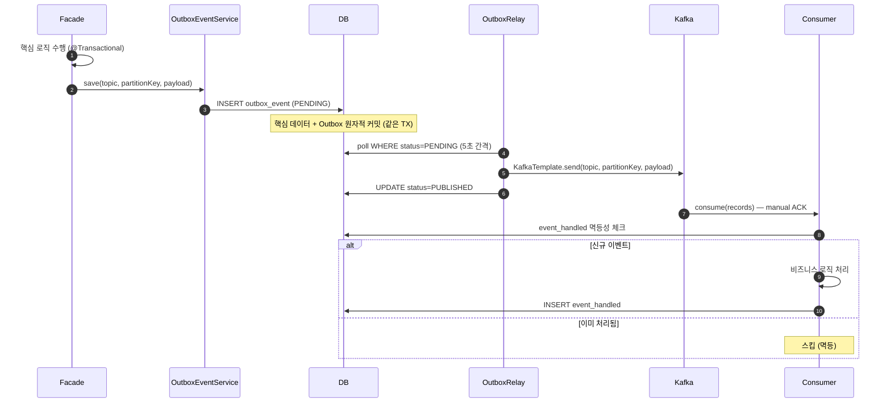
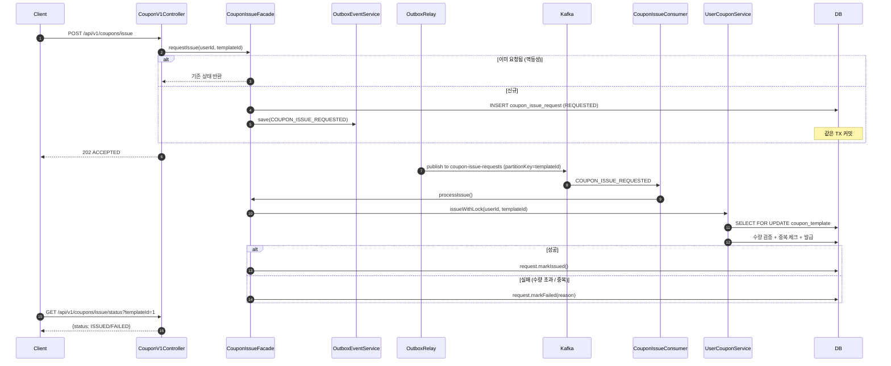

## 📌 Summary

- 배경: 기존 시스템은 부가 로직(결제 요청, 캐시 무효화, 집계)이 핵심 TX에 결합되어 있고, 서버 장애 시 이벤트가 유실되며, 선착순 쿠폰 발급 시 동시성 제어가 없었다.
- 목표: ApplicationEvent로 핵심/부가 로직 경계를 분리하고, Transactional Outbox + Kafka 파이프라인으로 At-Least-Once 이벤트 보장 체계를 구축하며, Kafka 기반 선착순 쿠폰 발급을 구현한다.
- 결과: Outbox Pattern으로 이벤트 유실 방지 + Kafka로 시스템 간 이벤트 전파 + 선착순 쿠폰 비동기 발급(비관적 락 + 멱등성). 쿠폰 도메인은 DIP 리팩터링으로 Application → Domain Service 의존으로 전환.


## 🧭 Context & Decision

### 문제 정의
- 현재 동작/제약: 부가 로직(결제, 캐시, 집계)이 Facade의 핵심 TX 안에서 동기 처리. 서버 재시작 시 ApplicationEvent는 JVM 메모리 기반이라 유실. 쿠폰 발급은 동기 API로 트래픽 스파이크에 취약.
- 문제(또는 리스크):
  - 부가 로직 실패가 핵심 TX를 롤백시킬 수 있음 (예: likeCount 증감 실패 → 좋아요 자체 실패)
  - 서버 죽으면 AFTER_COMMIT 이벤트 유실 → 결제 요청 누락, 집계 불일치
  - 선착순 쿠폰: 동기 처리 시 DB 커넥션 점유 + 동시 요청 시 수량 초과 발급 위험
- 성공 기준(완료 정의):
  - 핵심 로직과 부가 로직이 트랜잭션 경계로 분리
  - Outbox + Kafka로 이벤트 At-Least-Once 보장
  - Consumer에서 `event_handled` 테이블로 멱등 처리
  - 선착순 쿠폰: 비동기 발급 + 비관적 락으로 수량 정합성 보장
  - 기존 테스트 전체 통과 + 신규 테스트 추가

### 선택지와 결정

#### ① 이벤트 파이프라인 아키텍처

- 고려한 대안:
    - A: ApplicationEvent 단독 (V1) — Facade에서 `applicationEventPublisher.publish()`, 리스너에서 처리
    - B: Outbox + Kafka 직접 호출 (V2) — Facade에서 `outboxEventService.save()` 직접 호출
    - C: ApplicationEvent + Outbox + Kafka 하이브리드 (V3) — Facade는 도메인 이벤트만 발행, 리스너가 Outbox/로컬 처리 분기
- 최종 결정: **B (V2)**
- 트레이드오프: Facade가 `outboxEventService`, `KafkaTopics`, `partitionKey`를 직접 알고 있어 인프라 관심사가 Application 레이어에 침투. 하지만 V3 하이브리드는 현재 규모에서 overspec — ApplicationEvent + BEFORE_COMMIT 리스너 + Outbox + Kafka Consumer까지 4단계 간접 참조는 복잡도 대비 이득이 적다고 판단.
- 추후 개선 여지: 도메인이 복잡해지거나 로컬 처리(캐시 무효화)와 글로벌 전파(Kafka)를 분리할 필요가 생기면 V3로 전환 가능.

#### ② Outbox TX 전파 전략

- 고려한 대안:
    - A: `REQUIRES_NEW` — Outbox 저장이 별도 TX. 핵심 TX 롤백돼도 Outbox는 남음.
    - B: `REQUIRED` — Outbox가 Facade TX에 참여. 핵심 데이터와 Outbox가 원자적으로 커밋.
- 최종 결정: **B (REQUIRED)**
- 이유: `REQUIRES_NEW`면 핵심 TX가 롤백돼도 Outbox가 남아 Consumer가 존재하지 않는 주문에 대해 결제를 시도하는 등 정합성 문제 발생. `REQUIRED`면 핵심 데이터 + Outbox가 함께 커밋/롤백되어 데이터 일관성 보장.

#### ③ 선착순 쿠폰 동시성 제어

- 고려한 대안:
    - A: Kafka PartitionKey 순서 보장만 의존 (단일 파티션 → 순차 처리)
    - B: Kafka + DB 비관적 락 (SELECT FOR UPDATE) 이중 방어
- 최종 결정: **B**
- 이유: Kafka는 단일 파티션 내 순서만 보장. Consumer rebalance, 재시작, 여러 파티션 시 동시 처리 가능. DB 비관적 락이 최종 방어선으로 수량 정합성을 보장해야 한다.

#### ④ 쿠폰 발급 API 응답 전략

- 고려한 대안:
    - A: 동기 발급 — 200 OK + 발급 결과 즉시 반환
    - B: 비동기 발급 — 202 ACCEPTED + polling API로 결과 조회
- 최종 결정: **B**
- 이유: 선착순 쿠폰은 트래픽 스파이크가 발생하므로, API 서버에서 DB 락을 직접 잡으면 커넥션 풀 고갈 위험. Kafka Consumer로 부하를 분산하고, 클라이언트는 polling으로 결과 확인.

#### ⑤ 쿠폰 Application Layer DIP 리팩터링

- 고려한 대안:
    - A: Facade가 Repository 직접 참조 유지 (현상 유지)
    - B: Facade → Domain Service 경유로 전환
- 최종 결정: **B (쿠폰 도메인에만 적용)**
- 이유: `CouponIssueFacade`가 `CouponTemplateRepository.findByIdWithLock()` 같은 도메인 로직(발급 검증, 수량 체크, 중복 방지)을 직접 오케스트레이션하고 있었음. 이 로직을 `UserCouponService.issueWithLock()`으로 응집시켜 Facade는 순수 오케스트레이션만 담당.
- 적용 범위: 쿠폰 도메인에만 적용. 다른 도메인은 현 구조 유지.


## 🏗️ Design Overview

### 변경 범위
- 영향 받는 모듈/도메인: Order, Payment, Like, Catalog(Product), Coupon, Outbox(신규), Kafka(신규)
- 신규 추가:
  - `infrastructure/outbox/` — OutboxEvent 엔티티, OutboxEventService, OutboxRelay(@Scheduled 5초), KafkaTopics
  - `interfaces/consumer/` — OrderEventConsumer, CatalogEventConsumer, CouponIssueConsumer (commerce-api)
  - `apps/commerce-streamer/` — OrderEventConsumer, CatalogEventConsumer (commerce-streamer)
  - `domain/coupon/` — CouponIssueRequest, CouponIssueRequestService, CouponIssueRequestRepository, CouponIssueStatus
  - `infrastructure/coupon/` — CouponIssueRequestEntity, CouponIssueRequestJpaRepository, CouponIssueRequestRepositoryImpl
  - `application/coupon/` — CouponIssueFacade (비동기 발급 오케스트레이션)
- 제거/대체:
  - ApplicationEvent 핸들러 4개 비활성화(@Deprecated, @Component 제거) — 삭제하지 않고 레퍼런스로 보존
  - ApplicationEventPublisher 의존 → OutboxEventService로 전환

### 주요 컴포넌트 책임
- `OutboxEventService`: Outbox 레코드 저장 (REQUIRED 전파 — Facade TX에 참여)
- `OutboxRelay`: @Scheduled(5초) — PENDING 상태 Outbox 폴링 → Kafka 발행 → PUBLISHED 마킹
- `OrderEventConsumer (commerce-api)`: ORDER_PLACED → 결제 요청 + 캐시 무효화, PAYMENT_CONFIRMED → order.pay()
- `CatalogEventConsumer (commerce-api)`: PRODUCT_LIKED/UNLIKED → likeCount 증감 + 캐시 무효화
- `CouponIssueConsumer`: COUPON_ISSUE_REQUESTED → `CouponIssueFacade.processIssue()` (비관적 락으로 발급)
- `CouponIssueFacade`: 발급 요청 접수(requestIssue) + 실제 발급 처리(processIssue) + 상태 조회(getIssueStatus)
- `UserCouponService.issueWithLock()`: SELECT FOR UPDATE로 CouponTemplate 락 → 수량 검증 → 중복 체크 → 발급


## 🔁 Flow Diagram

### Main Flow — Transactional Outbox + Kafka 파이프라인



### Coupon Issue Flow — 선착순 쿠폰 비동기 발급




## ⚡ Performance & Data Integrity Notes

### 트랜잭션 경계와 DB 커넥션 효율

| 항목 | Before | After | 영향 |
|------|--------|-------|------|
| 주문 생성 시 결제 | Facade TX 밖 Controller 순차 호출 | Outbox 저장 후 TX 종료 → Consumer에서 비동기 결제 | DB 커넥션 점유 시간 단축 (PG 1~5초 대기 제거) |
| 좋아요 + likeCount | 같은 TX에서 동기 처리 | 좋아요만 TX 커밋 → likeCount는 Kafka Consumer에서 처리 | 핵심 TX 범위 축소, 부가 로직 실패가 핵심에 영향 없음 |
| 쿠폰 발급 | 동기 발급 (API에서 락 점유) | 비동기 (API → Outbox → Kafka → Consumer) | API 서버 부하 분산, 커넥션 풀 고갈 방지 |

### 이벤트 유실 방지 — At-Least-Once 보장

```
[Before] ApplicationEvent (JVM 메모리)
  - 서버 죽으면 이벤트 유실
  - 재처리 불가

[After] Transactional Outbox Pattern
  - Outbox 레코드가 핵심 데이터와 같은 TX에 커밋 → 서버 죽어도 DB에 남아 있음
  - OutboxRelay가 5초 간격으로 PENDING 폴링 → 미발행 이벤트 재전송
  - Consumer에서 event_handled 테이블로 중복 처리 방지 (멱등성)
```

### 선착순 쿠폰 — 동시성 제어 이중 방어

1. **Kafka PartitionKey (couponTemplateId)**: 같은 쿠폰 템플릿에 대한 요청이 같은 파티션으로 → 순서 보장
2. **DB 비관적 락 (SELECT FOR UPDATE)**: Consumer에서 `CouponTemplate`에 PESSIMISTIC_WRITE 락 → 수량 정합성 최종 방어선
3. **Unique Constraint (userId, couponTemplateId)**: `coupon_issue_request` 테이블 + `user_coupons` 테이블 양쪽에서 중복 발급 방지
4. **멱등 처리**: `CouponIssueRequest.status != REQUESTED`면 스킵 → Consumer 재시도 시에도 이중 발급 없음

### @Transactional 프록시 주의사항

- `private` 메서드에 `@Transactional` 선언 시 Spring AOP 프록시가 인터셉트하지 못해 **무시됨**
- 같은 클래스 내 self-invocation (`this.method()`)도 프록시를 경유하지 않아 `@Transactional` 미적용
- 해결: `@Transactional`이 필요한 DB 읽기는 public 메서드에 선언하거나, 이미 `@Transactional`이 있는 Domain Service에 위임
- 적용 사례: `ProductFacade.loadProductListFromDb()` (private) → `findProducts()` (public)에 `@Transactional(readOnly = true)` 선언으로 일관된 읽기 보장

### Kafka Producer/Consumer 설정

| 설정 | 값 | 이유 |
|------|-----|------|
| `acks` | `all` | 모든 ISR 복제본 확인 후 ACK → 메시지 유실 방지 |
| `enable.idempotence` | `true` | Producer 재시도 시 중복 전송 방지 |
| `max.in.flight.requests.per.connection` | `5` | 순서 보장 + 처리량 균형 (idempotence=true일 때 5까지 안전) |
| Consumer ACK | `manual` | 비즈니스 로직 완료 후 ACK → 처리 실패 시 재처리 보장 |
| Consumer group | 도메인별 분리 | `commerce-api-order`, `commerce-api-catalog`, `commerce-api-coupon-issue` — 독립적 offset 관리 |


## 🧪 Test Coverage

### Unit Tests
- `CouponIssueFacadeUnitTest` (7 cases) — requestIssue 정상/멱등성/NOT_FOUND, processIssue 정상/수량초과/중복/멱등성
- `OrderFacadeUnitTest` — outboxEventService mock 전환
- `LikeFacadeUnitTest` — outboxEventService mock 전환
- `PaymentCallbackFacadeUnitTest` — outboxEventService mock 전환
- `ProductFacadeUnitTest` — outboxEventService mock 전환

### Integration / E2E Tests
- `CouponV1ApiE2ETest` — 비동기 발급 flow (202 ACCEPTED + REQUESTED), 멱등성, 상태 조회
- `LikeFacadeConcurrencyTest` — Kafka 전환에 따라 likeCount 동시성 검증 제거 (좋아요 레코드만 검증)
