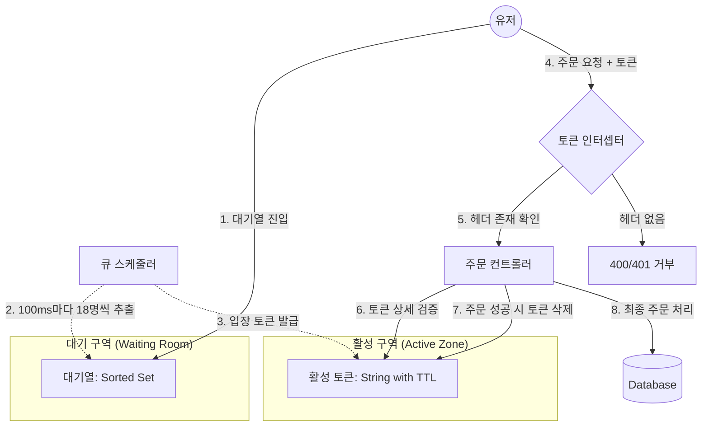
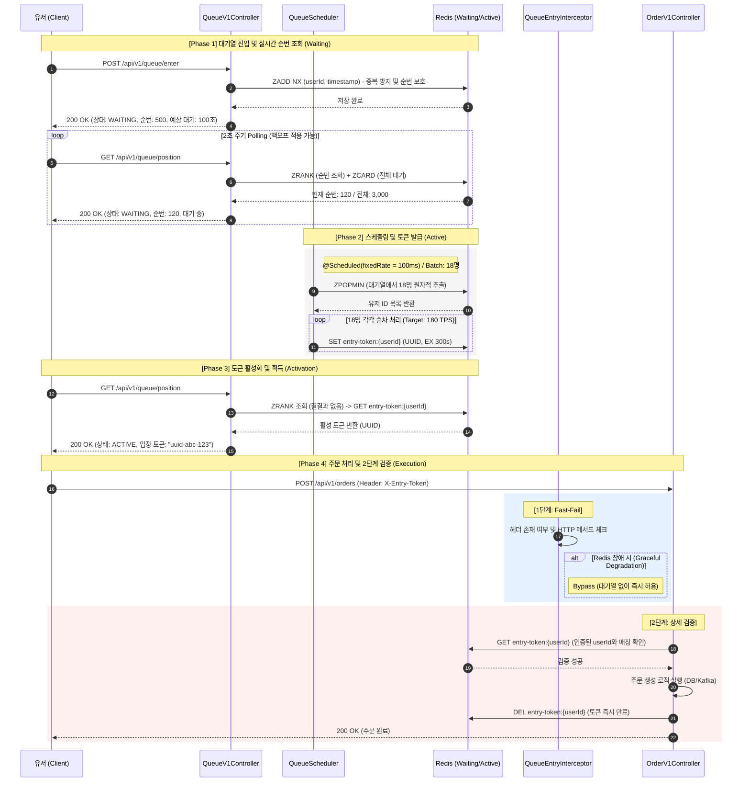
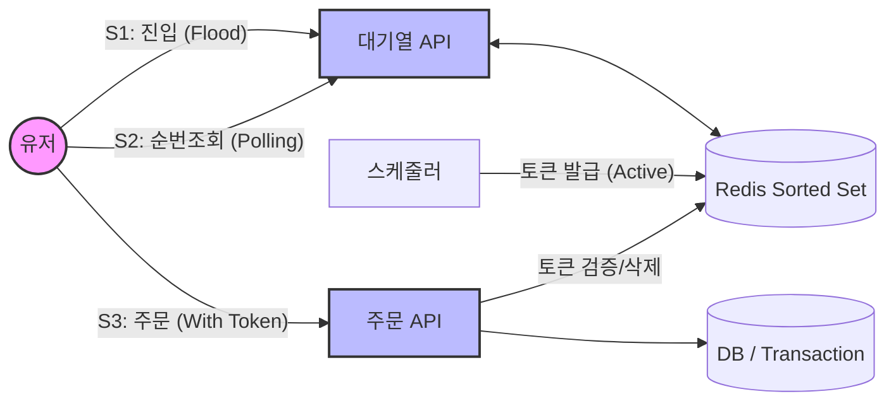

## 📌 Summary

- 배경: 블랙 프라이데이와 같이 트래픽이 폭증(초당 10,000건)하는 상황에서 DB 커넥션 고갈, 응답 타임아웃, 재시도 폭풍으로 시스템 전체 장애 위험을 초례할 수 있다.
- 목표: Redis 기반 대기열로 처리량을 제어(Back-pressure)하고, 입장 토큰과 실시간 순번 조회로 유저에게 공정한 대기 경험을 제공한다.
- 결과:
  - $목표 처리량(TPS) = \frac{DB 커넥션 풀}{평균 처리 시간} \times 안전 마진 = \frac{50}{0.2} \times 0.7 = 175 TPS$
  - $배치 크기 = \frac{목표 처리량}{스케줄러 실행 횟수(1초당)} = \frac{175}{10} \approx 18$
  - 100ms당 18명씩 유입을 제어하는 마이크로 배칭 구조로 Sorted Set 대기열 및 관문(Interceptor) 구현.

## 🏗️ System Architecture



## 🔁 System Flow



## 🧭 Context & Decision

### 문제 정의
- 현재 동작/제약: 주문 API가 트래픽을 직접 수용. DB 커넥션 풀(50)과 PG 처리량에 의한 물리적 한계 존재. 트래픽 스파이크 시 전체 서비스 장애로 이어짐.
- 문제(또는 리스크):
  - 초당 10,000건 → DB 커넥션 풀 고갈 → 전체 시스템 멈춤
  - 응답 없이 로딩 → 타임아웃 → 유저 재시도 → 트래픽 더 악화
  - 누가 먼저 요청했는지와 관계없이 운 좋은 사람만 성공 (공정성 부재)
- 성공 기준(완료 정의):
  - 대기열이 처리량(175 TPS)에 맞춰 유입을 조절
  - 유저는 순번과 예상 대기 시간을 실시간 확인 가능
  - 토큰 없이는 주문 API에 진입 불가 (관문 100% 차단)
  - 기존 주문 이후 흐름(Outbox → Kafka)은 변경 없음

### 선택지와 결정

#### ① 트래픽 제어 전략: Rate Limiting vs Queuing

- 고려한 대안:
    - A: Rate Limiting — 초과 요청 즉시 거부 (429 Too Many Requests)
    - B: Queuing — 초과 요청을 대기열에 보관, 순서대로 처리
- 최종 결정: **B (Queuing)**
- 트레이드오프: Rate Limiting은 구현이 간단하지만 블랙 프라이데이에 "나중에 다시 시도하세요"를 반환하면 유저 이탈 + 재시도 폭풍 유발. 대기열은 유저가 기다릴 의사가 있는 시나리오에 적합.

#### ② 대기열 자료구조: Redis Sorted Set

- 고려한 대안:
    - A: Kafka Topic — 메시지 순서 보장, but 순번 조회(ZRANK) 불가
    - B: Redis List (LPUSH/RPOP) — FIFO 보장, but 순번 조회 시 O(N)
    - C: Redis Sorted Set — 순서 보장 + O(log N) 순번 조회 + 중복 방지
- 최종 결정: **C**
- 이유: 유저가 "내 순번"을 실시간으로 알아야 하므로 ZRANK O(log N)이 핵심. List는 LPOS로 순번 조회 시 O(N)이고 Kafka는 offset 기반이라 "내가 몇 번째"를 알 수 없음.

#### ③ 스케줄러 배칭 전략: Thundering Herd 완화

- 고려한 대안:
    - A: 1초마다 175명 한번에 발급
    - B: 100ms마다 ~18명씩 분산 발급
- 최종 결정: **B (100ms 마이크로 배칭)**
- 이유: A는 175명이 동시에 POST /orders를 호출하여 DB 커넥션 175개 동시 점유 (Thundering Herd). B는 피크를 10배 평탄화.

#### ④ 토큰 검증 위치: Interceptor + Controller (2단계 검증)

- 고려한 대안:
    - A: Controller에서만 검증
    - B: Interceptor에서만 검증
    - C: Interceptor(Fast-fail) + Controller(상세 검증)
- 최종 결정: **C**
- 이유: Interceptor에서 헤더 존재 여부를 먼저 체크하여 불필요한 로직 진입을 막고, Controller에서 실제 인증된 `userId`와 토큰의 매칭 여부를 최종 확인하여 보안성을 극대화함.

#### ⑤ 처리량 산정 근거 및 분석 (Throughput Math)

- **수치 도출의 실무적 배경 (Engineering Rationale)**:

    1.  **DB 커넥션 풀 (50개)**: Spring Boot(HikariCP) 기본값(10)은 대규모 트래픽에 부족하며, 중소규모 서비스에서 안정적으로 운영 가능한 최소 기준점인 50을 벤치마크로 설정하였다. 무작정 늘릴 경우 DB 서버의 Context Switching 부하가 커지므로 보수적인 수치를 선택했다.

    2.  **평균 처리 시간 (200ms)**: 단순 조회가 아닌 '재고 차감, 쿠폰 검증, 주문 저장, 이벤트 발행' 등 복합적인 I/O 작업이 포함된 실무 시나리오를 가정했다. 일반적인 커머스 환경의 P95 Latency가 200ms 내외인 점을 근거로 하였다.

    3.  **안전 마진 (70%)**: 시스템을 100% 가동률로 운영할 경우, 네트워크 지연이나 GC 발생 시 즉시 병목이 발생하여 시스템이 연쇄적으로 붕괴(Cascading Failure)할 위험이 있다. 따라서 30%의 버퍼를 남겨두어 예기치 못한 스파이크에도 최소한의 응답성을 유지하도록 설계했다.

    4.  **마이크로 배칭 (100ms)**: 1초에 한 번 175명을 동시에 입장시키면 DB 커넥션을 순식간에 점유하여 다른 API에 영향을 줄 수 있다. **Thundering Herd(떼몰이)** 문제를 해결하기 위해 1초를 10개 구간으로 나누어 부하를 평탄화(Smoothing)함으로써 인프라 충격을 최소화했다.

- **수식 요소 설명**:
    - **목표 처리량 (Target TPS)**: 시스템이 초당 안전하게 처리할 수 있는 최대 주문 건수.
    - **DB 커넥션 풀 (DB Pool)**: 동시에 DB를 점유할 수 있는 최대 연결 수 (50개).
    - **평균 처리 시간 (Avg Processing Time)**: 주문 1건이 DB 커넥션을 점유하는 평균 시간 (0.2초).
    - **안전 마진 (Safety Margin)**: 갑작스러운 부하나 네트워크 지연을 대비한 여유 공간 (70% 적용).
    - **배치 크기 (Batch Size)**: 스케줄러가 한 번에 토큰을 발급할 인원수.
    - **스케줄러 주기 (Frequency)**: 1초를 몇 번으로 나누어 실행할 것인가 (100ms = 10회).

- **계산 과정 및 근거**:
    1. **시스템 최대 한계**: $50 \text{개} \div 0.2 \text{초} = 250 TPS$. 이는 이론상 DB 커넥션이 쉴 새 없이 돌아갈 때의 한계점이다.
    2. **목표 처리량 설정**: 한계치의 70% 수준인 **175 TPS**를 최종 목표로 설정하여 안정성을 확보. 이는 초당 10,000건의 유입을 175건으로 평탄화하여 DB 고갈을 원천 차단함을 의미한다.
    3. **마이크로 배칭 (100ms)**: 1초(1,000ms)를 10회로 쪼개어 **18명씩** 발급. 부하를 초당 10회로 평탄하게 분산하기 위함이다.
- **결정**: 100ms 주기의 스케줄러와 Batch Size 18을 통해 DB 커넥션 고갈을 원천 차단하고 시스템 안정성을 확보함.


## 🏗️ Design Overview

### 주요 컴포넌트 책임
- `QueueService`: Redis Sorted Set 기반 대기열 관리 및 토큰 생명주기 제어
- `QueueScheduler`: 100ms 주기로 대기열 유저 추출 및 활성화 (TPS 제어)
- `QueueEntryInterceptor`: 주문 API 진입 전 토큰 헤더 유무 확인 (Gatekeeper)
- `OrderV1Controller`: 실제 유저 ID와 토큰 대조 및 비즈니스 로직 수행


## 🧪 Test Scenarios & Results

### 1. 시스템 설명 (System Description)
본 시스템은 Redis Sorted Set을 활용한 가상 대기열(Virtual Waiting Room)로, 찰나의 순간에 몰리는 대규모 트래픽을 시스템이 감당 가능한 수준(175 TPS)으로 평탄화하여 DB 및 하류 시스템을 보호한다.

### 2. 테스트 가정 (Test Assumptions)
- **로컬 장비 사양**: MacBook Pro 14-inch (Apple M5 Pro, 48GB RAM)
- **인프라 구성**: 단일 WAS (non-Docker), Redis (Master-Replica), DB (MySQL).
- **데이터 세팅**: 1,000명의 테스트 유저(`testuser-1` ~ `1000`) 및 999,999개의 재고를 가진 1번 상품 사전 생성.
- **네트워크**: 로컬 루프백(localhost) 환경 테스트로 네트워크 지연은 최소화된 상태.

### 3. 테스트 범위 및 시나리오 (Testing Scope)

아래 다이어그램은 시스템 아키텍처 중 k6 부하 테스트가 집중적으로 검증한 지점(S1, S2, S3)을 나타냅니다.



- **Scenario 1 (S1: Queue Flood)**: 
    - **테스트 지점**: `POST /api/v1/queue/enter` → Redis `ZADD NX`
    - **목적**: 50초간 최대 1,000명의 유저가 동시 진입 시 Sorted Set의 정합성과 중복 진입 방지 확인.
- **Scenario 2 (S2: Polling Load)**: 
    - **테스트 지점**: `GET /api/v1/queue/position` → Redis `ZRANK`
    - **목적**: 200명의 유저가 30초간 반복 조회하여 Redis 부하 및 실시간 상태 변경(Waiting → Active) 확인.
- **Scenario 3 (S3: Order with Token)**: 
    - **테스트 지점**: `POST /api/v1/orders` → 토큰 검증 인터셉터 → 주문 처리
    - **목적**: 대기열 진입 → 순번 대기 → 토큰 획득 → 주문 생성의 전체 비즈니스 플로우 완주 여부 확인.

### 4. 테스트 결과 (Test Results)

#### 📊 성능 요약
- **총 요청 수**: 14,695건
- **HTTP 성공률**: 100.00% (장애 발생 0건)
- **주문 성공 건수**: 913건 (전체 플로우 완주)
- **평균 응답 시간**: 2.45s (대기열 진입 부하 포함)
- **대기열 진입 성공**: 9,047건

#### 📝 k6 Raw Output
```shell
$ k6 run k6/queue-benchmark.js

         /\      Grafana   /‾‾/  
    /\  /  \     |\  __   /  /   
   /  \/    \    | |/ /  /   ‾‾\ 
  /          \   |   (  |  (‾)  |
 / __________ \  |_|\_\  \_____/ 

     execution: local
        script: k6/queue-benchmark.js
        output: -

     scenarios: (100.00%) 3 scenarios, 1200 max VUs, 2m30s max duration (incl. graceful stop):
              * queue_flood: Up to 1000 looping VUs for 50s over 5 stages (gracefulRampDown: 30s, exec: queueEntryTest, gracefulStop: 30s)
              * polling_load: 200 looping VUs for 30s (exec: pollingTest, startTime: 55s, gracefulStop: 30s)
              * order_with_token: 50 looping VUs for 30s (exec: orderWithTokenTest, startTime: 1m30s, gracefulStop: 30s)


============================================================
Queue System Benchmark — 2026-04-02T15:28:57.082Z
============================================================

[ Scenarios ]

  queue_flood:
    executor:  ramping-vus
    stages:    0 → 100 → 500 → 1000 VUs (hold 20s) → 0
    purpose:   대기열 진입 폭증 시뮬레이션

  polling_load:
    executor:  constant-vus (200 VUs, 30s)
    purpose:   순번 Polling 부하 측정

  order_with_token:
    executor:  constant-vus (50 VUs, 30s)
    purpose:   대기열 → 토큰 → 주문 전체 플로우

[ Thresholds ]
    http_req_duration: p(95)<2000
    queue_enter: p(99)<1000
    queue_position: p(99)<500
    http_req_failed: rate<0.3

[ Target ]  http://localhost:8080

============================================================

     ✓ enter: status is 200
     ✗ enter: has rank
      ↳  98% — ✓ 8874 / ✗ 173
     ✓ position: status is 200
     ✓ order: status is 200

     checks.........................: 99.21%  ✓ 21743      ✗ 173   
     data_received..................: 6.1 MB  50 kB/s
     data_sent......................: 3.0 MB  25 kB/s
     http_req_duration..............: avg=2.45s    min=67.12ms  med=1.35s   max=7.06s   p(90)=5.86s   p(95)=5.94s   
     ✓ { name:queue_enter }.........: avg=3.87s    min=69.78ms  med=4.63s   max=7.06s   p(90)=5.92s   p(95)=5.98s   
     ✓ { name:queue_position }......: avg=122.92ms min=68.19ms  med=79.76ms max=1.04s   p(90)=95.55ms p(95)=509.13ms
     http_req_failed................: 0.00%   ✓ 0          ✗ 14695 
     http_reqs......................: 14695   121.147853/s
     iterations.....................: 12869   106.094026/s
     order_success..................: 913     7.526913/s
     order_throughput_rate..........: 100.00% ✓ 913        ✗ 0     
     queue_enter_success............: 9047    74.584867/s
```
