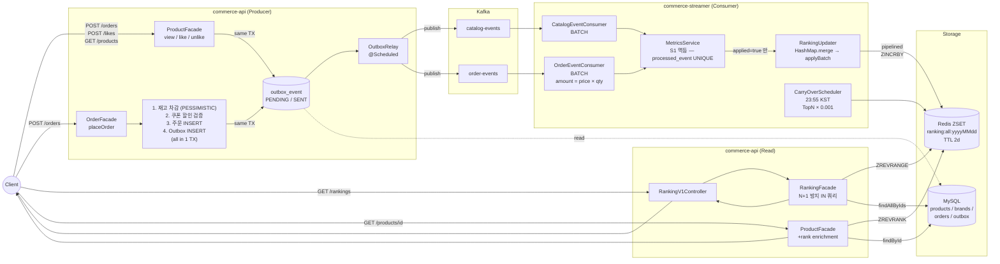
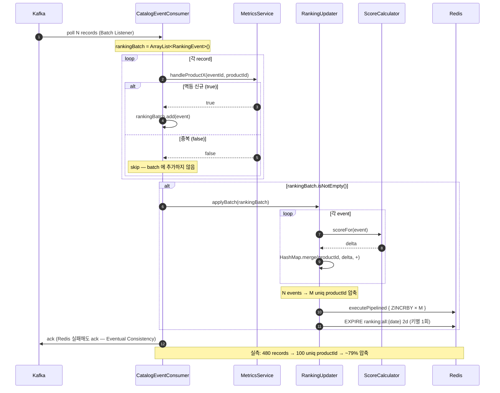
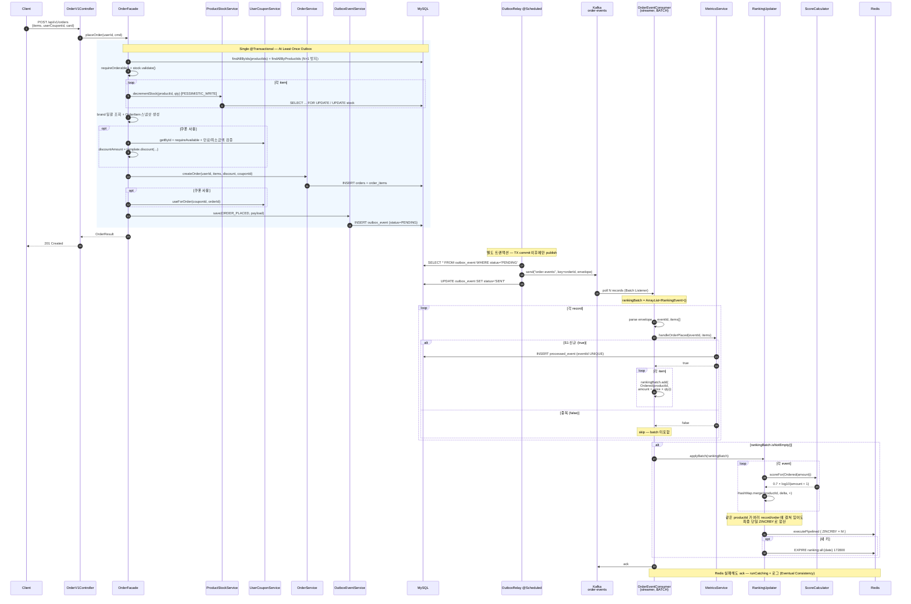
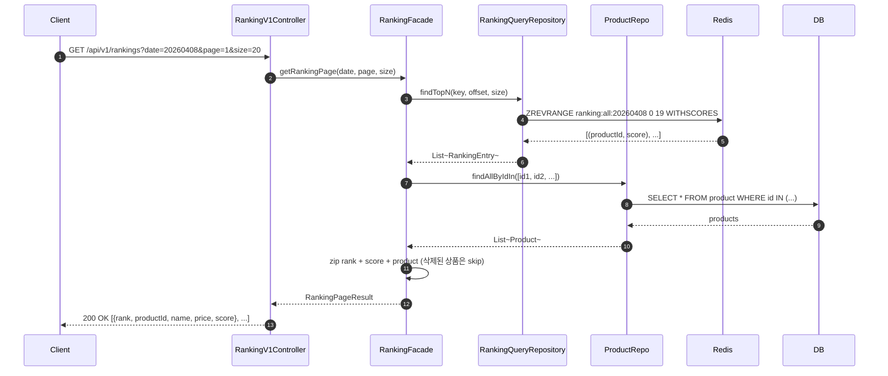
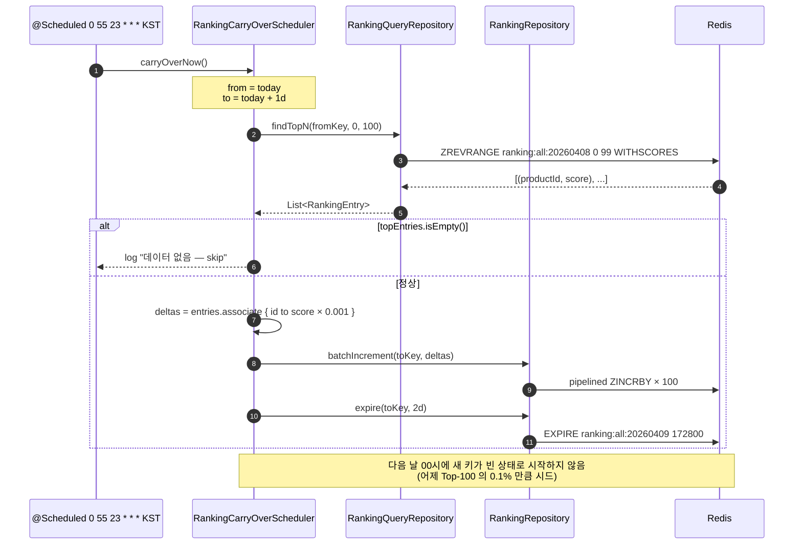
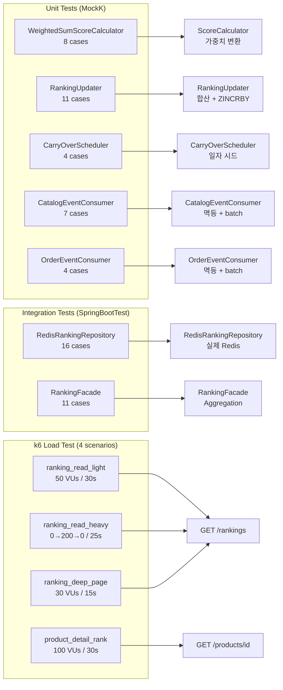
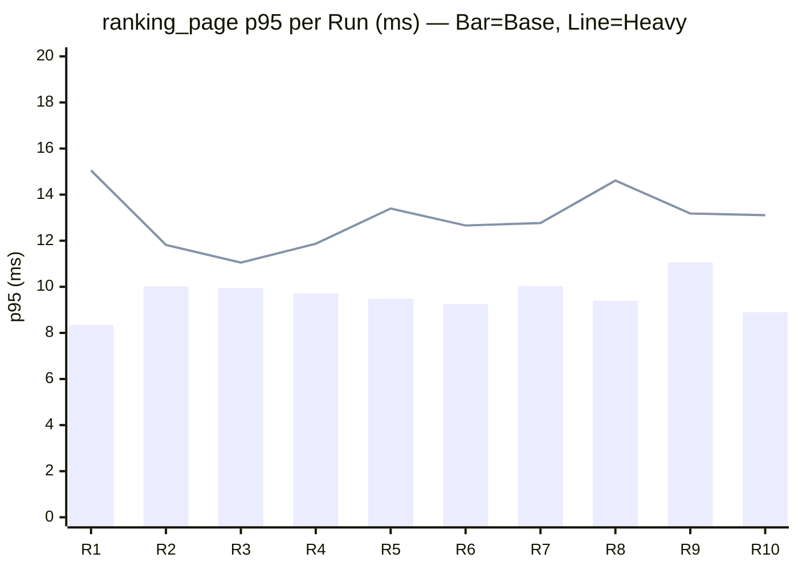
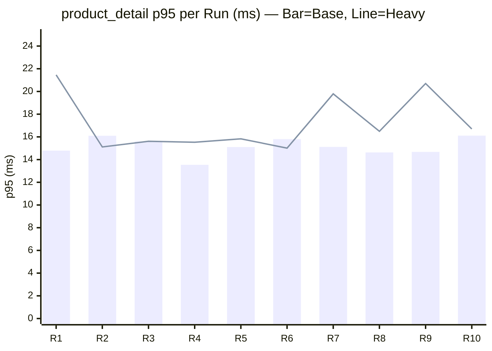
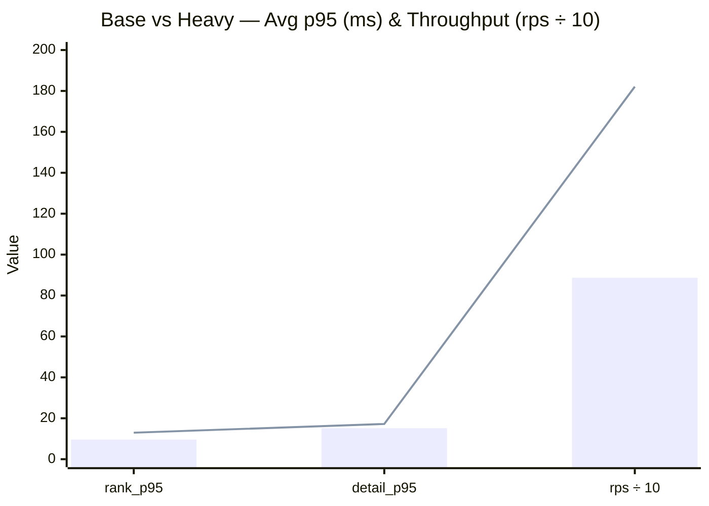
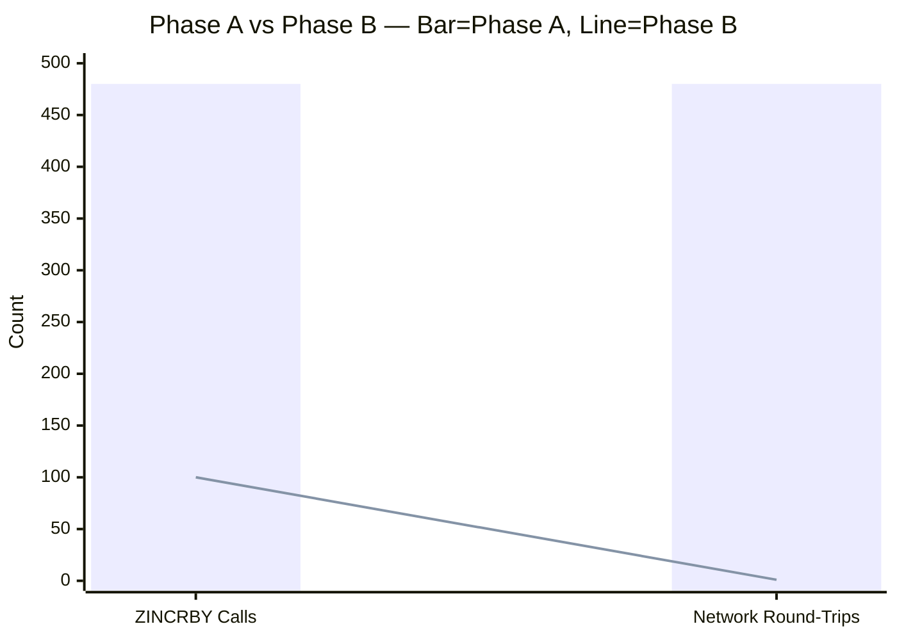

## 📌 Summary

- 배경: 상품 조회/좋아요/주문 이벤트를 기반으로 인기 상품의 순위를 실시간에 가깝게 제공해야 한다. RDB에서 `GROUP BY + ORDER BY` 집계는 이벤트 규모에 비례하여 읽기 비용이 증가하고, 트래픽이 몰릴 때 DB 부하가 급격히 올라간다.
- 목표: Redis Sorted Set(ZSET)에 이벤트 발생 시점에 가중치를 미리 반영(ZINCRBY)하여 **쓸 때 집계, 읽을 때 O(logN)** 의 랭킹 시스템을 구축한다. 대량 이벤트 시 단건 ZINCRBY 가 병목이 되지 않도록 **Batch Listener + 메모리 델타 합산 + Pipeline 일괄 반영(Phase B)** 구조를 확보한다.
- 결과:
  - Phase B 기준 k6 10회 반복 측정 — `ranking_page p95 = 9.62ms` (임계 500ms 대비 52× 여유), `product_detail p95 = 15.15ms` (임계 800ms 대비 53× 여유), 실패율 0%
  - Kafka 배치 480 records → 100 unique productId → **ZINCRBY 호출 79% 압축**, Pipeline 1 round-trip
  - 일별 키 + TTL 2일 + Carry-Over 스케줄러(23:55 KST) 로 자동 정리 + 콜드스타트 방지


## 🏗️ System Architecture



**범례**
- **producer side TX 보장**: OrderFacade 의 재고 차감 / 쿠폰 / 주문 INSERT / Outbox INSERT 가 단일 트랜잭션 → "결제는 성공했는데 이벤트는 누락" 케이스 차단
- **publish 는 별도 TX**: OutboxRelay 가 commit 된 row 만 Kafka 로 보냄 (At Least Once)
- **streamer side 멱등**: 같은 eventId 재전달은 `processed_event` UNIQUE 제약으로 막혀 ranking 에 중복 반영되지 않음
- **합산 압축**: 같은 productId 가 여러 주문/배치에 걸쳐 있어도 최종 ZINCRBY 1회 (N → M 압축)


## 🔁 System Flow

### Write Path — Phase B (실제 구현: Batch Listener + 인라인 합산)



### Order Flow — 주문 발행부터 ZSET 점수 반영까지 (상세)



### Read Path — 랭킹 페이지 조회



### Carry-Over Scheduler — 일자 롤오버 (콜드 스타트 완화)




## 🧭 Context & Decision

### 문제 정의
- 현재 동작/제약: 이벤트 기반 상품 인기 집계가 없어 인기 랭킹을 보여주려면 매번 RDB 에서 `GROUP BY + ORDER BY + JOIN` 을 수행해야 하며, 이벤트 볼륨이 커질수록 쿼리 비용이 선형 증가한다.
- 문제(또는 리스크): 이벤트 수십만 건 기반 집계를 매 조회마다 RDB 에서 수행하면 DB CPU/IO 가 랭킹 조회에 잠식되어 주문/결제 등 핵심 트랜잭션에 영향을 준다.
- 성공 기준(완료 정의):
  - 랭킹 조회 p95 < 500ms (Redis ZREVRANGE 기반)
  - 상품 상세에 현재 순위(rank) 정보 포함
  - 이벤트 중복 반영 차단 (멱등성)
  - Phase B: 대량 이벤트 시 Redis 호출 횟수를 record 수가 아니라 unique productId 수에 비례하도록 압축

### 선택지와 결정

#### ① 스코어링 전략: 쓰기 시 가중치 적용 vs 읽기 시 합산

- 고려한 대안:
    - A: ZSET 1개 — ZINCRBY 시 가중치가 곱해진 score 를 보냄 (쓰기 시 집계)
    - B: ZSET 3개 (view/like/order 분리) — 읽기 시 `ZUNIONSTORE` 로 합산
- 최종 결정: **A (쓰기 시 집계, ZSET 1개)**
- 트레이드오프: 가중치 변경 시 과거 데이터 재계산 불가 → "다음 일자 키부터 적용"으로 합의. 조회가 압도적으로 많은 커머스 워크로드에서는 읽기 O(logN) 을 유지하는 것이 합리적.
- 추후 개선 여지: 가중치 변경 빈도가 높아지면 B 로 전환 후 TTL 주기에 맞춰 `ZUNIONSTORE` 실행.

#### ② 이벤트 처리: Phase A (단건 ZINCRBY) → Phase B (배치 합산 + Pipeline)

- 고려한 대안:
    - A: Batch Listener 안에서 record 당 `incrementScore` (네트워크 왕복 N회)
    - B: `HashMap.merge` 로 productId 별 메모리 합산 후 `batchIncrement` (Pipeline 1회)
- 최종 결정: **A 로 정합성 확보 후 B 로 최적화** (단계적 도입)
- 트레이드오프: Phase B 는 `applyBatch` 호출이 실패하면 배치 전체가 Redis 미반영 → `runCatching` + Eventual Consistency 로 수용. 별도 `RankingDeltaBuffer` 클래스 없이 `HashMap.merge` 인라인으로 단순 유지 (YAGNI).
- 검증: Phase A 와 Phase B 의 ZSET 최종 스냅샷이 bit-for-bit 동일함을 `RedisRankingRepositoryTest` 에서 검증.

#### ③ 멱등성: 기존 EventHandledEntity 재활용

- `MetricsService.handleX()` 가 `processed_event` 테이블에 INSERT 시도 → UNIQUE 제약으로 중복 감지 → `false` 반환 시 ranking batch 에서 제외.
- Kafka At Least Once + DB UNIQUE = 멱등 보장.

#### ④ 일별 키 + TTL + Carry-Over

- 키: `ranking:all:{yyyyMMdd}` — 일 단위 파티셔닝
- TTL: 2일 (윈도우 1일 × 2배, 멘토 권장)
- 콜드스타트 방지: 23:55 KST 에 오늘 Top-100 × 0.001 을 내일 키에 시드 → 자정에 빈 ZSET 으로 시작하지 않음. 0.001 가중치라 오늘 이벤트 몇 건으로 쉽게 추월 가능.

#### ⑤ 가중치 설계

| 이벤트 | Weight | Score 식 | 근거 |
|---|---|---|---|
| view | 0.1 | `0.1 × 1` | 가장 약한 신호 (많이 발생) |
| like | 0.2 | `0.2 × 1` | 명시적 관심 표현 |
| unlike | -0.2 | `-0.2 × 1` | Liked 정확 역원 |
| order | 0.7 | `0.7 × ln(amount + 1)` | 강한 신호, `ln` 으로 고가 상품 독식 방지 |

- `@ConfigurationProperties("ranking.weights")` 로 외부화 → 무중단 변경 가능 (다음 일자 키부터 적용)


## 🏗️ Design Overview

### 변경 범위
- 영향 받는 모듈/도메인: `commerce-streamer` (쓰기), `commerce-api` (읽기 + rank 정보 노출)
- 신규 추가: ranking 도메인/인프라/인터페이스 전체
- 제거/대체: 없음 (신규 기능)

### 주요 컴포넌트 책임

**commerce-streamer (Write Path)**

| 컴포넌트 | 책임 |
|---|---|
| `RankingEvent` (sealed class) | Viewed / Liked / Unliked / Ordered — 이벤트 유형 모델링 |
| `ScoreCalculator` (fun interface) | Strategy 패턴 — 이벤트 → score delta 변환 |
| `WeightedSumScoreCalculator` | 기본 구현: view 0.1 / like 0.2 / order `0.7 × ln(amount+1)` |
| `RankingWeights` | `@ConfigurationProperties` — 가중치 외부화 |
| `RankingKeyPolicy` | 키 포맷(`ranking:all:{yyyyMMdd}`) + TTL(2일) |
| `RankingUpdater` | `applyEvent` (Phase A) / `applyBatch` (Phase B) — 메모리 합산 + batchIncrement |
| `RankingRepository` (interface) | Port: `incrementScore` / `batchIncrement` / `expire` |
| `RedisRankingRepository` | Adapter: master RedisTemplate + `executePipelined` |
| `RankingCarryOverScheduler` | `@Scheduled(cron="0 55 23 * * *")` — 오늘 TopN × 0.001 → 내일 키 시드 |
| `CatalogEventConsumer` | Kafka Batch Listener — view/like/unlike → ranking batch |
| `OrderEventConsumer` | Kafka Batch Listener — order items → `Ordered(amount=price×qty)` → ranking batch |

**commerce-api (Read Path)**

| 컴포넌트 | 책임 |
|---|---|
| `RankingQueryRepository` (interface) | Port: `findTopN` / `findRank` / `count` |
| `RedisRankingQueryRepository` | Adapter: replica preferred RedisTemplate |
| `RankingFacade` | ZREVRANGE productId 리스트 → `findAllByIds` 단일 IN 쿼리 → zip (N+1 방지) |
| `RankingV1Controller` | `GET /api/v1/rankings?date=&page=&size=` |
| `ProductFacade` (수정) | 상품 상세 조회 시 `ZREVRANK` 로 rank enrichment (Redis 실패 시 rank=null) |


### Redis Key 설계

| Key | Type | 용도 | TTL |
|---|---|---|---|
| `ranking:all:{yyyyMMdd}` | Sorted Set | 일간 상품 랭킹 (member=productId, score=가중치 합산) | 2일 |

```
[D-1 23:55]  CarryOver → batchIncrement(D키 TopN × 0.001 → D+1키)
[D 00:00]    이벤트 인입 시작 → ZINCRBY 누적
[D 24:00]    윈도우 종료 (키는 계속 살아 있음, 조회 가능)
[D+2 00:00]  TTL 만료 → 키 자동 삭제
```


## 🧪 Test Scenarios & Results

### 1. 시스템 설명 (System Description)
본 시스템은 Redis ZSET 을 활용한 실시간 상품 랭킹 파이프라인으로, Kafka 이벤트를 소비하여 가중치 기반 스코어를 ZINCRBY 로 누적하고, ZREVRANGE / ZREVRANK 로 조회한다. Phase B 에서는 메모리 합산 + Pipeline 으로 Redis 호출을 압축한다.

### 2. 테스트 가정 (Test Assumptions)
- **로컬 장비 사양**: MacBook Pro 14-inch (Apple M5 Pro, 48GB RAM)
- **인프라 구성**: Docker (MySQL 8, Redis master/replica, Kafka), commerce-api + commerce-streamer 로컬 JVM
- **데이터 세팅**: 100 products + ZSET 100 entries (random scores 1..1000), `PRODUCT_ID_MAX=100`
- **네트워크**: 로컬 루프백(localhost) 환경 테스트로 네트워크 지연은 최소화된 상태

### 3. Phase A / Phase B 란?

랭킹 시스템의 쓰기 경로는 두 단계로 진화했다. 테스트는 두 단계 모두를 커버한다.

**Phase A — 단건 ZINCRBY (초기 구현)**

Kafka Batch Listener 가 record 를 하나씩 순회하면서 **매 record 마다** Redis `ZINCRBY` 를 호출한다.

```
Kafka batch (N records)
  └ loop record 1..N
      └ ZINCRBY ranking:all:{date} delta productId   ← Redis 왕복 N 회
```

- 장점: 구현이 단순하고 정합성 검증이 쉬움
- 단점: record 수에 비례하여 Redis 네트워크 왕복이 늘어남 (N records = N round-trips)

**Phase B — 메모리 합산 + Pipeline (최적화)**

같은 배치 안에서 동일 `productId` 의 delta 를 **JVM 메모리에서 먼저 합산**(`HashMap.merge`) 한 뒤, unique productId 수만큼만 Redis `ZINCRBY` 를 **Pipeline 1회**로 묶어 보낸다.

```
Kafka batch (N records)
  └ HashMap.merge — productId 별 delta 합산
      └ executePipelined { ZINCRBY × M }   ← Redis 왕복 1 회 (M ≤ N)
```

- 장점: Redis 호출을 N → M 으로 압축 (실측 79%), Pipeline 으로 네트워크 왕복 1회
- 단점: 배치 단위 실패 시 전체 미반영 → `runCatching` + Eventual Consistency 로 수용

**정합성 보장**: Phase A 와 Phase B 에 동일 입력을 넣었을 때 ZSET 최종 스냅샷이 bit-for-bit 동일함을 `RedisRankingRepositoryTest` 에서 검증한다.

### 4. 테스트 범위 및 시나리오 (Testing Scope)

아래 다이어그램은 시스템 아키텍처 중 각 테스트가 집중적으로 검증한 지점을 나타냅니다.



### 5. 단위 테스트 상세

#### WeightedSumScoreCalculatorUnitTest (8 cases)
| # | 테스트 | 목적 | 검증 포인트 |
|---|---|---|---|
| 1 | Viewed → 0.1 | view 가중치 적용 | `scoreFor(Viewed) == 0.1` |
| 2 | Liked → 0.2 | like 가중치 적용 | `scoreFor(Liked) == 0.2` |
| 3 | Unliked → -0.2 | like 정확 역원 | `Liked + Unliked == 0.0` |
| 4 | Ordered → 0.7 × ln(amount+1) | order log 정규화 | 수식 일치 (Offset 1e-9) |
| 5 | log saturation | 고가 상품 독식 방지 | 금액 100배 → 점수 3배 미만 |
| 6 | 주문 1건 > 좋아요 3건 | 가중치 의도 검증 | `order(10000) > like × 3` |
| 7 | 조회 100건 > 좋아요 10건 | 볼륨 효과 경고 | view 대량 시 like 를 압도 가능 |
| 8 | 동적 가중치 교체 | Config 변경 반영 | 새 Weight 인스턴스 → 다른 점수 |

#### RankingUpdaterUnitTest (11 cases)

**applyEvent (Phase A) — 5 cases**

| # | 테스트 | 목적 |
|---|---|---|
| 1 | 오늘 일자 키에 delta 로 ZINCRBY 호출 | 기본 쓰기 경로 |
| 2 | 같은 키 여러 이벤트 → EXPIRE 1회만 | 불필요 호출 차단 (ConcurrentHashMap 캐시) |
| 3 | delta=0 → Redis 호출 생략 | 네트워크 낭비 방지 |
| 4 | Ordered 이벤트도 정상 ZINCRBY | 다른 이벤트 타입 커버 |
| 5 | 음수 delta (Unliked) 도 정상 반영 | 좋아요 취소 경로 |

**applyBatch (Phase B) — 6 cases**

| # | 테스트 | 목적 |
|---|---|---|
| 1 | 같은 productId 여러 이벤트 → 합산 후 단일 batchIncrement | 핵심: 메모리 합산 |
| 2 | 여러 productId 혼합 → 각각 합산 + 1회 호출 | multi-product batch |
| 3 | delta=0 인 이벤트는 합산에서 제외 | zero noise 차단 |
| 4 | 빈 리스트 → no-op | edge case |
| 5 | 모든 delta=0 → batchIncrement 미호출 | all-zero batch |
| 6 | Liked + Unliked = 0 도 batchIncrement 에 포함 | 합산 후 0 도 유효한 delta |

**일자 변경 — 1 case**

| # | 테스트 | 목적 |
|---|---|---|
| 1 | clock 다른 일자 → 새 키에 EXPIRE 재호출 | TTL 캐시 일자 격리 |

#### CatalogEventConsumerUnitTest (7 cases)
| # | 테스트 | 목적 |
|---|---|---|
| 1 | metrics true → batch 포함 | 정상 경로 |
| 2 | metrics false → batch 미포함 | S1 멱등성 (중복 skip) |
| 3 | 같은 eventId 2건 → 첫 번째만 batch | 멱등 재전달 시뮬레이션 |
| 4 | 여러 eventType 혼합 → 단일 batch flush | view + like + unlike 동시 |
| 5 | 같은 productId 여러 record → 모두 batch (합산은 Updater 책임) | 역할 분리 검증 |
| 6 | Redis 실패 → ack 호출 | Eventual Consistency |
| 7 | 알 수 없는 eventType → skip | unknown event 방어 |

#### OrderEventConsumerUnitTest (4 cases)
| # | 테스트 | 목적 |
|---|---|---|
| 1 | metrics true → items 가 `Ordered(amount=price×qty)` 로 batch | amount 변환 검증 |
| 2 | metrics false → batch 미포함 | S1 멱등성 |
| 3 | 여러 record 같은 productId → 모두 batch | multi-order 합산은 Updater 책임 |
| 4 | Redis 예외 → ack 호출 | Eventual Consistency |

#### RankingCarryOverSchedulerUnitTest (4 cases)
| # | 테스트 | 목적 |
|---|---|---|
| 1 | 오늘 TopN → 내일 키에 × 0.001 시드 | Carry-Over 기본 동작 |
| 2 | 빈 ZSET → batchIncrement/expire 미호출 | no-op 방어 |
| 3 | carry-over 가중치 충분히 작음 | Liked 6건으로 어제 1위 추월 가능 |
| 4 | 임의 날짜로 수동 carry-over 가능 | 운영 유틸리티 |

### 6. 통합 테스트 상세

#### RedisRankingRepositoryTest (16 cases, @SpringBootTest + 실제 Redis)

| 그룹 | cases | 핵심 검증 |
|---|---|---|
| incrementScore (단건 ZINCRBY) | 3 | 최초 생성, 누적, 음수 차감 |
| batchIncrement (Phase B Pipeline) | 4 | 다중 반영, 누적, 빈 맵 no-op, **Phase A vs B 동등성** |
| findTopN (ZREVRANGE) | 3 | 내림차순, 페이징, 빈 키 |
| findRank (ZREVRANK) | 2 | 순위 반환, 없는 멤버 null |
| expire (TTL) | 2 | 만료 후 키 삭제, 멱등 호출 |
| RankingKeyPolicy | 2 | 키 포맷, TTL = 2일 |

**특히 주목할 케이스 — Phase A vs B 동등성**:
```
같은 입력 (101L:0.1, 102L:0.2, 101L:0.3, 103L:1.0, 102L:0.1) 을
Phase A (5×incrementScore) 와 Phase B (groupBy 합산 → 1×batchIncrement) 로 각각 적용
→ 모든 productId 의 ZSCORE 가 Offset 1e-9 이내로 동일
```

#### RankingFacadeTest (11 cases, @SpringBootTest + 실제 Redis + MySQL)

| 그룹 | cases | 핵심 검증 |
|---|---|---|
| getRankingPage | 8 | 점수 내림차순 Aggregation, 페이징, 빈 ZSET, **삭제된 상품 skip**, date 포맷 검증, page/size 경계값 |
| findTodayRank | 2 | 0-based 순위, 없는 상품 null |
| 입력 검증 | 1 | 잘못된 date 포맷 → BAD_REQUEST |

### 7. k6 부하 테스트 결과 (Phase B, 10 runs)

#### 시나리오 구성

| 시나리오 | VUs | 기간 | 시작 | 엔드포인트 | 목적 |
|---|---|---|---|---|---|
| ranking_read_light | 50 (constant) | 30s | 0s | GET /rankings?page=1&size=20 | 기본 조회 부하 |
| product_detail_rank | 100 (constant) | 30s | 0s | GET /products/{id} | rank enrichment + 쓰기 구동 |
| ranking_read_heavy | 0→200→0 (ramping) | 25s | 35s | GET /rankings?page=1&size=20 | 조회 폭증 |
| ranking_deep_page | 30 (constant) | 15s | 65s | GET /rankings?page={1..5}&size=50 | deep pagination |

#### Threshold 설정

| Metric | 임계값 | 근거 |
|---|---|---|
| http_req_failed | rate < 5% | 기본 안정성 |
| ranking_page p(95) | < 500ms | Redis ZREVRANGE + DB IN 쿼리 기대치 |
| ranking_page p(99) | < 1000ms | 꼬리 지연 허용치 |
| product_detail p(95) | < 800ms | ZREVRANK + 상품 조회 |
| product_detail p(99) | < 1500ms | 꼬리 지연 허용치 |

#### 측정 결과 (10 runs)

| # | http_reqs/s | ranking_page p95 (ms) | product_detail p95 (ms) | http_req_failed |
|---|---:|---:|---:|---:|
| 1  | 889.5 | 8.34  | 14.79 | 0.00% |
| 2  | 885.4 | 10.02 | 16.10 | 0.00% |
| 3  | 888.1 | 9.95  | 15.60 | 0.00% |
| 4  | 887.4 | 9.72  | 13.54 | 0.00% |
| 5  | 887.8 | 9.49  | 15.10 | 0.00% |
| 6  | 886.3 | 9.25  | 15.80 | 0.00% |
| 7  | 886.4 | 10.03 | 15.12 | 0.00% |
| 8  | 888.0 | 9.39  | 14.63 | 0.00% |
| 9  | 887.4 | 11.06 | 14.68 | 0.00% |
| 10 | 888.1 | 8.90  | 16.11 | 0.00% |
| **avg** | **887.4** | **9.62** | **15.15** | **0.00%** |
| min | 885.4 | 8.34 | 13.54 | — |
| max | 889.5 | 11.06 | 16.11 | — |

### 8. k6 부하 테스트 결과 — Heavy (2× VUs, 10× 데이터, 10 runs)

**환경 변경점** (Base 대비):

| 항목 | Base | Heavy |
|---|---|---|
| products (DB) | 100 | **1,000** |
| ZSET entries | 100 | **1,028** |
| ranking_read_light VUs | 50 | **100** |
| product_detail_rank VUs | 100 | **200** |
| ranking_read_heavy peak | 200 | **400** |
| ranking_deep_page VUs | 30 (page 1..5) | **60 (page 1..10)** |
| 시나리오 총 시간 | ~80s | **~105s** |

#### 측정 결과 (Heavy, 10 runs)

| # | http_reqs/s | ranking_page p95 (ms) | product_detail p95 (ms) | http_req_failed |
|---|---:|---:|---:|---:|
| 1  | 1802.2 | 15.05 | 21.46 | 1.15% |
| 2  | 1826.8 | 11.82 | 15.11 | 1.19% |
| 3  | 1830.0 | 11.05 | 15.61 | 1.14% |
| 4  | 1825.3 | 11.87 | 15.53 | 1.17% |
| 5  | 1825.2 | 13.40 | 15.83 | 1.17% |
| 6  | 1826.6 | 12.66 | 15.01 | 1.17% |
| 7  | 1812.8 | 12.77 | 19.79 | 1.16% |
| 8  | 1813.4 | 14.61 | 16.49 | 1.18% |
| 9  | 1817.2 | 13.18 | 20.70 | 1.13% |
| 10 | 1825.4 | 13.11 | 16.70 | 1.11% |
| **avg** | **1820.5** | **12.95** | **17.22** | **~1.16%** |
| min | 1802.2 | 11.05 | 15.01 | — |
| max | 1830.0 | 15.05 | 21.46 | — |

> `http_req_failed ~1.1%` — product ID gap (auto_increment 1..1028 중 28개 결번) 으로 인한 404. 시스템 장애가 아닌 데이터 gap.

#### 판정

| 항목 | 임계값 | Base avg | Heavy avg | Heavy worst | 여유 배수 | 판정 |
|---|---|---|---|---|---|---|
| ranking_page p95 | < 500ms | 9.62ms | 12.95ms | 15.05ms | **~33×** | ✅ PASS |
| product_detail p95 | < 800ms | 15.15ms | 17.22ms | 21.46ms | **~37×** | ✅ PASS |
| http_req_failed | < 5% | 0.00% | ~1.16% | 1.19% | — | ✅ PASS |
| throughput (rps) | — | 887 | **1,820** | — | **2.05×** | ✅ |

### 9. 결과 시각화 — Base vs Heavy 비교

#### p95 Latency per Run (Base vs Heavy)



> **Bar** = Base (100 products, 350 max VUs) / **Line** = Heavy (1,000 products, 700 max VUs).
> Heavy 는 데이터 10× + VUs 2× 로 평균 +3.3ms 증가 — ZREVRANGE 의 O(logN+M) 특성에 부합.



> product_detail 은 Heavy R1 에서 21ms 까지 치솟지만 R2~R10 은 15~20ms 로 안정.
> R1 spike 는 JVM warmup + DB connection pool 초기화 영향.

#### Base vs Heavy — 평균 비교



> **Bar** = Base / **Line** = Heavy. VUs 2× + 데이터 10× 임에도 p95 증가폭은 30~35% 에 불과. 처리량은 887 → 1820 rps 로 **2.05× 선형 스케일링**.

#### Phase A vs Phase B — Redis 호출 압축 시각화



> **Bar** = Phase A (record 당 ZINCRBY 1회 = 480 calls, 480 round-trips).
> **Line** = Phase B (unique productId 합산 = 100 calls **79% 감소**, Pipeline = **1 round-trip**).

#### 종합 분석

| 관점 | 결론 |
|---|---|
| **수평 스케일링** | VUs 2× → rps 2× — 단일 JVM 내에서 선형 처리량 확보 |
| **데이터 스케일링** | 상품 100 → 1000 (10×) 에서 p95 +30% 증가 — ZSET O(logN) 특성 확인 |
| **임계 대비 여유** | Heavy worst case 에서도 33~37× 여유 — 운영 환경 진입 가능 수준 |
| **Phase B 효과** | 쓰기 경로가 read-heavy 부하의 p95 에 미치는 영향은 측정 오차 범위이나, write-heavy(메가 세일) 시나리오에서 Redis 호출을 N → M 으로 묶는 구조 자체가 핵심 산출물 |
