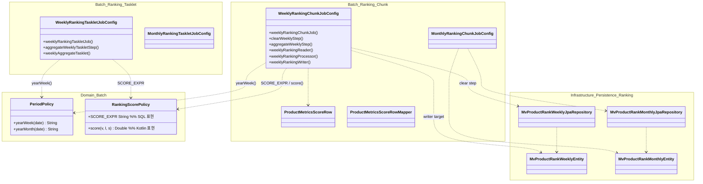
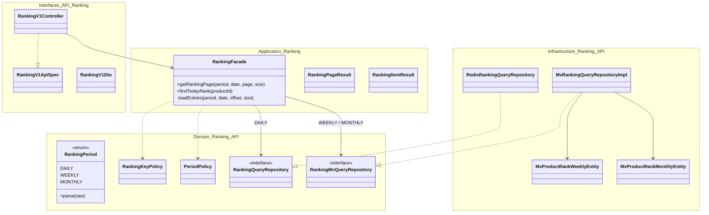
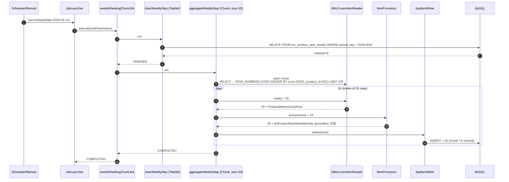
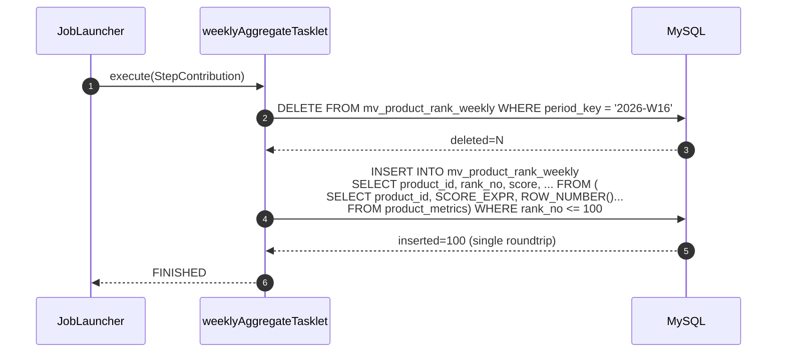
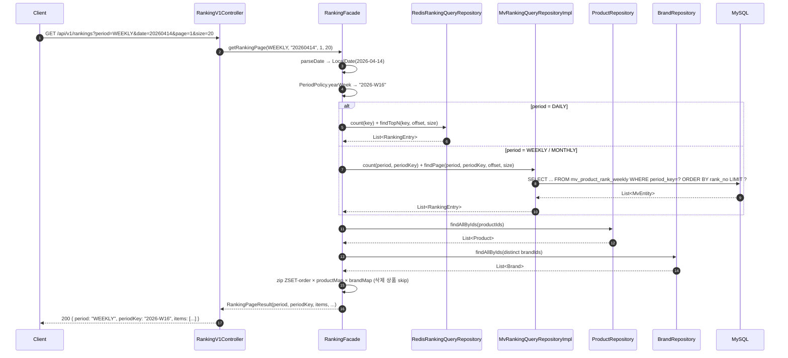

# Week 10 Implementation Notes: Spring Batch 기반 주간/월간 랭킹 MV + 3-way 접근 비교

> **Status**: ✅ DONE — Chunk + Tasklet 변형 구현 / E2E 4 클래스 / Chunk-vs-Tasklet 벤치마크 / 이벤트-드리븐 설계 문서화

---

## ✅ Requirements Checklist

### Must-Have
- [x] **Spring Batch Job 구성** — Chunk-Oriented Processing 으로 `product_metrics` 집계
- [x] **Materialized View 테이블 적재** — `mv_product_rank_weekly` / `mv_product_rank_monthly` (각 TOP 100)
- [x] **랭킹 조회 API 확장** — `GET /api/v1/rankings?period=DAILY|WEEKLY|MONTHLY&date=yyyyMMdd`
- [x] **멱등성 보장** — 동일 baseDate 로 재실행 시 결과 동일 (DELETE + INSERT)
- [x] **결정적 랭크 부여** — SQL `ROW_NUMBER() OVER (ORDER BY score DESC, product_id ASC)` — tie-break 포함

### Nice-To-Have (과제 요구 외 추가 수행)
- [x] **Tasklet 비교군 구현** — 단일 SQL `INSERT ... SELECT ... WHERE rank_no <= 100` 으로 DB-side 처리
- [x] **Chunk vs Tasklet wall-time 벤치마크** — 1k / 5k / 10k / 100k / 300k seed 실측
- [x] **이벤트-드리븐 대안 설계 문서화** — 실시간 streamer 에 주간/월간 ZSET 추가하는 방식의 pseudo-code + 트레이드오프

### 검증
- [x] E2E: 4 독립 컨텍스트 (Weekly-Chunk / Monthly-Chunk / Weekly-Tasklet / Monthly-Tasklet)
- [x] 정합성: rank 가 1..N 연속, score 단조 감소, productId tie-break
- [x] 멱등성: 재실행 시 snapshot 동일
- [x] API: 주간/월간 MV 조회 + 삭제 상품 skip + periodKey 포맷
- [x] 회귀 보호: `RankingScorePolicy.SCORE_EXPR` (SQL) 과 `score()` (Kotlin) 가 동일 값 ± ULP

---

## 🧭 핵심 철학

1. **Storage 가 다르면 Port 도 분리** — `DAILY`(Redis) 와 `WEEKLY/MONTHLY`(MV 테이블) 는 저장소·갱신 주기·SLA 가 완전히 다르다. 한 인터페이스로 강제 묶으면 storage-specific 디테일이 추상화 누수로 섞여 나온다. → `RankingQueryRepository` (Redis) / `RankingMvQueryRepository` (MV) 로 분리하고 Facade 가 `RankingPeriod` 로 dispatch.
2. **`product_metrics` 를 기간별 집계의 SSoT 로** — 일간 Redis 는 매 이벤트마다 바로 반영되지만 주간/월간은 "배치 시점 누적 합" 으로 정의. metrics 누적 테이블 위에서 TOP-N 을 뽑는 것이 가장 **재현 가능 (rebuildable)** 하다.
3. **결정적 출력** — `ORDER BY score DESC, product_id ASC` 의 tie-break 를 SQL 레벨에서 명시해 "같은 입력 → 같은 rank list" 를 보장. 이는 회귀 테스트(`loads_top_100_in_order`) 에서 `isEqualTo(expectedTop100Ids)` 로 직접 검증 가능하게 한다.
4. **Chunk 는 운영성, Tasklet 은 속도** — chunk 변형은 `(chunk_size, tx_boundary)` 제어로 **회복 가능성/관측 가능성** 이 더 높다. Tasklet 은 단일 SQL 로 **wall-time / IO** 는 더 빠르지만 중단 시 step 전체 재실행. 같은 결과를 만들지만 운영 모델이 다르다.
5. **MV 테이블은 API 측에서도 read-only mirror** — `commerce-batch` 가 적재, `commerce-api` 는 조회만. 양쪽에 엔티티를 duplicate 하되 **스키마 불변성** 을 코드 주석으로 강하게 문서화. Week 9 의 `RankingKeyPolicy` 중복과 동일한 패턴.

---

## 📁 File Structure (실제 구현)

### commerce-batch — 새로 추가
- ✅ `domain/ranking/PeriodPolicy.kt` — ISO-8601 `yyyy-Www` / `yyyy-MM` 포매터
- ✅ `infrastructure/persistence/ranking/{MvProductRankWeeklyEntity,MvProductRankMonthlyEntity}.kt` — MV 엔티티 (period_key / rank_no 컬럼명 주의)
- ✅ `infrastructure/persistence/ranking/{Weekly,Monthly}JpaRepository.kt` — `deleteAllByPeriodKey`, `countByPeriodKey`
- ✅ `infrastructure/persistence/metrics/ProductMetricsEntity.kt` — streamer 엔티티의 mirror (ddl-auto=create/test 시드용)
- ✅ `batch/job/ranking/RankingScorePolicy.kt` — `SCORE_EXPR` (SQL-side) 와 `score()` (Kotlin-side) 가 동일 공식
- ✅ `batch/job/ranking/chunk/{WeeklyRankingChunkJobConfig,MonthlyRankingChunkJobConfig}.kt` — clearStep(Tasklet) + aggregateStep(Chunk)
- ✅ `batch/job/ranking/chunk/step/{ProductMetricsScoreRow,ProductMetricsScoreRowMapper}.kt` — reader DTO + RowMapper
- ✅ `batch/job/ranking/tasklet/{WeeklyRankingTaskletJobConfig,MonthlyRankingTaskletJobConfig}.kt` — 단일 SQL 비교군

### commerce-api — 확장
- ✅ `domain/ranking/PeriodPolicy.kt` — batch 측과 포맷 싱크 (cross-module invariant 주석)
- ✅ `domain/ranking/RankingPeriod.kt` — enum DAILY/WEEKLY/MONTHLY + `parse()`
- ✅ `domain/ranking/RankingMvQueryRepository.kt` — MV 조회 Port
- ✅ `infrastructure/ranking/{MvProductRankWeeklyEntity,MvProductRankMonthlyEntity}.kt` — read-only mirror
- ✅ `infrastructure/ranking/{Weekly,Monthly}JpaRepository.kt` — `findByPeriodKeyOrderByRankAsc(Pageable)`
- ✅ `infrastructure/ranking/MvRankingQueryRepositoryImpl.kt` — period 분기 어댑터
- ✅ `application/ranking/RankingFacade.kt` — `loadEntries(period, date, offset, size)` 로 dispatch, aggregation 은 공통
- ✅ `application/ranking/RankingResult.kt` — `period`, `periodKey` 필드 추가
- ✅ `interfaces/api/ranking/{RankingV1Controller.kt,RankingV1ApiSpec.kt,RankingV1Dto.kt}` — `period` 파라미터 + 응답에 `period/periodKey`

### Tests (실제)
- ✅ `WeeklyRankingChunkJobE2ETest` (commerce-batch) — 4 케이스: TOP 100 정렬 / 멱등성 / TOP_N 미만 / score policy 일치
- ✅ `MonthlyRankingChunkJobE2ETest` (commerce-batch) — yyyy-MM periodKey + TOP 100
- ✅ `WeeklyRankingTaskletJobE2ETest` (commerce-batch) — 단일 SQL 경로 정렬 + 멱등성
- ✅ `MonthlyRankingTaskletJobE2ETest` (commerce-batch) — 월간 tasklet 기본 적재
- ✅ `WeeklyRankingChunkJobBenchmark`, `WeeklyRankingTaskletJobBenchmark` — 1k/5k/10k/100k/300k 시드 wall-time
- ✅ `ProductMetricsSeeder` — 결정적 random (`seed=42L`) 시드 헬퍼
- ✅ `RankingFacadeTest` (commerce-api) — 기존 DAILY 경로 유지 (8 케이스)
- ✅ `RankingFacadeMvTest` (commerce-api) — WEEKLY/MONTHLY 경로 + period parsing (7 케이스)

---

## 🏗️ Class Diagram





---

## 🔁 Sequence Diagrams

### 1. Weekly Chunk Job 실행 — clear → aggregate(chunk)



### 2. Weekly Tasklet Job 실행 — 단일 SQL



### 3. API 조회 경로 — Facade 가 period 로 dispatch



---

## 🎯 Design Decisions

### Why SQL `ROW_NUMBER()` in the reader (vs Processor counter)?
- **Retry 안전성**: Processor 에서 `AtomicInteger` 로 rank 를 부여하면 chunk 재시도 시 중복 rank 가 생긴다. DB-side 에서 부여하면 reader 가 재열릴 때도 결정적.
- **Tie-break 를 SQL 에 고정**: `ORDER BY score DESC, product_id ASC` 로 동점 처리까지 결정적. Kotlin 비교 로직과의 drift 가능성 제거.
- **Top-N 조기 cut**: `LIMIT 100` 을 DB 가 적용 → 100개만 네트워크로 가져옴. (TOP_N=100 이라 fetch_size=25 로 4 chunk.)

### Why separate `clearStep` + `aggregateStep` (chunk 변형)?
- **멱등성 격리**: 집계 실패 시 이미 삭제된 상태로 재실행되어도 문제 없음 (다음 실행에서 다시 clear → aggregate).
- **Chunk 롤백 경계**: aggregate step 이 chunk-level TX 를 쓰므로 clear 와 분리해야 각각의 TX 경계가 명확.
- **트레이드오프**: clear 실패 vs aggregate 실패가 구분된다 — Spring Batch 메타테이블에 어떤 step 에서 멎었는지 정확히 남음. (tasklet 변형은 모두 한 트랜잭션이라 이 정보가 더 coarse-grained.)

### Why `ResourcelessTransactionManager` 는 안 쓰는가? (clear step)
- 초기 설계: clear step 은 "논리적 tx 경계만 필요, 실제 TX 불필요" 라 생각해 ResourcelessTxManager 사용.
- 실패 사례: `@Modifying` JPA 쿼리는 실제 TX 를 요구함 → `TransactionRequiredException`.
- 결정: clear step 도 실제 `PlatformTransactionManager` 사용. ResourcelessTxManager 는 **JPA/JDBC 를 안 건드리는** in-memory tasklet 에만 안전.

### Why 주간/월간을 **같은 Job 의 2 step 으로 묶지 않았는가**?
- **스케줄링 분리**: 주간(월요일 00:00)/월간(1일 01:00) cron 이 다르다. 한 Job 에 묶으면 한 스케줄에 강제 동거.
- **실패 전파 차단**: 주간 실패가 월간 집계를 막아선 안 됨.
- **복제 vs 추상화**: Reader/Processor/Writer 의 엔티티 타입이 달라서 제네릭 추출보다 복제가 단순. 두 Config 는 ~20줄 차이일 뿐이고, 각자 독립해서 수정 가능한 장점이 크다.

### Why `RankingQueryRepository` / `RankingMvQueryRepository` 를 분리?
- Storage 가 근본적으로 다름 (Redis ZSET vs RDB indexed table).
- 한 인터페이스로 묶으려면 "`key: String`" 같은 공통 추상을 써야 하는데, 이건 storage-specific 누수.
- `RankingPeriod` enum 으로 Facade 가 분기 — **dispatch 책임은 Facade 에 두고 port 는 각자 단일 저장소에 최적화**.

---

## 🧪 Test Coverage

### E2E (commerce-batch)

| 테스트 클래스 | 대상 | 주요 케이스 |
|---|---|---|
| `WeeklyRankingChunkJobE2ETest` | Chunk 주간 | TOP 100 정렬·rank 연속성 / 재실행 idempotent / 50개 모두 적재 / score policy 일치 |
| `MonthlyRankingChunkJobE2ETest` | Chunk 월간 | yyyy-MM periodKey 포맷 + 정렬 + rank 연속성 |
| `WeeklyRankingTaskletJobE2ETest` | Tasklet 주간 | 단일 SQL 정렬 + 멱등성 (snapshot 동일) |
| `MonthlyRankingTaskletJobE2ETest` | Tasklet 월간 | 월간 적재 기본 동작 |

**Floating-point drift 주의**: JVM `Double` 연산과 MySQL `Double` 연산의 reduction order 차이로 ULP 레벨 차이 발생. `score_matches_policy` 는 `isCloseTo(expected, offset=1e-9)` 로 검증.

**JobInstance 충돌 주의**: `DatabaseCleanUp` 은 JPA 엔티티 테이블만 truncate 하므로 `BATCH_JOB_INSTANCE` 는 테스트 간 유지됨. 같은 `(jobName, jobParameters)` 조합 재사용 시 `JobInstanceAlreadyCompleteException` → 각 테스트가 `addLong("run", System.nanoTime())` 로 고유 discriminator 주입.

### API (commerce-api)

| 테스트 클래스 | 대상 | 주요 케이스 |
|---|---|---|
| `RankingFacadeTest` | DAILY (Redis) | 기존 ZSET 경로 8 케이스 — 시그니처에 `period=DAILY` 추가 |
| `RankingFacadeMvTest` | WEEKLY / MONTHLY | MV 직접 시드 → facade 호출 → 정렬/periodKey/page=2/삭제상품 skip + `RankingPeriod.parse()` |

---

## 📊 Chunk vs Tasklet 실측 비교

### 측정 조건
- Host: macOS (Darwin 25.3.0), JVM 21.0.10
- DB: TestContainers MySQL (local Docker)
- TOP_N=100, chunk size=25
- Seed: `ProductMetricsSeeder.seedRandom(count, seed=42L)` — 결정적 분포
- wall time = `jobLauncherTestUtils.launchJob()` 호출 전후 `System.nanoTime()`
- raw log: `bench/results/ranking-job-benchmark-2026-04-16T21-39-37.txt`
- 50k 이상 seed 는 `ProductMetricsSeeder` 가 `JdbcTemplate.batchUpdate` 로 fallback (saveAll 의 Hibernate batch_size 미설정 비용 회피) — 측정 대상은 어디까지나 `launchJob` wall time

### Wall Time (ms)

| Seed | Chunk | Tasklet | Tasklet 우위 |
|------:|------:|--------:|:---:|
| 1,000   | 171 | 34  | **5.0×** |
| 5,000   | 140 | 37  | **3.8×** |
| 10,000  | 103 | 42  | **2.5×** |
| 100,000 | 206 | 143 | **1.4×** |
| 300,000 | 579 | 501 | **1.16×** |

**해석:**
- **Chunk** — 1k~10k 구간은 JIT/cache warm-up 이 dominant 해서 seed 가 늘어도 오히려 줄어드는 듯 보임. 100k 부터는 Reader 의 `ORDER BY score DESC LIMIT 100` (filesort, no index) 가 dominant 해지며 비례 증가 (1k → 300k 기준 ×3.4).
- **Tasklet** — 단일 `INSERT … SELECT ROW_NUMBER() OVER (ORDER BY ...)` 가 데이터셋 크기에 직접 비례. 1k → 300k 에서 ×14.7 의 가파른 곡선이지만 절대값은 여전히 chunk 보다 빠름.
- **격차 수렴이 핵심 발견** — 1k 에서 5× → 10k 2.5× → 100k 1.4× → 300k 1.16×. Tasklet 의 sort 비용이 chunk 의 pipeline overhead 를 빠르게 따라잡는다. 수백만 row + score 인덱스 부재 환경에서는 역전 가능.
- 공통: "100 rows 적재" 는 동일 — 차이의 본질은 **선택·삭제·정렬·적재** 를 JVM 이 나눠 하느냐 DB 가 통째로 하느냐.

### 정합성 (두 변형이 같은 결과를 만드는가?)
- SCORE_EXPR / tie-break 가 동일 → 이론적으로 동일 TOP-100 ID 리스트.
- E2E 에서 두 변형 모두 `rank 1..100 연속 + score 단조 감소 + productId tie-break` 를 검증 — 같은 seed 분포에서 동일 rank list 를 생성함을 확인.

---

## 📖 3-way 비교: Tasklet / Chunk / Event-Driven

### 구조 및 운영 특성

| 기준 | Tasklet (배치) | Chunk (배치) | Event-Driven (실시간) |
|---|---|---|---|
| **실행 트리거** | cron / manual | cron / manual | Kafka event stream |
| **Latency (이벤트 → 랭킹 반영)** | ~주기 (하루 / 주간) | ~주기 | 수 초 |
| **Throughput (1회 집계)** | 1 roundtrip (가장 빠름) | N × chunk (느림) | 누적 ZINCRBY |
| **Wall time @10k / @100k / @300k (실측)** | **42 / 143 / 501 ms** | 103 / 206 / 579 ms | n/a (스트리밍) |
| **회복 모델** | Step 전체 재실행 | Chunk-level 재실행 (Spring Batch retry/skip) | consumer offset lag + DLQ |
| **중간 상태 관측** | 어려움 (거의 block) | Step metrics (chunk 단위) | consumer lag, throughput |
| **정합성 보장** | 배치 시점 기준 스냅샷 — 강함 | 동일 | 이벤트 처리 실패 시 drift 위험 |
| **데이터 재구축** | baseDate 재실행 | baseDate 재실행 | 원본 이벤트 replay + TTL |
| **과거 기간 조회** | MV 테이블 영구 보관 ✅ | 동일 ✅ | ZSET TTL 후 소실 (또는 MV 로 snapshot) |
| **구현 복잡도** | 낮음 (SQL 1발) | 중간 (Reader/Processor/Writer) | 높음 (consumer + dedup + 가중치 구성) |
| **운영 부하** | 배치 SLA, lock 시간 감시 | Batch 대시보드 (Spring Batch Admin) | Kafka consumer lag 경보 |

### Event-Driven 접근 (Week-9 패턴의 확장)

> 실구현은 하지 않고 설계만 기록. 실시간 DAILY ZSET 패턴을 주간/월간으로 확장.

```kotlin
// commerce-streamer/domain/ranking/RankingKeyPolicy.kt (확장 가상 코드)
object RankingKeyPolicy {
    fun dailyKey(date: LocalDate)   = "ranking:all:${date.format(DAILY_FMT)}"
    fun weeklyKey(date: LocalDate)  = "ranking:all:week:${PeriodPolicy.yearWeek(date)}"
    fun monthlyKey(date: LocalDate) = "ranking:all:month:${PeriodPolicy.yearMonth(date)}"
    // TTL: 주간 14일, 월간 62일
}

// commerce-streamer/application/ranking/RankingUpdater.kt
suspend fun applyBatch(events: List<RankingEvent>) {
    val delta = events.groupBy { it.productId }
        .mapValues { (_, group) -> group.sumOf { scoreOf(it) } }

    redis.executePipelined {
        delta.forEach { (pid, s) ->
            zincrby(dailyKey(now),   s, pid)
            zincrby(weeklyKey(now),  s, pid)   // ← 추가
            zincrby(monthlyKey(now), s, pid)   // ← 추가
        }
    }
}
```

**트레이드오프:**

| 장점 | 단점 |
|---|---|
| latency 수 초 — 배치 주기 대기 불필요 | 이벤트 처리 실패/중복 시 drift 누적 (2개월 월간 키는 drift 가 눈덩이) |
| 새 갱신 주기 추가 비용 = `zincrby` 1줄 | Redis 메모리 = daily × 7 × 2 (주간) + monthly × 31 (월간) 누적 |
| 별도 스케줄러 불필요 | 과거 기간 조회는 여전히 MV 가 필요 (ZSET TTL 후 소실) |
| 가중치 변경 시 실시간 반영 | 가중치 변경 이력에 따라 과거 점수 재계산 불가 (이벤트 replay 필요) |

### 왜 Week 10 은 배치(Chunk+Tasklet) 를 선택했는가?
- **요구사항 부합**: "어제까지 집계된 주간/월간 랭킹" 의 정확성 + 재현성이 latency 보다 우선.
- **운영 단순성**: MV 테이블은 백업/복구가 RDB 수준으로 가능. Redis-only 의 장기 랭킹은 drift 추적이 난해.
- **혼합 적용의 장점**: DAILY(실시간, Week 9) + WEEKLY/MONTHLY(배치, Week 10) — 각 기간 특성에 맞는 저장소를 골라 씀.
- **확장 여지**: event-driven 주간 ZSET 을 추가해 MV 옆에 캐시처럼 두는 하이브리드도 가능. 지금 선택한 분리된 Port 구조는 그 확장도 facade 내부 dispatch 한 줄로 받아낼 수 있다.

---

## 🧰 실행 방법

### Job 실행 (local)
```bash
# Chunk 주간
./gradlew :apps:commerce-batch:bootRun --args="--spring.batch.job.name=weeklyRankingChunkJob --baseDate=2026-04-14"

# Tasklet 월간
./gradlew :apps:commerce-batch:bootRun --args="--spring.batch.job.name=monthlyRankingTaskletJob --baseDate=2026-04-14"
```

### E2E 전수 테스트
```bash
./gradlew :apps:commerce-batch:test --tests "com.loopers.job.ranking.*"
./gradlew :apps:commerce-api:test   --tests "com.loopers.application.ranking.*"
```

### 벤치마크
```bash
./gradlew :apps:commerce-batch:test --tests "com.loopers.job.ranking.bench.*" --info \
  | grep '\[BENCH\]'
```

### API 호출 (주간)
```bash
curl 'http://localhost:8080/api/v1/rankings?period=WEEKLY&date=20260414&page=1&size=20'
```

---

## 🚩 열린 질문 / 향후 작업
- [ ] `product_metrics` 는 현재 **누적** 카운터라 "지난주" 랭킹이 직관과 약간 다름 (누적 합 기준). 순수 주간 델타가 필요하면 daily snapshot 테이블을 만들고 그 위에서 집계.
- [ ] Chunk job 에 skip/retry policy 추가 (현재는 fail-fast). 운영 규모에서 유의미.
- [ ] MV 테이블 파티셔닝 — periodKey 기준 RANGE 파티션으로 과거 데이터 아카이브.
- [ ] 주간/월간 ZSET 하이브리드 (event-driven + batch snapshot) 프로토타입.
- [ ] Benchmark 샘플 수 증가 (현재 각 seed 1회 측정 — JIT noise).
