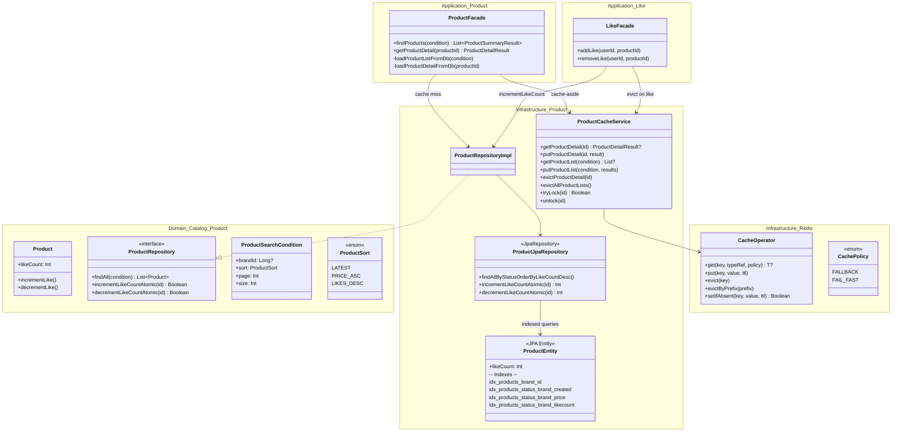
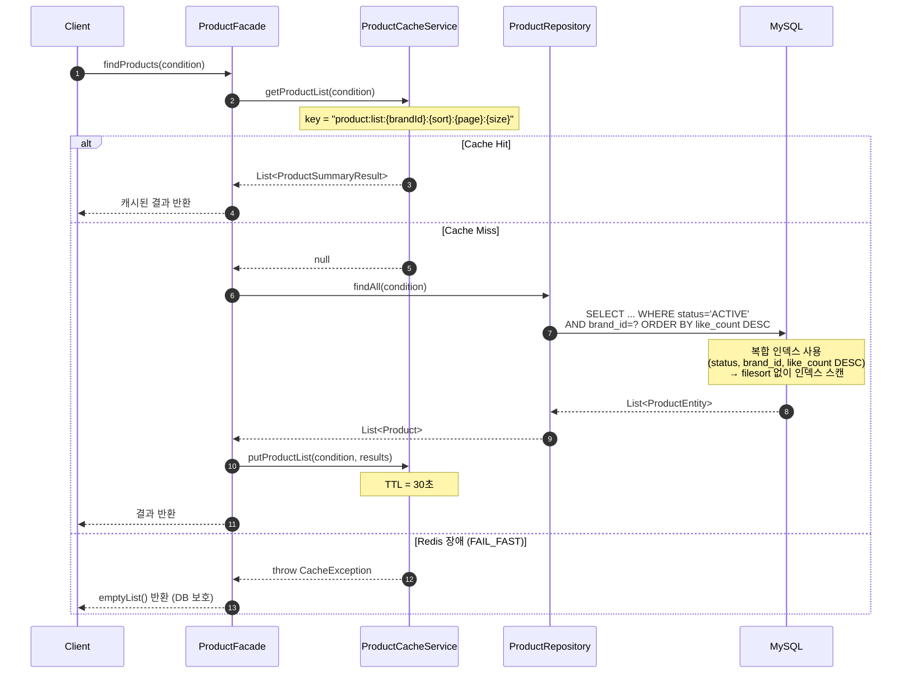
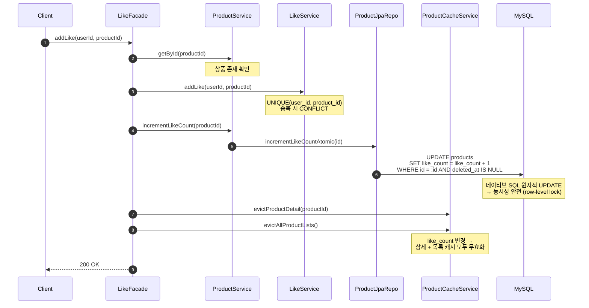
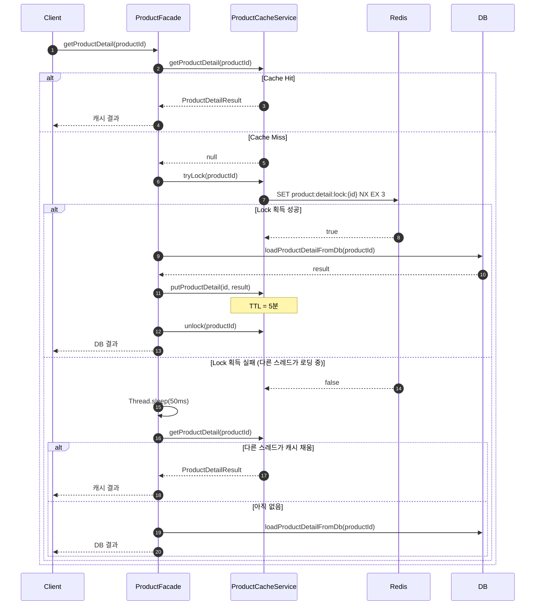
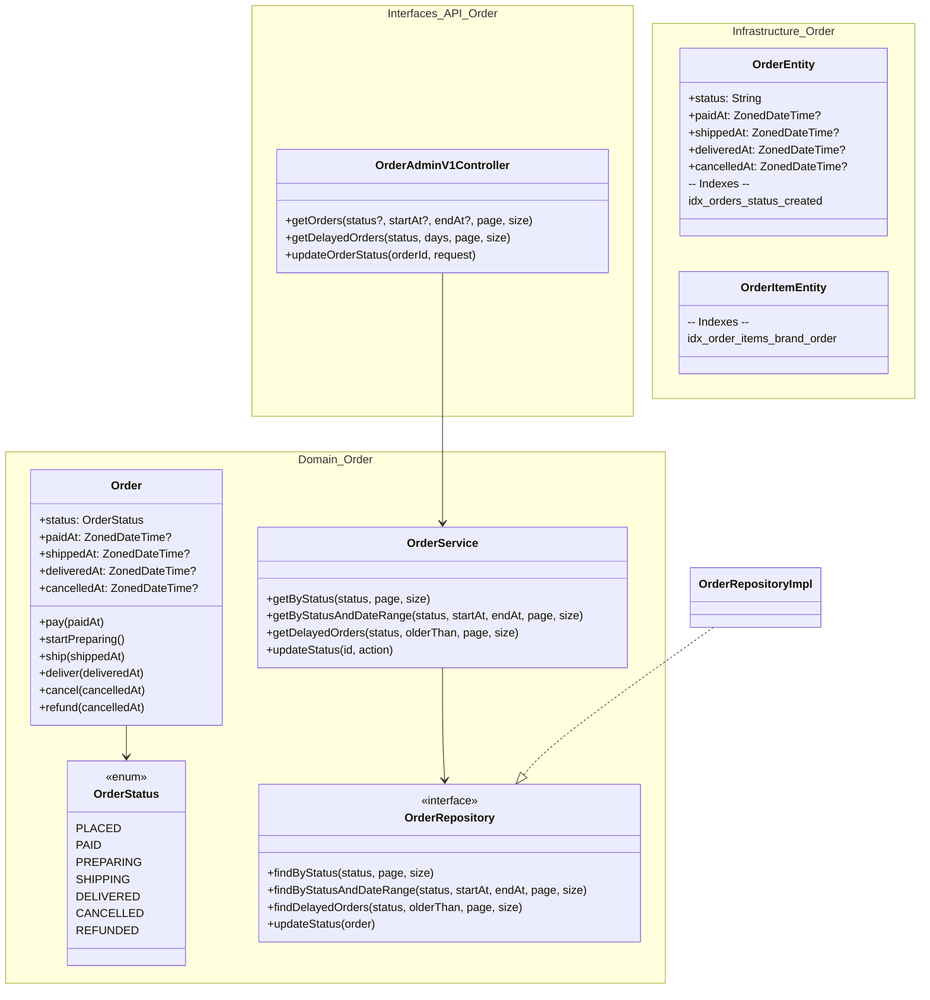
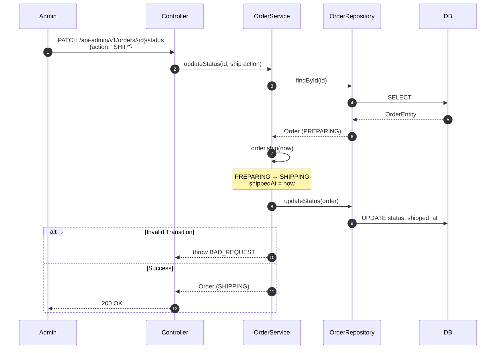

# Week 5 Implementation Notes

## ✅ Requirements Checklist

### 🔖 Index — 읽기 성능 최적화
- [x] 상품 목록 API에서 brandId 기반 검색, 좋아요 순 정렬 등을 처리했다
- [x] 조회 필터, 정렬 조건별 유즈케이스를 분석하여 인덱스를 적용하고 전후 성능비교를 진행했다

### ⚡ Cache — Redis 캐시 적용
- [x] Redis 캐시를 적용하고 TTL 또는 무효화 전략을 적용했다
- [x] 캐시 미스 상황에서도 서비스가 정상 동작하도록 처리했다

### ❤️ Structure — 좋아요 비정규화
- [x] 상품 목록/상세 조회 시 좋아요 수를 조회 및 좋아요 순 정렬이 가능하도록 구조 개선을 진행했다
- [x] 좋아요 적용/해제 진행 시 상품 좋아요 수 또한 정상적으로 동기화되도록 진행하였다

### 📦 Order Admin — 어드민 주문 조회 + 인덱스 최적화
- [x] 판매자/어드민 기준 주문 조회 쿼리 리스트업
- [x] OrderStatus + 주문 생명주기 타임스탬프 도메인 모델 추가
- [x] 어드민 주문 조회 API (상태별, 기간별, 지연주문, 브랜드별)
- [x] 주문 상태 변경 API (PAY, PREPARE, SHIP, DELIVER, CANCEL, REFUND)
- [x] 인덱스 최적화 (`idx_orders_status_created`, `idx_order_items_brand_order`)
- [x] DataSeedRunner 주문 상태 분포 반영 + IndexBenchmarkTest 어드민 쿼리 추가
- [x] 주문 상태 전이 단위 테스트 (valid/invalid transitions)

---

## 📁 File Structure

### ① Index — DB 인덱스 최적화
```
infrastructure/catalog/product/
  ProductEntity.kt       — 단일 인덱스 4개 + 복합 인덱스 3개 선언
  ProductJpaRepository.kt — status + brandId 필터 + sort 별 JPQL 쿼리 3종

config/
  db_index.md            — B-Tree 인덱스 내부 동작 + 설계 근거 문서
```

### ② Cache — Redis 캐시 적용
```
modules/redis/
  config/redis/
    CacheOperator.kt     — Redis 연산 추상화 (get/put/evict/lock)
    CachePolicy.kt       — FALLBACK (graceful) / FAIL_FAST (DB 보호)
    CacheException.kt    — FAIL_FAST 시 throw 되는 예외
    RedisConfig.kt       — Master-Replica Lettuce 설정
    RedisProperties.kt   — datasource.redis 프로퍼티 매핑

infrastructure/catalog/product/
  ProductCacheService.kt — 상품 상세/목록 캐시 + 분산 락

infrastructure/catalog/brand/
  BrandCacheService.kt   — 브랜드 상세/목록 캐시
```

### ③ Structure — 좋아요 수 비정규화
```
domain/catalog/product/
  Product.kt             — likeCount 필드 (비정규화, 0 이상)
                           incrementLike() / decrementLike() 도메인 메서드

infrastructure/catalog/product/
  ProductJpaRepository.kt — incrementLikeCountAtomic() / decrementLikeCountAtomic()
                            네이티브 SQL 원자적 UPDATE

domain/catalog/product/
  ProductService.kt      — incrementLikeCount() / decrementLikeCount()
                           (원자적 UPDATE → domain reload)

application/like/
  LikeFacade.kt          — addLike: getById → addLike → incrementLikeCount
                           removeLike: removeLike → decrementLikeCount
                           (트랜잭션 내 동기화)
```

### ④ Order Admin — 어드민 주문 조회
```
domain/order/
  OrderStatus.kt         — PLACED, PAID, PREPARING, SHIPPING, DELIVERED, CANCELLED, REFUNDED
  Order.kt               — status + 타임스탬프 필드, 상태 전이 메서드 6개
  OrderRepository.kt     — findByStatus, findByStatusAndDateRange, findDelayedOrders, updateStatus
  OrderService.kt        — getByStatus, getByStatusAndDateRange, getDelayedOrders, updateStatus

infrastructure/order/
  OrderEntity.kt         — status, paid_at, shipped_at, delivered_at, cancelled_at 컬럼
                           idx_orders_status_created 인덱스
  OrderItemEntity.kt     — idx_order_items_brand_order 인덱스
  OrderJpaRepository.kt  — 상태별/기간별/지연 주문 쿼리, 브랜드별 주문항목 쿼리
  OrderRepositoryImpl.kt — 모든 새 repository 메서드 구현

application/order/
  OrderResult.kt         — status + 타임스탬프 필드 추가

interfaces/api/order/
  OrderV1Dto.kt          — UpdateStatusRequest, OrderResponse에 status + 타임스탬프
  OrderAdminV1Controller.kt — 상태별/기간별/지연 주문 조회 + 상태 변경 API
  OrderAdminV1ApiSpec.kt — Swagger 스펙
```

---

## 🏗️ Class Diagram

### 읽기 최적화 구조 (Index + Cache + 비정규화)



---

## 🔁 Sequence Diagram

### 상품 목록 조회 (Cache + Index)



### 좋아요 등록 (비정규화 동기화 + 캐시 무효화)



### 상품 상세 조회 (Stampede Prevention)



---

## 🎯 Design Decisions

### ① 인덱스 전략: 복합 인덱스 (status, brand_id, sort_col)

**결정**: 정렬 조건별 복합 인덱스 3개 + `brand_id` 단일 인덱스 1개

**근거**:
- 상품 목록 쿼리 패턴: `WHERE status='ACTIVE' AND (brand_id=?) ORDER BY {sort} LIMIT 20`
- 동등 조건(`status`, `brand_id`)을 선두에, 정렬 조건을 마지막에 배치해 **filesort 제거**
- `brand_id` 단일 인덱스는 `findAllByBrandId` (cascade delete 등)에서 status 필터 없이 사용하므로 별도 유지 필요 (leftmost prefix rule)

**Trade-off**:
- 인덱스 3개 추가 → 쓰기(INSERT/UPDATE) 시 B-Tree 재정렬 비용 증가
- 특히 `like_count` 인덱스는 좋아요 때마다 UPDATE → B-Tree 재정렬
- 하지만 읽기 >> 쓰기 비율인 상품 목록 조회에서 인덱스 이득이 크다
- `brand_id` 없는 전체 조회 시 복합 인덱스로는 filesort 발생 가능 → 캐시(TTL 30초)로 보완

### ② 캐시 전략: Cache-Aside + 이벤트 기반 무효화

**캐시 키 설계**:

| 대상 | 키 패턴 | TTL | 정책 |
|------|---------|-----|------|
| 상품 상세 | `product:detail:{id}` | 5분 | FALLBACK |
| 상품 목록 | `product:list:{brandId}:{sort}:{page}:{size}` | 30초 | FAIL_FAST |
| 브랜드 상세 | `brand:detail:{id}` | 30분 | FALLBACK |
| 브랜드 목록 | `brand:list:{page}:{size}` | 10분 | FALLBACK |

**TTL 설계 근거**:
- 상품 목록 30초: 좋아요 수, 가격, 재고 변동이 잦아 짧은 TTL로 freshness 확보
- 상품 상세 5분: 개별 상품 변경 빈도는 목록보다 낮음 + 변경 시 명시적 evict
- 브랜드 30분/10분: 브랜드 정보는 거의 변경되지 않음

**무효화 전략**:

| 이벤트 | 무효화 대상 |
|--------|------------|
| 상품 생성 | 목록 전체 (`evictAllProductLists`) |
| 상품 수정 | 해당 상세 + 목록 전체 |
| 좋아요 등록/취소 | 해당 상세 + 목록 전체 |
| 주문 (재고 변동) | 해당 상품 상세 + 목록 전체 |
| 브랜드 삭제 | 브랜드 상세/목록 + 상품 목록 전체 (cross-domain) |

**Cache Policy 이원화**:
- `FALLBACK` (상품 상세, 브랜드): 캐시 장애 시 DB fallback → 서비스 정상 동작
- `FAIL_FAST` (상품 목록): 캐시 장애 시 빈 목록 반환 → DB thundering herd 방지
  - 상품 목록은 `(sort × brandId × page)` 조합이 많아, 캐시 미스 시 대량 DB 쿼리 우려

**Stampede Prevention**:
- 분산 락 (`SET NX EX 3`) + sleep(50ms) + retry 패턴
- 동일 상품 상세를 동시에 수백 요청이 요청해도 DB 접근은 1회만

### Master-Replica Redis 구성

**결정**: 읽기는 Replica 우선(`ReadFrom.REPLICA_PREFERRED`), 쓰기는 Master 전용

**근거**: 읽기 트래픽이 쓰기보다 월등히 많은 캐시 특성상, Replica로 읽기 부하 분산

### ③ 좋아요 수 정렬: 비정규화 (`like_count` on `products`) 선택

**결정**: `products.like_count` 컬럼으로 비정규화, Materialized View 미채택

**비정규화 vs Materialized View 비교**:

| 기준 | 비정규화 (`like_count`) | Materialized View (`product_summaries`) |
|------|------------------------|----------------------------------------|
| 구현 복잡도 | 낮음 — 기존 테이블에 컬럼 1개 | 높음 — 별도 테이블 + 4개 Facade 모두 sync |
| 동기화 지점 | 2곳 (addLike, removeLike) | 6곳+ (create, update, delete, like, unlike, soldOut) |
| 정합성 리스크 | 낮음 — sync 누락 가능성 적음 | 높음 — sync 누락 시 MV와 원본 불일치 |
| 쿼리 성능 | `ORDER BY like_count DESC` + 복합 인덱스 | 단일 테이블 조회 (brand join 불필요) |
| 쓰기 성능 | 네이티브 SQL 원자적 UPDATE | 별도 테이블에도 UPDATE 필요 |

**MV가 유리한 경우**: 조회가 복잡한 cross-table aggregation (예: 여러 테이블 join + group by)
**현재 상황**: `products` 테이블에 이미 `like_count`가 있고, brand 정보는 캐시로 해결 → MV 불필요

**동기화 방식**:
- `incrementLikeCountAtomic()` / `decrementLikeCountAtomic()`: 네이티브 SQL로 `like_count = like_count + 1` 원자적 UPDATE
- JPA의 dirty checking이 아닌 네이티브 SQL을 사용해 **동시 좋아요 요청 시 lost update 방지**
- `GREATEST(like_count - 1, 0)`으로 음수 방지

---

## 🔍 AS-IS / TO-BE 비교

### ① 상품 목록 조회

**AS-IS** (인덱스 + 캐시 적용 전):
```
1. DB 직접 조회: WHERE status='ACTIVE' AND brand_id=? ORDER BY like_count DESC
2. 단일 인덱스만 존재 → filesort 발생 (메모리 정렬)
3. 10만건 기준: 매 요청마다 full scan + sort
4. 브랜드 정보 조회: N+1 또는 추가 쿼리
```

**TO-BE** (복합 인덱스 + 캐시):
```
1. Redis 캐시 히트 → DB 접근 없음 (TTL 30초)
2. 캐시 미스 시: 복합 인덱스 (status, brand_id, like_count DESC) 사용
   → filesort 없이 인덱스 순서대로 20건 스캔
3. 브랜드 정보: batch fetch (findAllByIds) → N+1 없음
4. 결과를 캐시에 저장 → 이후 30초간 DB 접근 제로
```

### ② 좋아요 수 정렬

**AS-IS** (비정규화 없이 COUNT 집계):
```sql
-- 매 조회마다 likes 테이블 GROUP BY
SELECT p.*, COUNT(l.id) as like_count
FROM products p LEFT JOIN likes l ON p.id = l.product_id
GROUP BY p.id ORDER BY like_count DESC
```
- 10만 상품 × 평균 50 좋아요 = 500만 rows JOIN + GROUP BY
- 인덱스 최적화 불가 (집계 결과로 정렬)

**TO-BE** (비정규화):
```sql
-- products 테이블에서 직접 조회
SELECT * FROM products
WHERE status = 'ACTIVE' AND brand_id = ?
ORDER BY like_count DESC LIMIT 20
```
- 복합 인덱스로 20건만 스캔
- JOIN/GROUP BY 없음
- 좋아요 변경 시 원자적 UPDATE로 동기화

### ③ 캐시 적용

**AS-IS** (캐시 없음):
```
모든 요청 → DB 조회
- 상품 상세: Product + Brand + Stock = 3 테이블 조회
- 상품 목록: Products + Brands = 2 쿼리
- 동일 요청 반복 시에도 매번 DB 접근
```

**TO-BE** (Redis 캐시):
```
대부분 요청 → Redis 응답 (sub-ms)
- 상품 상세: TTL 5분, 변경 시 즉시 무효화
- 상품 목록: TTL 30초, 변경 시 즉시 무효화
- Stampede 방지: 분산 락으로 DB 동시 접근 1회 제한
- Redis 장애 시: FALLBACK(상세) / FAIL_FAST(목록) 이원화
```

---

## 📊 상품 EXPLAIN 벤치마크 결과 (10K products)

### Single-column vs Multi-column vs Hybrid

| Query | Single (type/rows) | Multi (type/rows) | Hybrid (type/rows) | Best |
|-------|--------------------|--------------------|--------------------|------|
| LATEST + mega brand | index / 139 | ref / 1,253 | ref / 1,253 | SINGLE |
| LATEST + small brand | ref / 103 | ref / 86 | ref / 86 | HYBRID |
| LATEST + no brand | index / 20 | ref / 5,098 | index / 40 | SINGLE |
| PRICE_ASC + mega brand | index / 139 | ref / 1,253 | ref / 1,253 | SINGLE |
| PRICE_ASC + no brand | index / 20 | ref / 5,098 | index / 40 | SINGLE |
| POPULAR + mega brand | index / 139 | ref / 1,253 | ref / 1,253 | SINGLE |
| POPULAR + no brand | index / 20 | ref / 5,098 | index / 40 | SINGLE |

**결론**: Hybrid 전략 — 단일 정렬 인덱스 유지 + 복합 인덱스 추가. brand 필터가 있는 small brand 쿼리에서 복합 인덱스가 filesort 제거.

---

## 🧪 Test Coverage

### Cache 관련 Unit Tests

| Test File | 검증 항목 |
|---|---|
| `ProductCacheServiceTest` | detail get/put/evict, list 조건별 캐시, 패턴 eviction, 분산 락 동시성 |
| `ProductFacadeUnitTest` | cache hit/miss 흐름, stampede lock, `evictAllProductLists` 호출 검증 |
| `BrandFacadeUnitTest` | cache hit/miss, cross-domain eviction (deleteBrand → productCacheService) |
| `LikeFacadeUnitTest` | addLike/removeLike 후 `evictProductDetail` + `evictAllProductLists` 검증 |
| `OrderFacadeUnitTest` | placeOrder 후 재고 변동 상품 `evictProductDetail` + `evictAllProductLists` 검증 |

### E2E Tests (SpringBootTest)

| Test File | 캐시/인덱스 관련 검증 |
|---|---|
| `ProductV1ApiE2ETest` | 목록 조회 (brandId 필터 + 정렬), 상세 조회 → DB + 캐시 통합 |
| `ProductAdminV1ApiE2ETest` | 상품 생성/수정/삭제 후 캐시 무효화 동작 |
| `LikeV1ApiE2ETest` | 좋아요 등록/취소 후 likeCount 동기화 + 캐시 무효화 |

---

## 📐 인덱스 설계 요약

### products 테이블

```
단일 인덱스 (1개 유지):
  idx_products_brand_id              (brand_id)

복합 인덱스 (3개 — 정렬 조건별):
  idx_products_status_brand_created  (status, brand_id, created_at DESC)
  idx_products_status_brand_price    (status, brand_id, price ASC)
  idx_products_status_brand_likecount (status, brand_id, like_count DESC)
```

### 기타 테이블

```
orders:
  idx_orders_user_created            (user_id, created_at DESC)   — 사용자 주문 조회
  idx_orders_status_created          (status, created_at)         — 어드민 주문 조회 (Q1, Q2, Q4)

order_items:
  idx_order_items_order_id           (order_id)                   — 주문 상세 조회
  idx_order_items_brand_order        (brand_id, order_id)         — 판매자/브랜드별 주문 조회 (Q3)

brands:
  idx_brands_status                  (status)

likes:
  UNIQUE(user_id, product_id)        — 기존 유지
  idx_likes_product_id               (product_id)
```

### EXPLAIN 분석 포인트

```sql
-- brand 필터 + 좋아요 정렬 (복합 인덱스 활용)
EXPLAIN SELECT * FROM products
WHERE status = 'ACTIVE' AND brand_id = 5
ORDER BY like_count DESC LIMIT 20;
-- Expected: type=range, key=idx_products_status_brand_likecount, Extra에 filesort 없음

-- brand 필터 없이 좋아요 정렬 (복합 인덱스 부분 활용)
EXPLAIN SELECT * FROM products
WHERE status = 'ACTIVE'
ORDER BY like_count DESC LIMIT 20;
-- Expected: filesort 발생 가능 → 캐시(TTL 30초)로 보완
```

---

## 📦 Order Admin — 주문 조회 최적화

### 주문 생명주기

```
PLACED → PAID → PREPARING → SHIPPING → DELIVERED
  ↓       ↓                                ↓
CANCELLED                              REFUNDED
```

### 어드민 쿼리 → 인덱스 매핑

| Query | WHERE | ORDER BY | Index Used |
|-------|-------|----------|------------|
| Q1: 상태별 조회 | `status = ?` | `created_at DESC` | `idx_orders_status_created` |
| Q2: 상태 + 기간 | `status = ? AND created_at BETWEEN` | `created_at DESC` | `idx_orders_status_created` |
| Q3: 브랜드별 조회 | `order_items.brand_id = ?` | `order_id DESC` | `idx_order_items_brand_order` |
| Q4: 지연 주문 | `status = ? AND created_at < ?` | `created_at ASC` | `idx_orders_status_created` |

### 주문 상태 분포 (DataSeedRunner)

```
DELIVERED: 55%, SHIPPING: 10%, PREPARING: 10%, PAID: 10%,
PLACED: 5%, CANCELLED: 7%, REFUNDED: 3%
```

### 어드민 API 엔드포인트

```
GET  /api-admin/v1/orders?status=PREPARING&page=0&size=20             — Q1: 상태별 조회
GET  /api-admin/v1/orders?status=DELIVERED&startAt=...&endAt=...      — Q2: 상태 + 기간
GET  /api-admin/v1/orders/delayed?status=PAID&days=2&page=0&size=20   — Q4: 지연 주문
PATCH /api-admin/v1/orders/{orderId}/status                           — 상태 변경
```

### 🏗️ Order Admin Class Diagram



### 🔁 Order Status Change Sequence



### 🎯 Order Admin Design Decisions

#### 인덱스 전략: `(status, created_at)` 복합 인덱스

**결정**: 어드민 주문 조회에 `idx_orders_status_created (status, created_at)` 복합 인덱스 추가

**근거**:
- 어드민 쿼리 패턴: `WHERE status = ? [AND created_at BETWEEN ...] ORDER BY created_at`
- `status` 동등 조건이 선두 → 해당 상태의 주문만 B-Tree 범위 스캔
- `created_at`이 후미 → 정렬 컬럼이 인덱스에 포함되어 filesort 불필요
- Q1(상태별), Q2(상태+기간), Q4(지연주문) 3개 쿼리를 인덱스 1개로 커버

#### 브랜드별 주문 조회: `(brand_id, order_id)` 복합 인덱스

**결정**: `order_items` 테이블에 `idx_order_items_brand_order (brand_id, order_id)` 추가

**근거**:
- 판매자 대시보드에서 "내 브랜드의 주문 목록" 조회 시 사용
- `brand_id` 동등 조건 + `order_id DESC` 정렬 → 인덱스만으로 처리
- 기존 `idx_order_items_order_id`는 주문 상세 조회용으로 유지

#### 주문 상태 전이: 도메인 모델 책임

**결정**: 상태 전이 로직을 `Order` 도메인 모델의 메서드로 구현

**근거**:
- 도메인 규칙(PLACED→PAID만 가능, PREPARING→SHIPPING만 가능)이 도메인 객체에 캡슐화
- 서비스는 `updateStatus(id, action)` — 도메인 규칙을 모름, orchestration만 담당
- 잘못된 전이 시 `CoreException(BAD_REQUEST)` — 명확한 에러 메시지

### 📊 Order EXPLAIN 벤치마크 결과 (10K orders)

#### Single-column vs Hybrid 비교

| Query | Single (type/rows) | Hybrid (type/rows) | Verdict |
|-------|--------------------|--------------------|---------|
| [orders] by status (PREPARING) | ALL / 9,741 | **ref / 990** | Full scan → Index |
| [orders] status + date range (DELIVERED) | ALL / 9,741 | **range / 157** | Full scan → Index |
| [orders] delayed (PAID, >2 days) | ALL / 9,741 | **range / 987** | Full scan → Index |
| [order_items] by brand_id | index / 20 | ref / 2,817 | Single wins (index scan) |

**분석**:
- **orders 쿼리 (Q1, Q2, Q4)**: `idx_orders_status_created` 인덱스 적용으로 Full table scan → ref/range 전환. 10K 데이터 기준으로도 rows가 크게 감소 (9,741 → 157~990). 실제 운영 환경(100K+ orders)에서는 효과가 더 극적.
- **Q2 (상태 + 기간)**: `range` 타입으로 `status = 'DELIVERED' AND created_at BETWEEN` 조건을 인덱스만으로 처리. 157 rows만 스캔 — 가장 큰 개선.
- **order_items by brand_id (Q3)**: Single-column 상태에서는 `idx_order_items_order_id` 인덱스의 index scan(20 rows)이 더 효율적. 하지만 이는 LIMIT 20이 작기 때문. 대량 조회 시에는 `idx_order_items_brand_order` 복합 인덱스가 유리.
- **결론**: Hybrid 전략이 최적 — 기존 단일 인덱스 유지 + 어드민 쿼리용 복합 인덱스 추가.

### 🧪 Order Admin Test Coverage

| Test File | 검증 항목 | 테스트 수 |
|---|---|---|
| `OrderUnitTest` | 상태 전이 valid (7) + invalid (7) + 기존 (8) | 22 |
| `OrderServiceUnitTest` | getByStatus, getByStatusAndDateRange, getDelayedOrders, updateStatus + 기존 | 16 |
| `OrderFacadeUnitTest` | placeOrder 기존 테스트 (status=PLACED 검증) | 5 |
