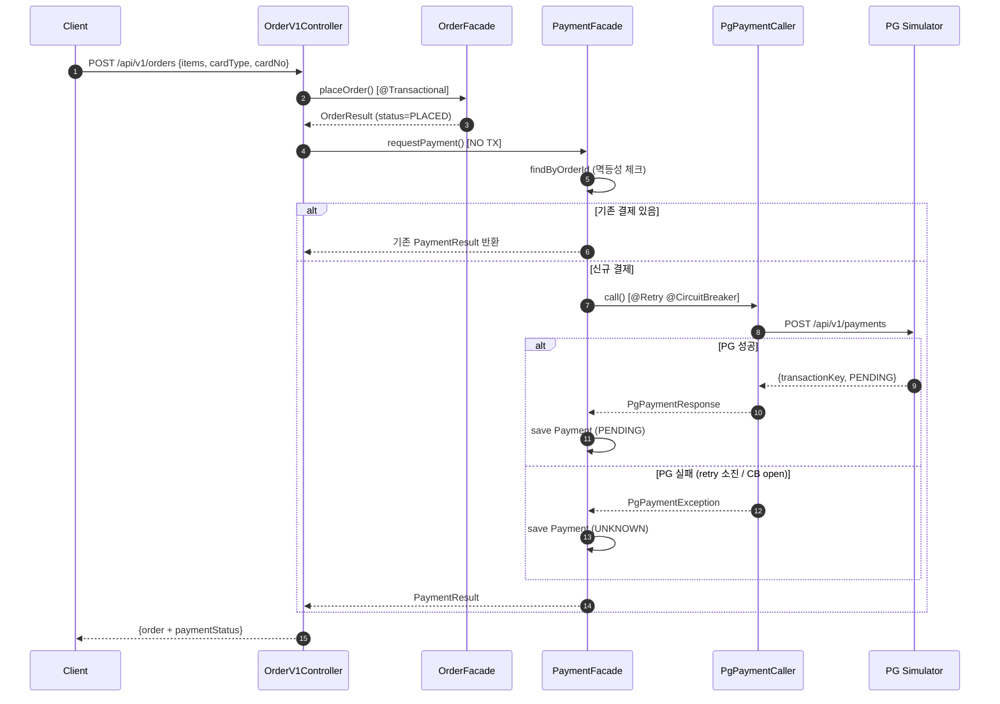
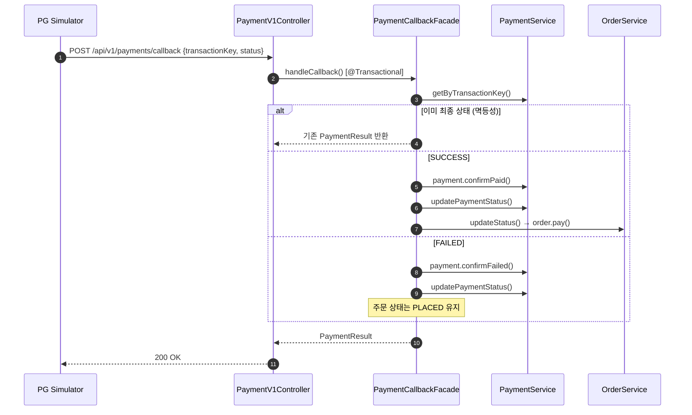
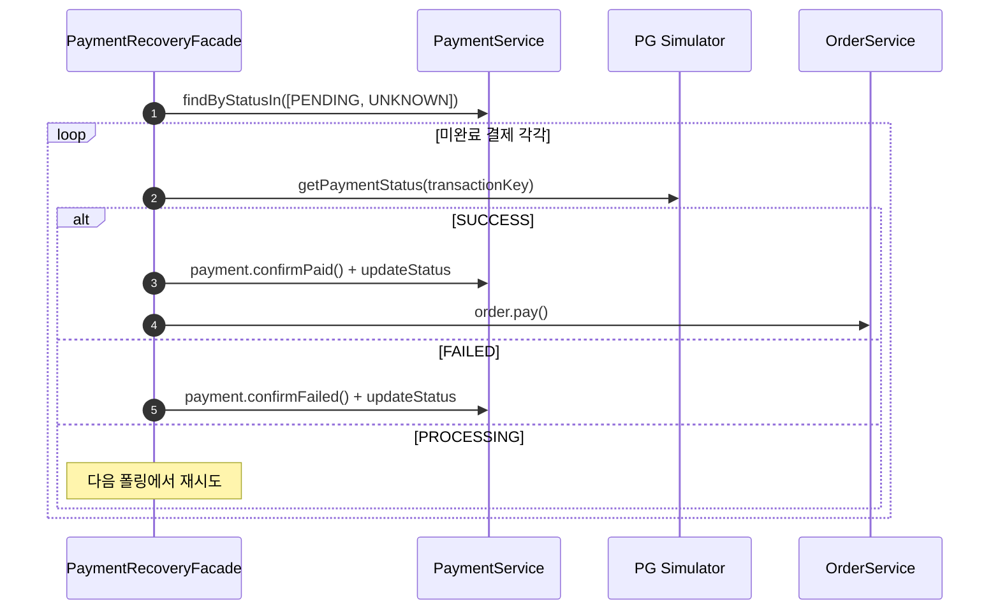

# Week 6 Implementation Notes: PG Payment Integration with Resilience Patterns

## ✅ Requirements Checklist
- [x] Payment 도메인 모델 (상태 머신: PENDING → PAID / FAILED / UNKNOWN)
- [x] PG 클라이언트 도메인 포트 인터페이스 (DIP 준수)
- [x] Infrastructure 레이어 (JPA Entity, Repository, RestClient)
- [x] Resilience4j 설정 (Retry 3회 + Circuit Breaker 70%)
- [x] Application 레이어 (PaymentFacade, PaymentCallbackFacade, PgPaymentCaller)
- [x] API 레이어 (콜백 컨트롤러, 관리자 API)
- [x] 주문 생성 → 결제 요청 플로우 통합
- [x] 결제 복구 스케줄러 (PENDING/UNKNOWN 폴링)
- [x] 멱등성 보장 (중복 콜백 무시, 중복 결제 요청 방지)
- [x] 단위 테스트 (도메인 모델, 서비스, 파사드)

## 📁 File Structure

### Domain Layer
- `domain/payment/PaymentStatus.kt` - 결제 상태 enum (PENDING, PAID, FAILED, UNKNOWN)
- `domain/payment/CardType.kt` - 카드 타입 enum (SAMSUNG, KB, HYUNDAI)
- `domain/payment/Payment.kt` - 결제 도메인 모델 (상태 머신)
- `domain/payment/PaymentRepository.kt` - 저장소 인터페이스
- `domain/payment/PaymentService.kt` - 도메인 서비스
- `domain/payment/PgPaymentClient.kt` - PG 포트 인터페이스 + DTO

### Infrastructure Layer
- `infrastructure/payment/PaymentEntity.kt` - JPA 엔티티 (인덱스: order_id unique, transaction_key unique)
- `infrastructure/payment/PaymentJpaRepository.kt` - Spring Data JPA
- `infrastructure/payment/PaymentRepositoryImpl.kt` - Repository 구현체
- `infrastructure/payment/PgPaymentClientImpl.kt` - RestClient 기반 PG 클라이언트
- `infrastructure/payment/PgClientConfig.kt` - PG 접속 설정 (@ConfigurationProperties)

### Application Layer
- `application/payment/PaymentCommand.kt` - RequestPaymentCommand, PaymentCallbackCommand
- `application/payment/PaymentResult.kt` - 결과 DTO
- `application/payment/PgPaymentCaller.kt` - @Retry + @CircuitBreaker AOP 프록시
- `application/payment/PaymentFacade.kt` - PG 결제 요청 (NO TX)
- `application/payment/PaymentCallbackFacade.kt` - 콜백 처리 (@Transactional)
- `application/payment/PaymentRecoveryFacade.kt` - 미완료 결제 복구 (@Scheduled)

### Interfaces Layer
- `interfaces/api/payment/PaymentV1Controller.kt` - POST /api/v1/payments/callback
- `interfaces/api/payment/PaymentV1Dto.kt` - 요청/응답 DTO
- `interfaces/api/payment/PaymentV1ApiSpec.kt` - Swagger 스펙
- `interfaces/api/payment/PaymentAdminV1Controller.kt` - 관리자 API

### Modified Files
- `application/order/OrderCommand.kt` - PlaceOrderCommand에 cardType/cardNo 추가
- `interfaces/api/order/OrderV1Controller.kt` - 주문 후 결제 요청 호출
- `interfaces/api/order/OrderV1Dto.kt` - PlaceOrderRequest에 cardType/cardNo, OrderResponse에 paymentStatus 추가
- `CommerceApiApplication.kt` - @EnableScheduling 추가
- `build.gradle.kts` - resilience4j 의존성 추가
- `application.yml` - PG/resilience4j 설정 추가

## 🏗️ Class Diagram

```mermaid
classDiagram
    namespace Domain_Payment {
        class Payment {
            +orderId: Long
            +amount: Int
            +cardType: CardType
            +cardNo: String
            +transactionKey: String?
            +status: PaymentStatus
            +reason: String?
            +confirmPaid(receivedAt)
            +confirmFailed(reason, receivedAt)
            +markUnknown(reason)
            +isTerminal(): Boolean
        }
        class PaymentStatus {
            <<enumeration>>
            PENDING
            PAID
            FAILED
            UNKNOWN
            +isTerminal(): Boolean
        }
        class CardType {
            <<enumeration>>
            SAMSUNG
            KB
            HYUNDAI
        }
        class PaymentRepository {
            <<interface>>
            +save(payment): Payment
            +findByOrderId(orderId): Payment?
            +findByTransactionKey(key): Payment?
            +findByStatusIn(statuses): List~Payment~
            +updateStatus(payment)
        }
        class PaymentService {
            +createPayment(payment): Payment
            +getByOrderId(orderId): Payment
            +findByOrderId(orderId): Payment?
            +getByTransactionKey(key): Payment
            +updatePaymentStatus(payment)
        }
        class PgPaymentClient {
            <<interface>>
            +requestPayment(request): PgPaymentResponse
            +getPaymentStatus(key): PgPaymentStatusResponse
        }
    }

    namespace Application_Payment {
        class PaymentFacade {
            +requestPayment(cmd): PaymentResult
        }
        class PaymentCallbackFacade {
            +handleCallback(cmd): PaymentResult
        }
        class PgPaymentCaller {
            +call(request): PgPaymentResponse
            -fallback(request, ex): PgPaymentResponse
        }
        class PaymentRecoveryFacade {
            +recoverPendingPayments()
            +recoverSingle(paymentId, orderId, txnKey)
        }
    }

    namespace Infrastructure_Payment {
        class PaymentEntity {
            +toDomain(): Payment
            +updateFromDomain(payment)
        }
        class PaymentRepositoryImpl
        class PgPaymentClientImpl
    }

    namespace Interfaces_API_Payment {
        class PaymentV1Controller {
            +handleCallback(request): ApiResponse
        }
        class PaymentAdminV1Controller {
            +getPendingPayments(): ApiResponse
            +recoverPayment(paymentId): ApiResponse
        }
    }

    Payment --> PaymentStatus
    Payment --> CardType
    PaymentService --> PaymentRepository
    PaymentFacade --> PaymentService
    PaymentFacade --> PgPaymentCaller
    PgPaymentCaller --> PgPaymentClient
    PaymentCallbackFacade --> PaymentService
    PaymentCallbackFacade --> OrderService
    PaymentRecoveryFacade --> PaymentService
    PaymentRecoveryFacade --> PgPaymentClient
    PaymentRecoveryFacade --> OrderService
    PaymentRepositoryImpl ..|> PaymentRepository
    PgPaymentClientImpl ..|> PgPaymentClient
    PaymentV1Controller --> PaymentCallbackFacade
    PaymentAdminV1Controller --> PaymentRecoveryFacade
```



## 🔁 Sequence Diagram

### 주문 + 결제 요청 플로우



### PG 콜백 처리 플로우



### 결제 복구 플로우



## 🎯 Design Decisions

### 1. 트랜잭션 경계 분리
- **결정**: OrderFacade.placeOrder()는 @Transactional, PaymentFacade.requestPayment()는 NO TX
- **이유**: PG 호출은 1-5초 소요 → DB 커넥션을 장시간 점유하면 커넥션 풀 고갈 위험
- **트레이드오프**: 주문은 생성됐지만 결제는 실패할 수 있음 → Recovery 스케줄러로 보완

### 2. PgPaymentClient를 도메인 포트로 정의
- **결정**: domain 패키지에 interface, infrastructure에 RestClient 구현
- **이유**: DIP 준수. 도메인이 인프라에 의존하지 않도록 함
- **효과**: PG 변경 시 infrastructure만 수정

### 3. PgPaymentCaller를 별도 Bean으로 분리
- **결정**: @Retry / @CircuitBreaker는 AOP 프록시 기반이므로 별도 @Component 필요
- **이유**: private 메서드나 같은 클래스 내 호출은 프록시를 경유하지 않아 AOP 미적용
- **효과**: Resilience4j 어노테이션이 정상 동작

### 4. Resilience4j 설정값
- **Retry**: maxAttempts=3, waitDuration=200ms → P(3회 모두 실패) = 0.4^3 = 6.4%
- **Circuit Breaker**: failureRateThreshold=70% (> 기본 실패율 40%) → 정상 운영 시 CB가 열리지 않음
- **slidingWindowSize=10**: 최근 10건 기준으로 판단

### 5. 멱등성 전략
- **결제 요청**: orderId로 기존 결제 확인 → 있으면 기존 결과 반환
- **콜백 처리**: 이미 terminal 상태이면 무시
- **DB 인덱스**: order_id UNIQUE, transaction_key UNIQUE로 강제

### 6. UNKNOWN 상태 도입
- **결정**: PG 호출 실패 시 UNKNOWN 상태로 저장
- **이유**: PG에 요청은 도달했을 수 있으나 응답을 받지 못한 경우 → Recovery에서 PG 폴링으로 최종 상태 확인

## 📊 k6 PG Simulator 벤치마크

### 테스트 시나리오

PG 시뮬레이터의 성능 특성과 장애 패턴을 파악하기 위해 k6 부하 테스트를 수행했다.

| Phase | 시나리오 | 설정 |
|-------|----------|------|
| 1 | 결제 요청 부하 | ramping-vus: 1→10→30→50 VUs, 100초간 |
| 2 | 상태 조회 부하 | constant-vus: 10 VUs, 30초간 (Phase 1 종료 후) |

### 벤치마크 결과 RAW

```
============================================================
PG Simulator Benchmark — 2026-03-18T13:17:21.673Z
============================================================

총 요청 수:    6,811건 (49.5 req/s)
총 반복 수:    6,731건 (48.9 iter/s)
최대 동시 VU:  50

     ✗ status is 200
      ↳  60% — ✓ 3998 / ✗ 2587
     ✗ has transactionKey
      ↳  60% — ✓ 3998 / ✗ 2587
     ✓ status check 200

     checks.........................: 60.95% ✓ 8076      ✗ 5174
     data_received..................: 1.7 MB 12 kB/s
     data_sent......................: 2.1 MB 16 kB/s
     http_req_blocked...............: avg=115.24µs min=1µs      med=6µs      max=5.2ms    p(90)=312µs    p(95)=363µs
     http_req_connecting............: avg=86.61µs  min=0s       med=0s       max=5.14ms   p(90)=244µs    p(95)=280µs
   ✓ http_req_duration..............: avg=306.49ms min=3.23ms   med=306.11ms max=518.16ms p(90)=469.02ms p(95)=487.86ms
       { expected_response:true }...: avg=307.32ms min=3.23ms   med=309.05ms max=518.16ms p(90)=469.62ms p(95)=489.03ms
   ✓ http_req_failed................: 38.95% ✓ 2653      ✗ 4158
     http_req_receiving.............: avg=99.65µs  min=6µs      med=80µs     max=6.21ms   p(90)=168µs    p(95)=212.49µs
     http_req_sending...............: avg=30.57µs  min=4µs      med=25µs     max=1.67ms   p(90)=50µs     p(95)=63µs
     http_req_tls_handshaking.......: avg=0s       min=0s       med=0s       max=0s       p(90)=0s       p(95)=0s
     http_req_waiting...............: avg=306.36ms min=3.11ms   med=306.04ms max=518.01ms p(90)=468.92ms p(95)=487.69ms
     http_reqs......................: 6811   49.482891/s
     iteration_duration.............: avg=448.28ms min=203.53ms med=415.1ms  max=3.01s    p(90)=578.1ms  p(95)=597.23ms
     iterations.....................: 6731   48.90168/s
     payment_fail...................: 2587   18.794926/s
     payment_success................: 3998   29.046043/s
     status_check_duration..........: avg=7.0625   min=4        med=7        max=26       p(90)=9        p(95)=9.05
     status_pending.................: 80     0.581211/s
     vus............................: 2      min=0       max=50
     vus_max........................: 60     min=60      max=60
```

### 핵심 분석

#### 성공률/실패율

| 메트릭 | 값 |
|--------|-----|
| 결제 성공 (payment_success) | 3,998건 (60.7%) |
| 결제 실패 (payment_fail) | 2,587건 (39.3%) |
| 상태 조회 시 PENDING | 80건 |

> PG 기본 성공률 60%와 일치 → Retry 없이 단일 호출 기준 결과.
> Retry 3회 적용 시 P(성공) = 1 - 0.4³ = 93.6%로 개선 기대.

#### 응답 시간 분포

| 메트릭 | avg | med | p(90) | p(95) | max |
|--------|-----|-----|-------|-------|-----|
| http_req_duration | 306ms | 306ms | 469ms | 488ms | 518ms |
| iteration_duration | 448ms | 415ms | 578ms | 597ms | 3,010ms |
| status_check_duration | 7ms | 7ms | 9ms | 9ms | 26ms |

> - PG 결제 요청: p(95) = 488ms. PG 내부 처리 지연(1~5초)은 콜백 방식이므로 응답에 미포함.
> - 상태 조회: avg 7ms로 매우 빠름. Recovery 스케줄러 폴링에 적합.

### 벤치마크 결론 — Resilience4j 설정 근거

| 항목 | PG 특성 | 설정 근거 |
|------|---------|-----------|
| 실패율 | 40% | CB threshold 70% > 40% → 정상 운영 시 CB 미작동 |
| 응답 시간 p(95) | 488ms | readTimeout 2,000ms → p(99+) 커버. Retry waitDuration 200ms |
| 초당 처리량 | 49.5 req/s | 50 VU에서 안정적 처리 |
| 상태 조회 시간 | avg 7ms | Recovery 폴링(30초 간격)에 충분 |

---

## 🧪 Test Coverage

### Unit Tests
- **PaymentUnitTest** (15 cases)
  - init validation (amount < 0, cardNo blank, zero amount 허용)
  - confirmPaid: PENDING → PAID, UNKNOWN → PAID, 이미 terminal이면 예외
  - confirmFailed: PENDING → FAILED, UNKNOWN → FAILED, terminal이면 예외
  - markUnknown: PENDING → UNKNOWN, terminal이면 예외
  - isTerminal: PENDING=false, UNKNOWN=false, PAID=true, FAILED=true
  - PaymentStatus.isTerminal 전수 검증

- **PaymentServiceUnitTest** (7 cases)
  - createPayment, getByOrderId (성공/NOT_FOUND), findByOrderId (null 반환)
  - getByTransactionKey (성공/NOT_FOUND), findByStatusIn, updatePaymentStatus

- **PaymentFacadeUnitTest** (3 cases)
  - 멱등성: 기존 결제 존재 시 PG 미호출
  - PG 성공 → PENDING 결제 저장
  - PG 실패 → UNKNOWN 결제 저장

- **PaymentCallbackFacadeUnitTest** (4 cases)
  - SUCCESS → PAID + order.pay()
  - FAILED → FAILED, order 상태 미변경
  - 이미 PAID → 스킵 (멱등성)
  - 이미 FAILED → 스킵 (멱등성)

- **PaymentRecoveryFacadeUnitTest** (5 cases)
  - PG SUCCESS → confirmPaid + order.pay()
  - PG FAILED → confirmFailed
  - transactionKey null → 스킵
  - 이미 terminal → 스킵
  - PG PROCESSING → 아무것도 안함
  - 미완료 결제 0건 → PG 미호출
