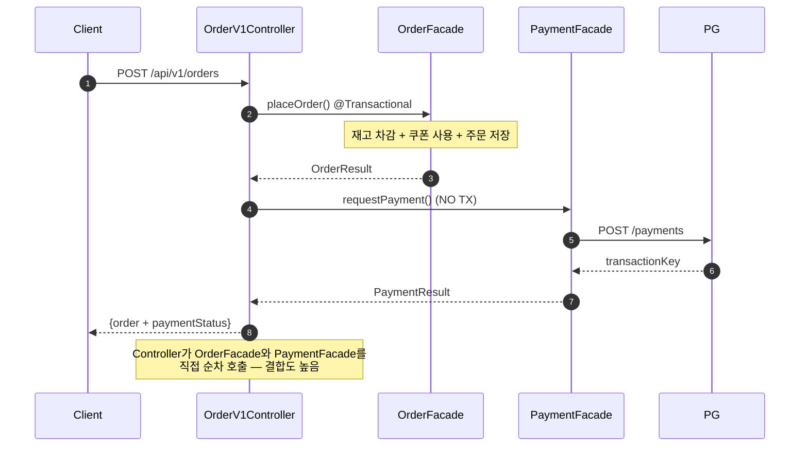
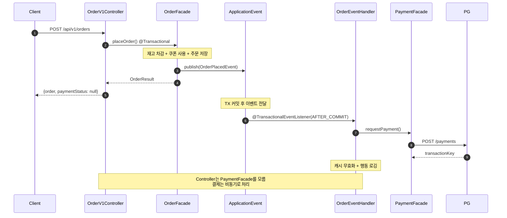
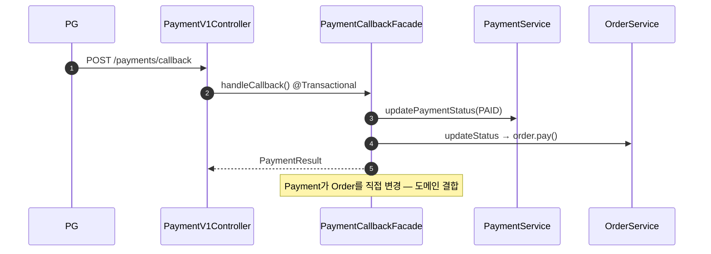
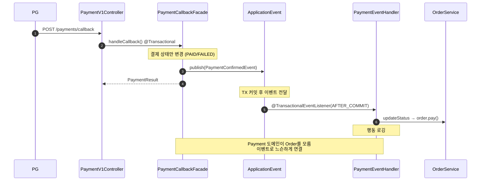
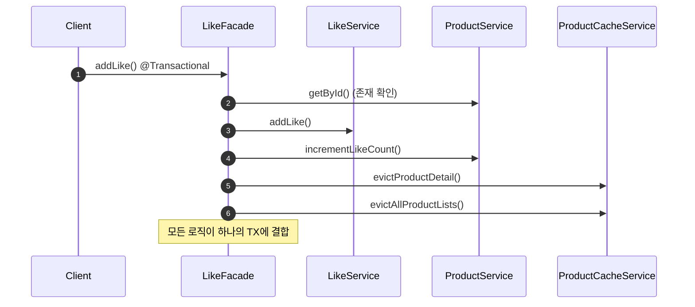
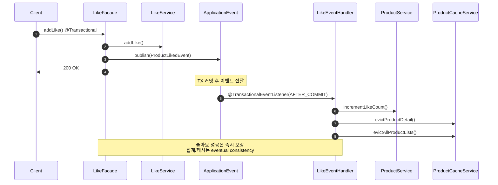
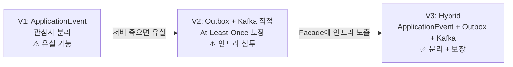
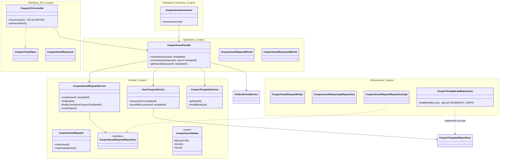
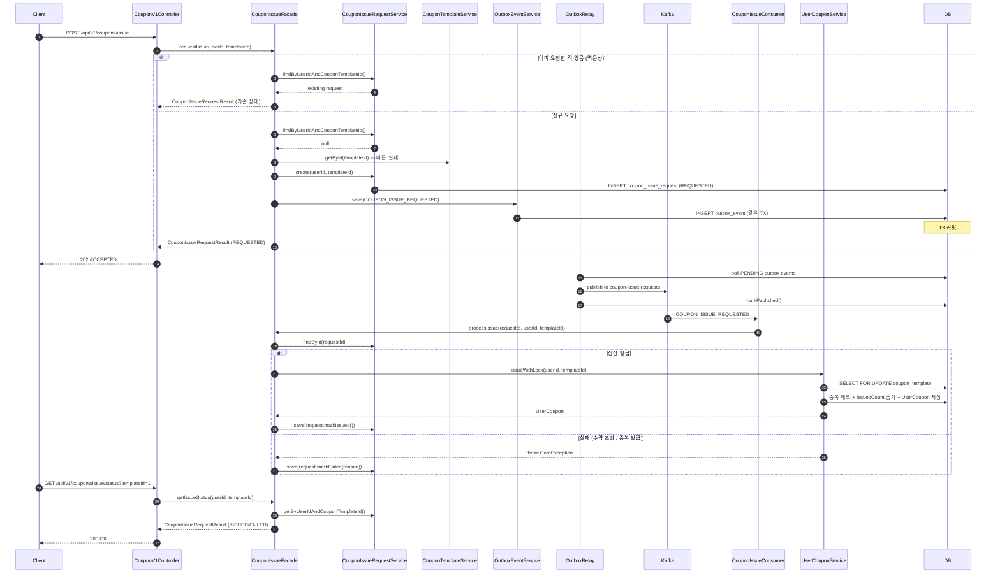

# Week 7 Implementation Notes: Event-Driven Architecture with Kafka

## ✅ Requirements Checklist

### Step 1 — ApplicationEvent로 경계 나누기
- [x] 주문–결제 플로우에서 부가 로직을 이벤트 기반으로 분리
- [x] 좋아요 처리와 집계를 이벤트 기반으로 분리 (집계 실패와 무관하게 좋아요는 성공)
- [x] 유저 행동(조회, 좋아요, 주문 등)에 대한 서버 레벨 로깅을 이벤트로 처리
- [x] 동작의 주체를 적절하게 분리하고, 트랜잭션 간의 연관관계를 고민

### Step 2 — Kafka Producer / Consumer
- [x] ApplicationEvent 중 시스템 간 전파가 필요한 이벤트를 Kafka로 발행
- [x] `acks=all`, `idempotence=true` 설정
- [x] Transactional Outbox Pattern 구현
- [x] PartitionKey 기반 이벤트 순서 보장
- [x] Consumer가 Metrics 집계 처리 (product_metrics upsert)
- [x] `event_handled` 테이블을 통한 멱등 처리 구현
- [x] manual Ack + `version`/`updated_at` 기준 최신 이벤트만 반영

### Step 3 — 선착순 쿠폰 발급
- [x] 쿠폰 발급 요청 API → Kafka 발행 (비동기 처리)
- [x] Consumer에서 선착순 수량 제한 + 중복 발급 방지 구현
- [x] 발급 완료/실패 결과를 유저가 확인할 수 있는 구조 설계
- [x] 동시성 테스트 — 수량 초과 발급이 발생하지 않는지 검증

### Refactoring
- [x] 쿠폰 Application Layer → Domain Service 의존으로 전환 (DIP 적용)

---

## 🎯 이벤트 경계 분석 — 핵심 vs 부가 로직

### 판단 기준

> "이 로직이 실패하면 사용자 요청 자체가 실패해야 하는가?"
> - **Yes** → 핵심 TX에 유지 (커밋 보장)
> - **No** → 부가 로직, 이벤트로 분리 가능 (AFTER_COMMIT)

### 1. 주문 생성 플로우

```
OrderFacade.placeOrder() — 현재 단일 @Transactional
├── [핵심] 재고 검증 & 차감        ← 주문 성립의 전제조건
├── [핵심] 쿠폰 검증 & 할인 계산    ← 금액 결정에 필수
├── [핵심] 쿠폰 상태 변경 (USED)    ← 돈과 직결, 원자적 처리 필수
├── [핵심] 주문 생성 & 저장         ← 핵심 비즈니스 결과물
│
├── [부가] 결제 요청 (PG 호출)      ← 이미 TX 밖. 이벤트로 전환
├── [부가] 캐시 무효화              ← eventual consistency OK
├── [부가] 유저 행동 로깅 (미구현)   ← 분석용, 비동기
└── [부가] 판매량 집계 (미구현)      ← product_metrics, 비동기
```

**쿠폰을 핵심 TX에 유지하는 이유:**
- 쿠폰 상태 변경을 AFTER_COMMIT으로 빼면, 주문 성공 → 쿠폰 USED 실패 → 같은 쿠폰으로 재주문 가능
- 쿠팡/무신사 등 실제 커머스에서도 쿠폰 차감은 주문과 함께 원자적으로 처리
- 검증뿐 아니라 상태 변경까지 핵심 TX에 포함

**결제를 이벤트로 분리하는 이유:**
- 현재도 Controller에서 TX 밖에서 순차 호출 중 (`OrderV1Controller` L42-53)
- 주문은 PLACED로 확정 → 결제는 나중에 해도 됨 (시간 제한 내)
- PG 장애가 주문 자체를 막으면 안 됨
- 이벤트로 전환하면 Controller가 PaymentFacade를 직접 모를 수 있음 → 결합도 감소

### 2. 결제 콜백 플로우

```
PaymentCallbackFacade.handleCallback() — 현재 단일 @Transactional
├── [핵심] 결제 상태 변경 (PAID/FAILED)  ← 결제 도메인의 핵심
│
├── [부가] 주문 상태 변경 (order.pay())   ← 결제가 주문을 직접 변경 중, 결합도 높음
└── [부가] 유저 행동 로깅 (미구현)        ← 분석용
```

**주문 상태 변경을 이벤트로 분리하는 이유:**
- Payment 도메인이 Order 도메인을 직접 변경하는 건 도메인 간 결합
- `PaymentConfirmedEvent` 발행 → Order 리스너가 `order.pay()` 처리
- 실패 시? Payment는 PAID인데 Order는 PLACED → recovery scheduler가 정합성 보정
- 이미 PaymentRecoveryFacade가 이 역할을 할 수 있는 구조

### 3. 좋아요 플로우

```
LikeFacade.addLike() — 현재 단일 @Transactional
├── [핵심] 좋아요 생성/삭제           ← 유저 액션의 핵심 결과
│
├── [부가] Product.likeCount 증감     ← 집계 실패해도 좋아요는 성공해야 함
├── [부가] 캐시 무효화                ← eventual consistency OK
└── [부가] 유저 행동 로깅 (미구현)     ← 분석용
```

**likeCount를 이벤트로 분리하는 이유:**
- 좋아요는 유저 통계/경험 목적, 자주 발생하지 않음
- 카운트 불일치는 일시적이고 최종 정합성으로 충분
- commerce-streamer에서 product_metrics로 집계하면 더 정확

### 4. 상품 상세 조회 (미구현 — 신규)

```
ProductFacade.getProductDetail()
└── [부가] 조회수 로깅 (미구현)       ← fire-and-forget, 조회 응답에 영향 없어야 함
```

- 읽기 전용이므로 핵심 TX 없음
- `@EventListener` + `@Async`로 충분 (AFTER_COMMIT 불필요)

---

## 🔀 이벤트 경계 요약

| 이벤트 | 핵심 TX (커밋 보장) | AFTER_COMMIT 이벤트 리스너 |
|--------|---------------------|--------------------------|
| **주문 생성** | 재고 차감 + 쿠폰 사용 + 주문 저장 | 결제 요청, 캐시 무효화, 행동 로깅, 판매량 집계 |
| **결제 콜백** | 결제 상태 변경 (PAID/FAILED) | 주문 상태 변경 (`order.pay()`), 행동 로깅 |
| **좋아요** | 좋아요 생성/삭제 | likeCount 증감, 캐시 무효화, 행동 로깅 |
| **상품 조회** | (없음 — 읽기) | 조회수 로깅 (fire-and-forget) |

---

## 🏗️ ApplicationEvent 설계

### 이벤트 클래스

```kotlin
// 주문 생성 완료 이벤트
data class OrderPlacedEvent(
    val orderId: Long,
    val userId: Long,
    val items: List<OrderItemSnapshot>,   // productId, quantity, price
    val originalTotalPrice: Int,
    val discountAmount: Int,
    val totalPrice: Int,
    val userCouponId: Long?,
    val cardType: CardType,
    val cardNo: String,
)

// 결제 확인 이벤트
data class PaymentConfirmedEvent(
    val paymentId: Long,
    val orderId: Long,
    val transactionKey: String,
    val amount: Int,
    val paidAt: ZonedDateTime,
)

// 결제 실패 이벤트
data class PaymentFailedEvent(
    val paymentId: Long,
    val orderId: Long,
    val reason: String?,
)

// 좋아요 이벤트
data class ProductLikedEvent(
    val userId: Long,
    val productId: Long,
)

data class ProductUnlikedEvent(
    val userId: Long,
    val productId: Long,
)

// 상품 조회 이벤트
data class ProductViewedEvent(
    val userId: Long?,
    val productId: Long,
)
```

### 리스너 구조

```kotlin
// 주문 이벤트 핸들러
@Component
class OrderEventHandler {

    @TransactionalEventListener(phase = AFTER_COMMIT)
    @Async
    fun handleOrderPlaced(event: OrderPlacedEvent) {
        // 1. 결제 요청 (PG 호출)
        // 2. 캐시 무효화
        // 3. 유저 행동 로깅
    }
}

// 결제 이벤트 핸들러
@Component
class PaymentEventHandler {

    @TransactionalEventListener(phase = AFTER_COMMIT)
    @Async
    fun handlePaymentConfirmed(event: PaymentConfirmedEvent) {
        // 1. 주문 상태 → PAID
        // 2. 유저 행동 로깅
    }
}

// 좋아요 이벤트 핸들러
@Component
class LikeEventHandler {

    @TransactionalEventListener(phase = AFTER_COMMIT)
    @Async
    fun handleProductLiked(event: ProductLikedEvent) {
        // 1. likeCount 증감
        // 2. 캐시 무효화
        // 3. 유저 행동 로깅
    }
}
```

---

## 🔁 변경 전후 시퀀스 다이어그램

### 주문 생성 — Before (현재)



### 주문 생성 — After (이벤트 분리)



### 결제 콜백 — Before (현재)



### 결제 콜백 — After (이벤트 분리)



### 좋아요 — Before (현재)



### 좋아요 — After (이벤트 분리)



---

## 🔀 ApplicationEvent / Kafka / Outbox Pattern — 진화 과정

### 핵심 전제: ApplicationEvent와 Kafka는 다른 것이다

멘토링에서 강조된 포인트:
- **ApplicationEvent** = JVM 내부의 코드 디커플링 도구. 관심사 분리 목적.
- **Kafka** = 시스템 간 이벤트 전파 + 영속성 + 재처리가 가능한 글로벌 이벤트 인프라.
- 둘은 "교체"가 아니라 **역할이 다르다.** 함께 쓸 수 있다.

---

### V1 — ApplicationEvent 단독 (이전 버전)

```
OrderFacade [@Transactional]
  ├─ 핵심: 재고 차감 + 쿠폰 사용 + 주문 저장
  └─ applicationEventPublisher.publish(OrderPlacedEvent)
       ↓
  @TransactionalEventListener(AFTER_COMMIT) + @Async
  OrderPlacedEventHandler
       ├─ 결제 요청 (PG)
       ├─ 캐시 무효화
       └─ 행동 로깅
```

**장점:**
- Facade가 부가 로직을 모른다 (관심사 분리)
- 핵심 TX에 부가 로직 실패가 영향을 주지 않음

**한계:**
- 서버가 죽으면 이벤트 유실 (JVM 메모리 기반)
- 재처리 불가 — 실패한 이벤트를 다시 돌릴 방법이 없음
- 다른 서비스(commerce-streamer)로 이벤트를 전달할 수 없음

---

### V2 — Outbox + Kafka 직접 호출 (현재 구현)

```
OrderFacade [@Transactional]
  ├─ 핵심: 재고 차감 + 쿠폰 사용 + 주문 저장
  └─ outboxEventService.save(                   ← Facade가 outbox를 직접 호출
       topic = "order-events",
       partitionKey = orderId,
       payload = OrderPlacedEvent(...)
     )
       ↓ [TX 커밋 — Outbox에 PENDING 상태로 저장]
OutboxRelay (@Scheduled 5초)
  └─ Kafka publish → markPublished()
       ↓
OrderEventConsumer (commerce-api)     → 결제 요청, 캐시 무효화
OrderEventConsumer (commerce-streamer) → 판매량 집계 (product_metrics)
```

**장점:**
- At-Least-Once 보장 — DB에 저장되므로 서버가 죽어도 이벤트 유실 없음
- Kafka를 통해 commerce-streamer로 글로벌 이벤트 전파 가능
- consumer에서 `event_handled` 테이블로 멱등 처리 구현

**한계:**
- Facade가 `outboxEventService`, `KafkaTopics`, `partitionKey`를 직접 알고 있음
- 인프라 관심사(topic, partitionKey)가 application 레이어에 침투
- 로컬에서만 처리하면 되는 이벤트(캐시 무효화)도 Kafka를 경유함

---

### V3 — ApplicationEvent + Outbox + Kafka 하이브리드 (개선 방향)

```
OrderFacade [@Transactional]
  ├─ 핵심: 재고 차감 + 쿠폰 사용 + 주문 저장
  └─ applicationEventPublisher.publish(OrderPlacedEvent)   ← 도메인 이벤트만 발행
       ↓

  ┌─ [로컬 리스너] ──────────────────────────────────────────┐
  │ @TransactionalEventListener(AFTER_COMMIT)             │
  │ LocalSideEffectHandler                                │
  │   ├─ 캐시 무효화 (Kafka 불필요)                            │
  │   └─ 기타 JVM 내부 처리                                   │
  └───────────────────────────────────────────────────────┘

  ┌─ [글로벌 리스너] ────────────────────────────────────────┐
  │ @TransactionalEventListener(BEFORE_COMMIT)            │
  │ OutboxEventSaver                                      │
  │   └─ outboxEventService.save(...)  ← 같은 TX에 포함      │
  └───────────────────────────────────────────────────────┘
       ↓ [TX 커밋 — Outbox PENDING + 핵심 데이터 원자적 저장]
OutboxRelay (@Scheduled)
  └─ Kafka publish
       ↓
OrderEventConsumer (commerce-api)     → 결제 요청
OrderEventConsumer (commerce-streamer) → 판매량 집계
```

**각 레이어의 책임:**

| 레이어 | 역할 | 알아야 하는 것 |
|--------|------|---------------|
| **Facade** | 도메인 로직 + 이벤트 발행 | `OrderPlacedEvent` (도메인 이벤트) |
| **LocalSideEffectHandler** | JVM 내부 부가 처리 | 캐시, 로깅 등 |
| **OutboxEventSaver** | 글로벌 이벤트 영속화 | Outbox, topic, partitionKey |
| **OutboxRelay** | Kafka 발행 | KafkaTemplate |
| **Consumer** | 이벤트 소비 + 멱등 처리 | event_handled 테이블 |

**V2 대비 개선점:**
- Facade가 인프라(outbox, topic, partitionKey)를 모른다 → DIP 준수
- 로컬 처리(캐시 무효화)는 Kafka를 경유하지 않아 지연 없음
- 같은 이벤트를 로컬/글로벌 리스너가 **독립적으로** 처리 가능
- Kafka → SQS 전환 시 `OutboxEventSaver`만 수정, Facade는 변경 없음

**BEFORE_COMMIT을 쓰는 이유:**
- Outbox 저장이 핵심 TX와 같은 커밋에 포함되어야 At-Least-Once 보장
- AFTER_COMMIT이면 커밋 후 Outbox 저장 실패 → 이벤트 유실 가능

---

### 진화 요약



| | V1 (ApplicationEvent) | V2 (Outbox 직접) | V3 (Hybrid) |
|---|---|---|---|
| **코드 디커플링** | ✅ Facade가 리스너 모름 | ❌ Facade가 outbox 직접 호출 | ✅ Facade가 도메인 이벤트만 발행 |
| **이벤트 유실 방지** | ❌ JVM 메모리 기반 | ✅ DB 영속화 | ✅ DB 영속화 (BEFORE_COMMIT) |
| **글로벌 전파** | ❌ JVM 내부만 | ✅ Kafka | ✅ Kafka |
| **로컬 처리 지연** | ✅ 즉시 | ❌ Kafka 경유 (5초 relay) | ✅ 즉시 (로컬 리스너) |
| **인프라 교체 용이성** | - | ❌ Facade 수정 필요 | ✅ 리스너만 수정 |

---

## 📁 Kafka 토픽 설계

| Topic | Partition Key | 이벤트 | Consumer Group | 처리 |
|-------|--------------|--------|----------------|------|
| `order-events` | orderId | ORDER_PLACED, PAYMENT_CONFIRMED, PAYMENT_FAILED | commerce-api-order | 결제 요청, 주문 상태 변경 |
| `order-events` | orderId | ORDER_PLACED | commerce-streamer-order | 판매량 집계 → product_metrics |
| `catalog-events` | productId | PRODUCT_LIKED, PRODUCT_UNLIKED, PRODUCT_VIEWED | commerce-api-catalog | likeCount 증감, 캐시 무효화 |
| `catalog-events` | productId | PRODUCT_LIKED, PRODUCT_UNLIKED, PRODUCT_VIEWED | commerce-streamer-catalog | 좋아요수/조회수 집계 → product_metrics |
| `coupon-issue-requests` | couponTemplateId | COUPON_ISSUE_REQUESTED | commerce-api-coupon | 선착순 수량 제한 + 중복 발급 방지 |

**Producer**: Transactional Outbox Pattern으로 At-Least-Once 보장
**Consumer**: `event_handled` 테이블로 멱등 처리 + manual Ack

---

## 🏗️ Step 3 — 선착순 쿠폰 발급 Class Diagram



## 🔁 Step 3 — 선착순 쿠폰 발급 Sequence Diagram

### 발급 요청 → Kafka → 처리 → 상태 조회



## 🎯 Step 3 Design Decisions

### 1. 비동기 발급 (API → Outbox → Kafka → Consumer)
- **결정**: 동기 발급 대신 비동기 Kafka 파이프라인을 통한 발급
- **이유**: 선착순 쿠폰은 트래픽 스파이크가 발생하므로, DB 부하를 Kafka Consumer로 분산. PartitionKey(couponTemplateId) 기반으로 같은 쿠폰 템플릿에 대한 요청을 순서대로 처리
- **트레이드오프**: 즉시 발급 결과를 알 수 없어 polling API 필요

### 2. 비관적 락 (SELECT FOR UPDATE)
- **결정**: CouponTemplate에 PESSIMISTIC_WRITE 락으로 동시성 제어
- **이유**: Kafka Consumer가 단일 파티션을 순서대로 처리하지만, 여러 파티션이나 consumer 재시작 시 동시 처리 가능. DB 레벨에서 최종 방어선 필요
- **트레이드오프**: 락 경합으로 처리량 제한되지만, 쿠폰 수량 정합성이 더 중요

### 3. CouponIssueRequest 상태 추적
- **결정**: 별도 도메인 모델로 요청 상태(REQUESTED → ISSUED/FAILED) 관리
- **이유**: 비동기 처리이므로 클라이언트가 결과를 조회할 수 있어야 함. (userId, couponTemplateId) unique constraint로 멱등성 보장

### 4. Application Layer → Domain Service 의존 (DIP 리팩터링)
- **결정**: CouponIssueFacade/CouponFacade가 Repository를 직접 참조하지 않고 Domain Service를 통해 접근
- **이유**: 도메인 로직(발급 검증, 수량 체크, 중복 방지)이 서비스 계층에 응집되어야 함. Facade는 오케스트레이션만 담당
- **적용 범위**: 쿠폰 도메인에만 적용 (다른 도메인은 현상 유지)

## 🧪 Test Coverage

### Unit Tests
- `CouponIssueFacadeUnitTest` (7 cases)
  - requestIssue: 정상 저장 + outbox 발행, 멱등성 (이미 요청), 템플릿 미존재 NOT_FOUND
  - processIssue: 정상 발급 → ISSUED, 수량 초과 → FAILED, 중복 발급 → FAILED, 이미 처리된 요청 스킵 (멱등성)
- `OrderFacadeUnitTest` — outboxEventService mock으로 전환
- `LikeFacadeUnitTest` — outboxEventService mock으로 전환
- `PaymentCallbackFacadeUnitTest` — outboxEventService mock으로 전환
- `ProductFacadeUnitTest` — outboxEventService mock으로 전환

### Integration / E2E Tests
- `CouponV1ApiE2ETest` — 비동기 발급 flow (202 ACCEPTED + REQUESTED), 멱등성, 상태 조회
- `LikeFacadeConcurrencyTest` — Kafka 전환에 따라 likeCount 동시성 검증 제거 (좋아요 레코드만 검증)
