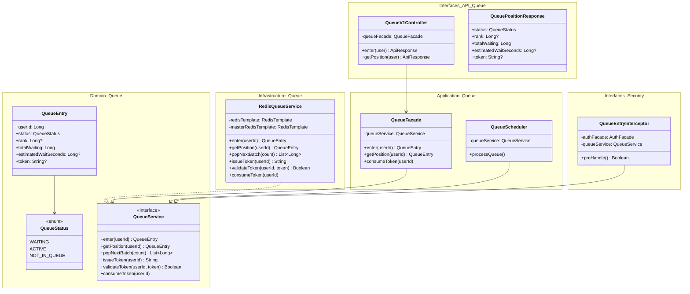
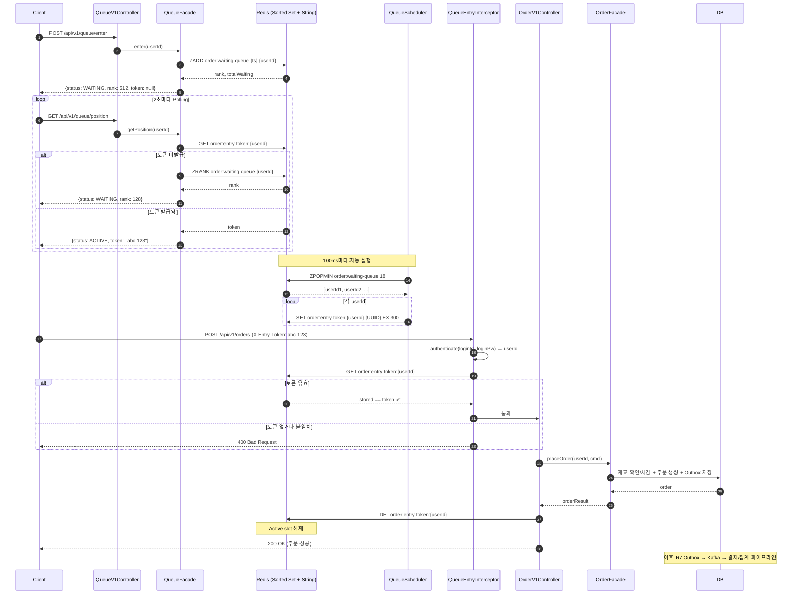

# Week 8 Implementation Notes: Redis 기반 주문 대기열 시스템

## ✅ Requirements Checklist

### Step 1 — Redis 기반 대기열
- [x] Redis Sorted Set 기반 대기열 진입 API (`POST /api/v1/queue/enter`)
- [x] 순번 조회 API (`GET /api/v1/queue/position`)
- [x] userId 기반 중복 진입 방지 (`addIfAbsent`)
- [x] 전체 대기 인원 조회 (`ZCARD` → `totalWaiting`)

### Step 2 — 입장 토큰 & 스케줄러
- [x] 스케줄러가 100ms마다 18명씩 대기열에서 꺼내 입장 토큰 발급
- [x] 토큰 TTL 5분 설정 (`Duration.ofMinutes(5)`)
- [x] 주문 API 진입 시 토큰 검증 (Interceptor에서 인증 + Redis 검증)
- [x] 주문 완료 후 토큰 삭제 (`consumeToken()`)
- [x] 처리량 기준 배치 크기 산정 근거 문서화 (QueueScheduler 주석)

### Step 3 — 실시간 순번 조회
- [x] 예상 대기 시간 계산 로직 (`rank / 175`)
- [x] Polling 기반 순번 + 예상 대기 시간 응답
- [x] 토큰 발급 시 순번 조회 응답에 토큰 포함 (status=ACTIVE)

### 검증
- [x] 동시 진입 테스트 — 100명 동시 진입, rank 유니크 보장
- [x] 토큰 만료 테스트 — k6 TTL 초과 시 주문 거부 검증
- [x] 처리량 초과 테스트 — k6 2000 VU 폭주 + 관문 차단 + 처리량 측정

---

## 📁 File Structure

### Domain Layer
- `domain/queue/QueueEntry.kt` — 대기열 상태 도메인 모델 (userId, status, rank, totalWaiting, estimatedWaitSeconds, token)
- `domain/queue/QueueService.kt` — Port 인터페이스 (enter, getPosition, popNextBatch, issueToken, validateToken, consumeToken)

### Infrastructure Layer
- `infrastructure/queue/RedisQueueService.kt` — Adapter 구현 (Redis Sorted Set + String with TTL)

### Application Layer
- `application/queue/QueueFacade.kt` — 대기열 진입/조회/토큰 소비 오케스트레이션
- `application/queue/QueueScheduler.kt` — 100ms 주기 마이크로 배칭, ConditionalOnProperty로 테스트 시 비활성화

### Interface Layer
- `interfaces/api/queue/QueueV1Controller.kt` — POST /enter, GET /position
- `interfaces/api/queue/QueueV1Dto.kt` — QueuePositionResponse
- `interfaces/api/security/QueueEntryInterceptor.kt` — Active Zone 관문 (인증 → 토큰 검증)

### Configuration
- `config/WebMvcConfig.kt` — QueueEntryInterceptor를 /api/v1/orders에 등록

### Tests
- `infrastructure/queue/RedisQueueServiceTest.kt` — 통합 테스트 10개
- `application/queue/QueueSchedulerUnitTest.kt` — 단위 테스트 3개
- `application/queue/QueueFacadeUnitTest.kt` — 단위 테스트 3개
- `k6/queue-benchmark.js` — 대기열 진입 폭증 + Polling 부하 + 전체 플로우
- `k6/queue-token-ttl-test.js` — 토큰 TTL 만료 검증
- `k6/queue-throughput-test.js` — 처리량 초과 안정성 + 관문 차단

---

## 🏗️ Class Diagram



---

## 🔁 Sequence Diagram

### Main Flow — 대기열 진입부터 주문 완료까지



---

## 🎯 Design Decisions

### 1. Redis Sorted Set을 대기열 자료구조로 선택

- **Why**: 순서 보장(timestamp score) + 중복 방지(Set 특성) + 원자적 연산(ZADD, ZPOPMIN, ZRANK) + μs 단위 조회
- **Trade-off**: 인메모리 기반이라 Redis 장애 시 대기열 데이터 유실 가능 → Graceful Degradation 전략 필요

### 2. 스케줄러 100ms 마이크로 배칭 (Thundering Herd 완화)

- **설계 기준**: DB 커넥션 풀 50 / 주문 평균 200ms → 최대 250 TPS → 70% 안전 마진 = 175 TPS
- **Why**: 1초에 175명 한번에 발급하면 동시 DB 커넥션 175개 점유 (Thundering Herd). 100ms마다 18명씩 분산하면 피크가 10배 평탄화
- **Trade-off**: 스케줄러 장애 시 대기열 전체 멈춤 → 헬스체크/이중화 필요

### 3. Interceptor에서 토큰 검증 (Active Zone 관문)

- **Before**: Interceptor는 헤더 존재만 확인, Controller에서 실제 검증 → 빈 관문
- **After**: Interceptor에서 AuthFacade로 userId 확보 → Redis 토큰 검증 → 실패 시 즉시 거부
- **Why**: Controller에 도달하기 전에 차단해야 진짜 관문. DIP에 따라 인프라(인증, Redis) 관심사를 Interface 레이어에서 처리

### 4. R7 이벤트 파이프라인과의 연결

- 대기열은 주문 API **앞단**의 관문일 뿐, 주문 이후 흐름은 R7의 Outbox → Kafka 파이프라인 그대로 활용
- `OrderFacade.placeOrder()` → Outbox 저장 → OutboxRelay → Kafka → Consumer (결제, 집계)

### 5. 테스트 시 스케줄러 비활성화

- `@ConditionalOnProperty(name = "queue.scheduler.enabled", matchIfMissing = true)`
- test/local 프로필에서 `queue.scheduler.enabled=false` → 테스트가 대기열 상태를 deterministic하게 검증 가능

---

## 📊 Redis Key Design

| Key | Type | 용도 | TTL |
|-----|------|------|-----|
| `order:waiting-queue` | Sorted Set | 대기열 (score=timestamp, member=userId) | 없음 |
| `order:entry-token:{userId}` | String | 입장 토큰 (value=UUID) | 5분 |

### 상태 전이

```
[진입]                    [스케줄러 pop]             [주문 성공]
Sorted Set에 ZADD    →   ZPOPMIN으로 제거      →
                          String SET (TTL 5분)  →   String DEL
                          
status: WAITING       →   status: ACTIVE        →   status: NOT_IN_QUEUE
token: null           →   token: "abc-123"      →   token: (삭제됨)
```

---

## 🧪 Test Coverage

### Unit Tests (6 cases)
- `QueueSchedulerUnitTest` — 배치 처리, 빈 큐, 개별 실패 시 나머지 계속 처리
- `QueueFacadeUnitTest` — 진입/순번 조회/토큰 소비 위임 검증

### Integration Tests (10 cases)
- `RedisQueueServiceTest`
  - 순차 rank 할당
  - 중복 진입 방지
  - 동시 100명 진입 (rank 유니크 + 전체 100명)
  - NOT_IN_QUEUE 상태
  - ACTIVE 상태 (토큰 발급 후)
  - FIFO pop 순서
  - 빈 큐 pop
  - 토큰 발급/검증/소비
  - 예상 대기 시간 계산
  - 전체 플로우 (진입 → pop → 토큰 → 검증 → 소비)

### k6 Load Tests
- `queue-benchmark.js` — 대기열 진입 1000 VUs + Polling 200 VUs + 주문 50 VUs
- `queue-token-ttl-test.js` — TTL 이내 주문 성공 + TTL 초과 주문 거부
- `queue-throughput-test.js` — 2000 VU 폭주 + 토큰 없는 주문 100% 차단 + 처리량 측정
