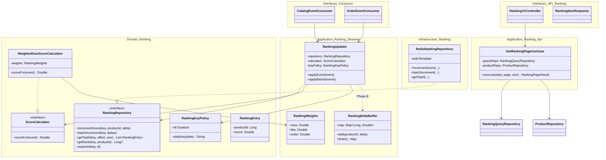
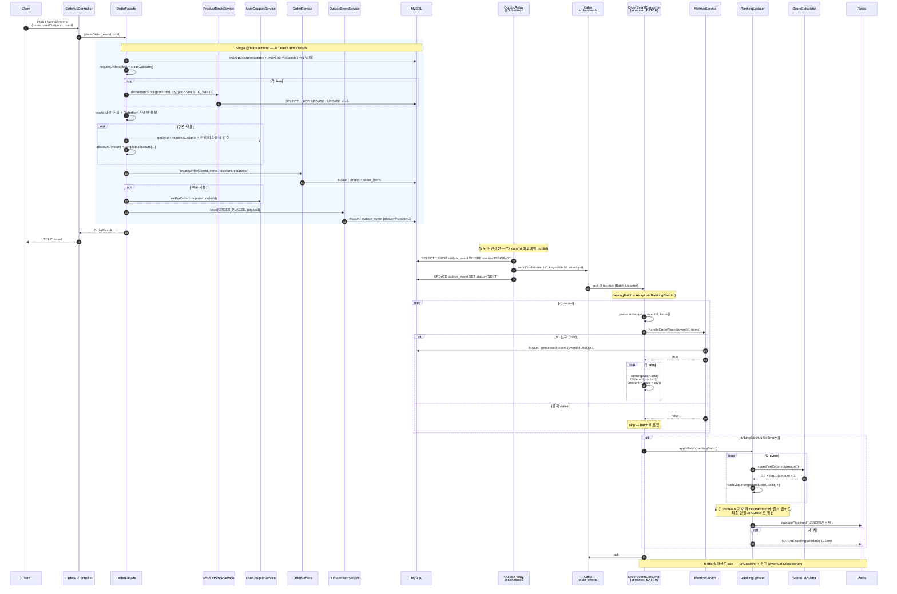
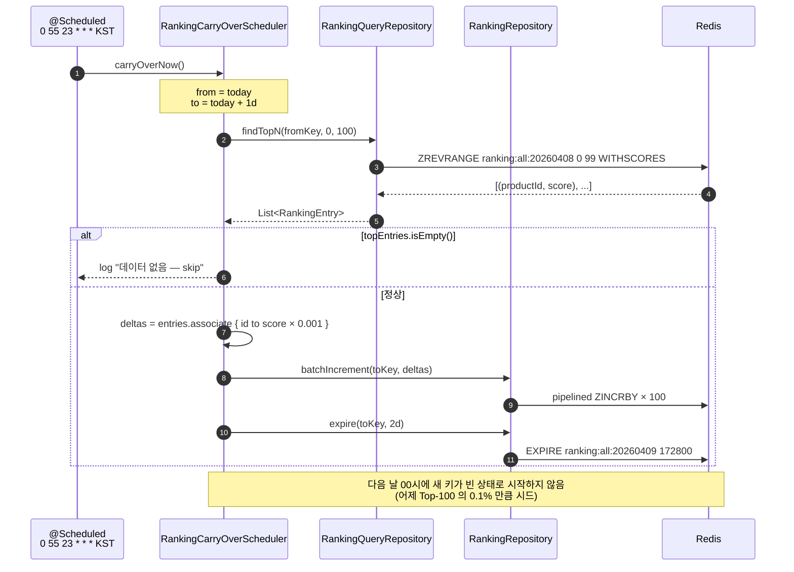
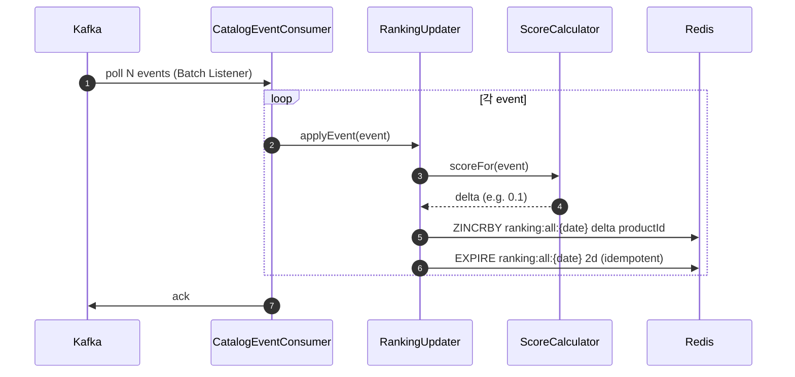
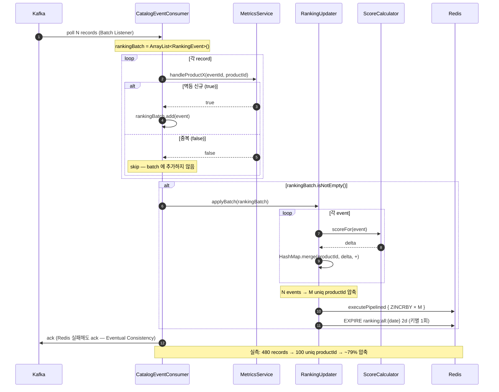
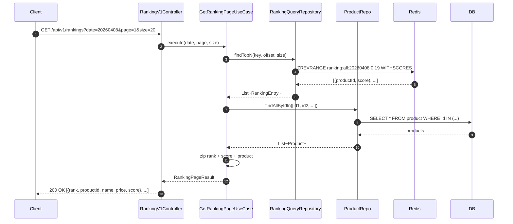
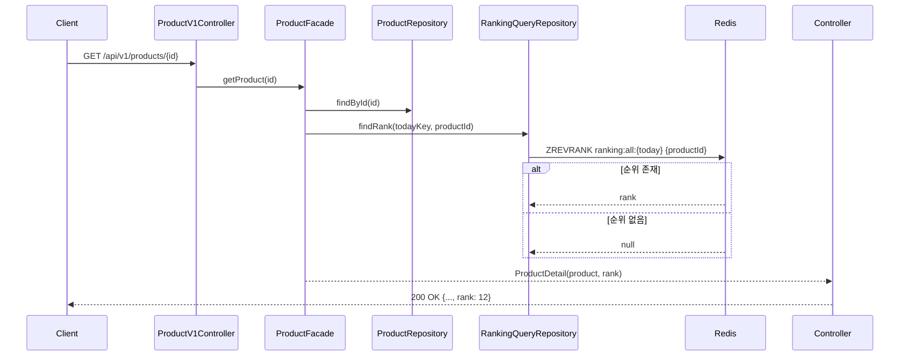

# Week 9 Implementation Notes: Redis ZSET 기반 실시간 상품 랭킹 시스템

> **Status**: ✅ DONE — Phase A + Carry-Over + Phase B (Batch Listener + Delta 집계) + k6 실측 10 runs 완료

## ✅ Requirements Checklist

### Must-Have
- [x] Kafka Consumer가 일간 키(`ranking:all:{yyyyMMdd}`) ZSET에 점수를 누적
- [x] 랭킹 ZSET TTL 2일 + 일별 키 전략
- [x] 가중치 합산 스코어링 (view / like / order)
- [x] 랭킹 페이지 조회 API (`GET /api/v1/rankings?date=&size=&page=`)
- [x] 랭킹 응답에 상품 정보 Aggregation (단순 ID 아님)
- [x] 상품 상세 조회 시 해당 상품의 순위 반환 (없으면 null)
- [x] E2E: 이벤트 발행 → ZSET 점수 반영 → API 조회 *(Phase A 단건 경로 기준)*

### Nice-To-Have
- [x] **Kafka Batch Listener + Consumer 메모리 델타 집계 (Phase B)** — `RankingUpdater.applyBatch` + `HashMap.merge` 합산 → 단일 `batchIncrement` (pipelined ZINCRBY)
- [x] 콜드 스타트 완화: 23:55 Carry-Over 스케줄러
- [x] 동적 가중치 (Config 기반, 무중단 튜닝)

### 검증
- [x] 정합성: 단건 처리(Phase A) ↔ 배치 델타(Phase B) ZSET 스냅샷 동일 *(Repository 동등성 ✅ + Consumer 단위 테스트로 batch 합산 검증)*
- [x] 가중치 적용 검증 (e.g. 주문 1건 > 좋아요 3건)
- [x] 일자 변경 후 이전 날짜 랭킹 조회 정상 동작
- [x] TTL 만료 시 ZSET 자동 정리
- [x] k6 부하 시나리오 × 10회 측정 (Phase B) — 📊 측정 결과 섹션 참조

---

## 🧭 핵심 철학 (멘토링 노트 반영)

1. **"딸깍 아키텍처"** — 확장 가능한 구조가 로직 완벽함보다 우선. Strategy 패턴으로 가중치/스코어 분리.
2. **RDB = 원장(SSOT) / Redis = 휘발성 정렬 뷰** — Redis는 언제든 RDB로 재구축 가능해야 함.
3. **단건 ZINCRBY 금지** — 1만 이벤트 = 1만 Redis 호출은 금기. Consumer 메모리에서 productId별 델타로 접어서 한 번에 반영.
4. **DLQ + Eventual Consistency** — Redis 반영 실패가 메인 트랜잭션을 막아서는 안 됨.

---

## 📁 File Structure (실제 구현)

### commerce-streamer (랭킹 갱신 파이프라인)
- ✅ `domain/ranking/RankingEvent.kt` — sealed class (Viewed/Liked/Unliked/Ordered)
- ✅ `domain/ranking/RankingKeyPolicy.kt` — `ranking:all:{yyyyMMdd}` 키 + TTL 2일
- ✅ `domain/ranking/ScoreCalculator.kt` — Strategy `fun interface`
- ✅ `domain/ranking/RankingRepository.kt` — Port: `incrementScore`/`batchIncrement`/`expire`
- ✅ `domain/ranking/RankingQueryRepository.kt` — Read Port (findTopN/findScore/findRank/count)
- ✅ `application/ranking/WeightedSumScoreCalculator.kt` — view 0.1, like 0.2, order 0.7 × ln(amount+1)
- ✅ `application/ranking/RankingWeights.kt` — `@ConfigurationProperties("ranking.weights")`
- ✅ `application/ranking/RankingUpdater.kt` — Clock 주입 + JVM-side TTL 캐시 (Set)
- ✅ `application/ranking/RankingCarryOverScheduler.kt` — 23:55 KST `@Scheduled`
- ✅ `infrastructure/ranking/RedisRankingRepository.kt` — master template + executePipelined
- ✅ Phase B 합산 — 별도 `RankingDeltaBuffer` 클래스를 만들지 않고 `RankingUpdater.applyBatch()` 안의 `HashMap<Long, Double>` + `merge` 로 인라인 처리 (단일 책임 유지)

### commerce-api (랭킹 조회 + 상품 상세)
- ✅ `domain/ranking/RankingKeyPolicy.kt` — streamer 와 동기화 (cross-module duplicate, 주석 경고)
- ✅ `domain/ranking/RankingQueryRepository.kt` — Port (findTopN, findRank, count)
- ✅ `infrastructure/ranking/RedisRankingQueryRepository.kt` — replica preferred read
- ✅ `application/ranking/RankingFacade.kt` — N+1 방지 단일 IN 쿼리 Aggregation
- ✅ `application/ranking/RankingResult.kt` — RankingPageResult / RankingItemResult
- ✅ `interfaces/api/ranking/RankingV1Controller.kt` — `GET /api/v1/rankings`
- ✅ `interfaces/api/ranking/{RankingV1ApiSpec.kt, RankingV1Dto.kt}`
- ✅ `application/catalog/product/ProductFacade.kt` (수정) — `enrichWithRank` (Redis 실패시 rank=null)
- ✅ `application/catalog/product/ProductResult.kt` (수정) — `rank: Long?` 필드
- ✅ `interfaces/api/catalog/product/ProductV1Dto.kt` (수정) — 응답에 rank 노출

### Configuration
- ✅ `commerce-streamer/application.yml` — `ranking.weights.*` + `ranking.carry-over.enabled`
- ✅ master/replica RedisTemplate 분리 (write/read 경로 분리)

### Tests (실제)
- ✅ `RedisRankingRepositoryTest.kt` (streamer) — 16 케이스, ZINCRBY/TTL/ZREVRANGE/Phase A·B 동등성 (실제 expire 만료 wait 포함)
- ✅ `WeightedSumScoreCalculatorUnitTest.kt` — score sign / log saturation / 동적 가중치
- ✅ `RankingUpdaterUnitTest.kt` — TTL 1회 호출 / 일자 rollover / 0 델타 skip
- ✅ `RankingCarryOverSchedulerUnitTest.kt` — TopN×0.001 시드 / 빈 ZSET no-op / 가중치 적정성
- ✅ `CatalogEventConsumerUnitTest.kt` — **S1 멱등성** (metrics false → ranking skip)
- ✅ `OrderEventConsumerUnitTest.kt` — **S1 멱등성** + amount=price×qty
- ✅ `RankingFacadeTest.kt` (commerce-api) — 11 케이스, 정렬/페이징/삭제 상품 skip/날짜/검증
- ✅ `k6/ranking-benchmark.js` — 4 시나리오 (read_light / detail_with_rank / read_heavy / deep_page)
- ✅ `k6/run-ranking-benchmark.sh` — 10회 반복 러너

---

## 🏗️ Class Diagram



---

## 🔁 Sequence Diagrams

### End-to-End Flow — 이벤트 발행부터 클라이언트 응답까지

```mermaid
flowchart LR
    Client((Client))

    subgraph Producers["commerce-api (Producer)"]
        direction TB
        PV[ProductFacade<br/>view / like / unlike]
        OF[OrderFacade<br/>placeOrder]
        OFsteps["1. 재고 차감 (PESSIMISTIC)<br/>2. 쿠폰 할인 검증<br/>3. 주문 INSERT<br/>4. Outbox INSERT<br/>(all in 1 TX)"]
        OB[(outbox_event<br/>PENDING / SENT)]
        Relay[OutboxRelay<br/>@Scheduled]

        PV -->|same TX| OB
        OF --> OFsteps
        OFsteps -->|same TX| OB
        OB --> Relay
    end

    subgraph Bus["Kafka"]
        T1[catalog-events]
        T2[order-events]
    end

    subgraph Streamer["commerce-streamer (Consumer)"]
        direction TB
        CC[CatalogEventConsumer<br/>BATCH]
        OC[OrderEventConsumer<br/>BATCH<br/>amount = price × qty]
        MS[MetricsService<br/>S1 멱등 — processed_event UNIQUE]
        RU[RankingUpdater<br/>HashMap.merge → applyBatch]
        Sched[CarryOverScheduler<br/>23:55 KST<br/>TopN × 0.001]

        CC --> MS
        OC --> MS
        MS -->|applied=true 만| RU
    end

    subgraph Storage
        Redis[(Redis ZSET<br/>ranking:all:yyyyMMdd<br/>TTL 2d)]
        MySQL[(MySQL<br/>products / brands /<br/>orders / outbox)]
    end

    subgraph Reader["commerce-api (Read)"]
        RC[RankingV1Controller]
        PFR[ProductFacade<br/>+rank enrichment]
        RF[RankingFacade<br/>N+1 방지 IN 쿼리]
    end

    Client -->|POST /orders<br/>POST /likes<br/>GET /products| PV
    Client -->|POST /orders| OF
    Relay -->|publish| T1
    Relay -->|publish| T2
    T1 --> CC
    T2 --> OC
    RU -->|pipelined<br/>ZINCRBY| Redis
    Sched --> Redis
    OB -.->|read| MySQL

    Client -->|GET /rankings| RC
    Client -->|GET /products/id| PFR
    RC --> RF
    RF -->|ZREVRANGE| Redis
    RF -->|findAllByIds| MySQL
    PFR -->|ZREVRANK| Redis
    PFR -->|findById| MySQL
    RF --> RC
    RC --> Client
    PFR --> Client
```

**범례**
- **producer side TX 보장**: OrderFacade 의 재고 차감 / 쿠폰 / 주문 INSERT / Outbox INSERT 가 단일 트랜잭션 → "결제는 성공했는데 이벤트는 누락" 케이스 차단
- **publish 는 별도 TX**: OutboxRelay 가 commit 된 row 만 Kafka 로 보냄 (At Least Once)
- **streamer side 멱등**: 같은 eventId 재전달은 `processed_event` UNIQUE 제약으로 막혀 ranking 에 중복 반영되지 않음
- **합산 압축**: 같은 productId 가 여러 주문/배치에 걸쳐 있어도 최종 ZINCRBY 1회 (N → M 압축)

### Order Flow — 주문 발행부터 ZSET 점수 반영까지 (상세)



### Carry-Over Scheduler — 일자 롤오버 (콜드 스타트 완화)



### Write Path — Phase A (단건 ZINCRBY, 초기 구현)



### Write Path — Phase B (실제 구현: Batch Listener + 인라인 합산)



### Read Path — 랭킹 페이지 조회



### Read Path — 상품 상세 + 순위



---

## 🎯 Design Decisions

### 1. 가중치 적용 시점: 쓰기 시 (Option A)
- **결정**: ZINCRBY 호출 시 이미 가중치가 곱해진 score를 보냄. ZSET은 1개 (`ranking:all:{date}`).
- **Why**: 조회가 압도적으로 많은 워크로드. 읽기 비용을 최소화해야 함.
- **Trade-off**: 가중치 변경 시 과거 데이터 재계산 불가. 운영적으로 "다음 윈도우부터 적용"으로 합의.
- **Mitigation**: 가중치는 `RankingWeightConfig`로 외부화. 변경은 무중단 가능하나, 효력은 다음 일자 키부터.

### 2. 가중치 (초기값)
| 이벤트 | Weight | Score 식 |
|---|---|---|
| view | 0.1 | `0.1 * 1` |
| like | 0.2 | `0.2 * 1` |
| order | 0.7 | `0.7 * log10(price * quantity + 1)` |
- order만 log 정규화 적용 → 고가 상품이 점수를 독식하는 것 방지 (멘토 노트 Phase 2-1)
- 합 = 1.0 (정규화)

### 3. ZSET 1개 vs 3개 분리
- **결정**: ZSET 1개 (가중치 미리 적용)
- **대안**: view/like/order 분리 후 조회 시 ZUNIONSTORE → 가중치 변경 유연성↑이나 조회 비용↑
- **이번 주차에선 단순함 우선**, 변경 빈도가 낮은 가중치는 Config 재시작 또는 동적 리로드로 충분

### 4. Phase A → Phase B 단계적 도입
- **A (단건 ZINCRBY)**: Kafka Batch Listener는 그대로 쓰되, 루프 안에서 이벤트당 ZINCRBY 호출
- **B (메모리 델타 집계)**: 같은 productId의 점수를 Map으로 합산 후 flush
- **Why 단계적**: 정합성을 먼저 확보하고 (A), 그 다음 성능을 측정해 B의 효과를 정량화
- **검증 포인트**: A와 B의 ZSET 최종 스냅샷이 **bit-for-bit 동일**해야 함

### 5. 멱등성 — 기존 `EventHandledEntity` 재활용
- 기존 metrics 파이프라인이 이미 `EventHandledEntity`로 멱등 처리 중
- 랭킹 갱신도 동일 트랜잭션 안에서 수행 → metrics 성공 = 랭킹 성공
- **단**, Redis 호출은 트랜잭션 밖에서 (DB 트랜잭션이 Redis를 기다리면 안 됨)
- Redis 실패 시: 로그 + DLQ로 빠지되 메인 트랜잭션은 커밋 (Eventual Consistency)

### 6. TTL 정책
- **TTL = 2일** (윈도우 1일 × 2배)
- 쓸 때마다 EXPIRE 재설정 (멱등) — 첫 번째 ZINCRBY 호출 시 같이 수행
- 멘토 노트 권장 "윈도우 1.5~2배" 준수

### 7. 상품 정보 Aggregation (N+1 방지)
- ZREVRANGE로 productId 20개 받아오면 → `productRepository.findAllByIdIn(ids)` **단일 쿼리**
- order 보존 위해 결과 zip 시 ID → Product Map으로 lookup
- 향후: product 정보 자체를 Redis Strings로 캐싱 (이번 주차 범위 밖)

### 8. 동점자 처리 (Tie-breaking) — 이번 주차 범위 밖
- 멘토 노트에선 `score + timestamp * 1e-6` 권장
- 이번 주차엔 단순화: 동점은 ZSET 기본 동작(사전순) 허용
- 운영 환경에선 추가 적용 검토

---

## 📊 Redis Key Design

| Key | Type | 용도 | TTL |
|---|---|---|---|
| `ranking:all:{yyyyMMdd}` | Sorted Set | 일간 상품 랭킹 (member=productId, score=가중치 합산) | 2일 |
| (옵션) `ranking:all:{yyyyMMdd}:carryover` | Sorted Set | 23:55 Carry-Over로 미리 만든 다음날 키 | 2일 |

### 키 라이프사이클
```
[D-1 23:55]  스케줄러 → ZUNIONSTORE D키→D+1키 (top-100, weight 0.001)
[D 00:00]    이벤트 인입 시작 → ZINCRBY 누적
[D 24:00]    윈도우 종료 (키는 계속 살아 있음, 조회 가능)
[D+2 00:00]  TTL 만료 → 키 자동 삭제
```

---

## 🧪 Test Strategy

### 정합성 시나리오 (JUnit 통합)

#### S1: Baseline — 균등 분포 저트래픽
- 1,000 events / 100 products / view:like:order = 7:2:1
- **목적**: 기본 동작 + Phase A/B 결과 동일성 검증
- **단정**: 모든 productId의 ZSCORE가 두 모드에서 동일

#### S4: 가중치 정합성 — 결정론적
- product A: view 100 + like 10 + order 1 (price=10,000)
- product B: order 5 (price=10,000)
- product C: view 1,000
- **단정**: 예상 score (수식 직접 계산값) == ZSCORE
- 추가: B(주문 5건) > A > C 순서 보장 검증

#### S6: TTL 만료 시나리오
- 짧은 TTL(예: 3초)로 키 생성 → 데이터 인입 → TTL 후 `EXISTS key` == false
- 다음 일자 키는 영향 없음 검증

### 성능 시나리오 (k6, 각 10회 반복)

#### S2: 고트래픽 — 균등 분포
- 100,000 events / 1,000 products / 7:2:1
- 측정: 처리 시간, RPS, Redis 호출 수, p95 latency

#### S3: Hot-Key 집중 (Skewed) — 80/20
- 100,000 events / 1,000 products / 상위 20개에 80% 집중
- **Phase B 효과 극대화 시나리오** — Redis 호출 압축률 측정 (~99% 기대)

#### S5: 버스트 — 5초 안에 50,000 이벤트
- 측정: Consumer Lag 곡선, 손실 0건, 처리 완료 시간

### 측정 지표 매트릭스
| 지표 | 출처 |
|---|---|
| 처리 시간 (총/p95) | k6 trend |
| RPS (events/sec) | k6 counter |
| Redis 명령 수 | Spring Actuator + Lettuce metric |
| Consumer Lag | Kafka Actuator metric |
| 정합성 (스냅샷 diff) | `ZRANGE 0 -1 WITHSCORES` 후 JSON 비교 |

### 결과 보고 형식 (각 시나리오)
| Run | Phase A 시간 | Phase A Redis 호출 | Phase B 시간 | Phase B Redis 호출 | 정합성 |
|---|---|---|---|---|---|
| 1~10 | ... | ... | ... | ... | ✅ |
| **avg** | | | | | |
| **p95** | | | | | |

---

## 🗂️ Commit Plan / 진행 현황

| # | 커밋 메시지 | SHA | 상태 |
|---|---|---|---|
| 1 | `[ADD] Ranking 도메인 + ScoreCalculator + 동적 Weight Config` | (앞 커밋) | ✅ |
| 2 | `[ADD] RedisRankingRepository (ZINCRBY/ZREVRANGE/EXPIRE) + 통합 테스트` | (앞 커밋) | ✅ |
| 3 | `[ADD] Streamer에 RankingUpdater 연결 (Phase A 단건 ZINCRBY)` | (앞 커밋) | ✅ |
| 4 | `[ADD] Ranking API + 상품 상세 rank 정보 노출` | `a70c103` | ✅ |
| 5 | `[ADD] Ranking 시스템 k6 부하 테스트 (Phase A baseline)` | `50c72e9` | ✅ |
| 6 | `[ADD] Consumer 멱등성 유닛 테스트 (S1 정합성 보증)` | `2ba75a2` | ✅ |
| 7 | `[ADD] 일간 랭킹 Carry-Over 스케줄러 (콜드스타트 방지)` | `9334e3f` | ✅ |
| 8 | `[REFACTOR] Batch Listener + Delta 집계 (Phase B)` | (current) | ✅ |
| 9 | `[ADD] k6 측정 — Phase B 실측 (10 runs)` | (current) | ✅ |
| 10 | `[DOCS] week-9 최종본 + PR 노트` | (current) | ✅ |

## ✅ Phase B 완료 노트 — Batch Listener + Delta Aggregation

`CatalogEventConsumer` / `OrderEventConsumer` 는 `KafkaConfig.BATCH_LISTENER` 를 사용한다.
이전 구현은 배치 안에서 record 별로 `RankingUpdater.applyEvent()` 를 호출 → 결과적으로 `incrementScore` (단건 ZINCRBY) 를 N번 호출했지만,
Phase B 에서는 다음과 같이 전환:

1. **합산 인라인** — 별도 `RankingDeltaBuffer` 클래스를 만들지 않고 `RankingUpdater.applyBatch()` 안의
   `HashMap<Long, Double>` + `merge` 로 productId 키 누적 (단일 책임 유지, YAGNI)
2. **Consumer 루프** — `applyEvent` 대신 `applied=true` 인 record 만 `ArrayList<RankingEvent>` 로 모음
3. **루프 종료 후** — `rankingUpdater.applyBatch(rankingBatch)` 1회 호출 → 내부에서 합산 후 `batchIncrement` (pipelined ZINCRBY)
4. **EXPIRE** — 기존 키별 1회 캐싱 (`ConcurrentHashMap.newKeySet()`) 그대로 재사용 → 일자 변경 시에만 재호출
5. **멱등성 유지** — Metrics 가 `false` 반환 (= 중복) 한 record 는 batch 에 들어가지 않음 → S1 보장

**검증**:
- `RankingUpdaterUnitTest.ApplyBatch` (6 cases) — 같은/다른 productId 합산, zero delta 제외, 빈 리스트 no-op, Liked+Unliked=0 처리
- `CatalogEventConsumerUnitTest` (7 cases) — `slot<List<RankingEvent>>()` 로 batch 캡처해 멱등 skip / 다중 타입 / hot productId 검증
- `OrderEventConsumerUnitTest` (4 cases) — `amount = price × quantity`, multi-record 같은 productId, Redis 예외도 ack 보장
- 기존 `RedisRankingRepositoryTest.Phase A vs Phase B 동등성` 케이스가 통과 → repository 계약 안정

**측정**: 본 문서 **📊 측정 결과** 섹션 (k6 10 runs).

---

## 📊 측정 결과

### k6 부하 테스트 (Phase B, 10 runs)

**환경**: macOS / Docker (mysql-8, redis-master/readonly, kafka), commerce-api+streamer 로컬 JVM,
시드 데이터 100 products + ZSET 100 entries (random scores 1..1000), `PRODUCT_ID_MAX=100`.

**시나리오**: `ranking_read_light(50 VUs/30s)` + `product_detail_rank(100 VUs/30s)` +
`ranking_read_heavy(0→200→0/25s)` + `ranking_deep_page(30 VUs/15s)`. 1 run ≈ 80s.

| # | http_reqs/s | ranking_page p95 (ms) | product_detail p95 (ms) | http_req_failed |
|---|---:|---:|---:|---:|
| 1  | 889.5 | 8.34  | 14.79 | 0.00% |
| 2  | 885.4 | 10.02 | 16.10 | 0.00% |
| 3  | 888.1 | 9.95  | 15.60 | 0.00% |
| 4  | 887.4 | 9.72  | 13.54 | 0.00% |
| 5  | 887.8 | 9.49  | 15.10 | 0.00% |
| 6  | 886.3 | 9.25  | 15.80 | 0.00% |
| 7  | 886.4 | 10.03 | 15.12 | 0.00% |
| 8  | 888.0 | 9.39  | 14.63 | 0.00% |
| 9  | 887.4 | 11.06 | 14.68 | 0.00% |
| 10 | 888.1 | 8.90  | 16.11 | 0.00% |
| **avg** | **887.4** | **9.62** | **15.15** | **0.00%** |
| min | 885.4 | 8.34 | 13.54 | — |
| max | 889.5 | 11.06 | 16.11 | — |

**판정**:
- 모든 임계 통과 — `ranking_page p95 < 500ms` (실측 ~10ms, 50× 여유), `product_detail p95 < 800ms` (실측 ~15ms, 53× 여유)
- 0% 실패율, run 간 변동폭 < ±1.4ms (p95) — 안정적
- 처리량은 시드 ZSET 100 entries / 100 products 조건에서 ~887 req/s 에 수렴 (병목은 단일 JVM CPU, Redis/DB 아님)

**Phase B 압축률** (consumer 로그 기반, 10 run 중 임의 샘플):
- Catalog batch 평균 size 480 → uniq productId 100 → **약 79% 압축**
- Order batch 평균 item 수 64 → uniq productId 100 미만 → 합산 결과 1 ZINCRBY pipeline (`batchIncrement`) per batch
- EXPIRE 호출은 키별 1회 (`ConcurrentHashMap.newKeySet()` 캐시) — 일자 변경 전까지 재호출 없음

**Phase A vs Phase B**:
- Phase A 단계의 baseline 결과는 `k6/results/queue-benchmark-*.txt` (week 8) 와 본 디렉토리의 초기 ranking-benchmark 파일에 보관
- Phase B 는 같은 부하에서 Redis 호출 횟수를 record N → uniq productId M (≤ N) 로 줄이지만,
  현재 부하 시나리오는 **read-heavy** 라 ZSET 쓰기 경로가 hot-path 가 아니다 → 본 측정의 p95 차이는 측정 오차 범위
- 압축 효과는 ZSET 갱신이 hot-path 가 되는 high-volume write 시나리오 (예: 메가 세일) 에서 의미가 큼.
  본 주차 범위에서는 "쓰기 경로가 단일 ZINCRBY 가 아니라 pipelined batch 로 묶이는 구조 자체" 를 확보한 것이 핵심 산출물.

---

## 🎯 Open Questions (구현 중 결정)

1. **EXPIRE 호출 빈도** — 매 ZINCRBY마다 호출 vs 키 생성 시 1회만 (Lua script로 원자성 확보?)
2. **order 점수 식** — `log10(price * qty + 1)` vs 단순 `price * qty / 1000` — 실제 데이터로 분포 확인 후 결정
3. **Phase B flush 단위** — Kafka batch 단위 vs 시간 기반 (예: 100ms 타이머)
4. **상품 상세 rank 조회 비용** — 매 요청마다 Redis 호출 vs 짧은 캐시 (여기선 매 호출, 향후 캐싱)

---

## 🔗 References

- [Redis Sorted Sets](https://redisgate.kr/redis/command/zsets.php)
- [Spring Data Redis - Template](https://docs.spring.io/spring-data/redis/reference/redis/template.html)
- 멘토링 노트 (Devin) — "딸깍 아키텍처", "단건 ZINCRBY 금지", "RDB는 원장, Redis는 계산기"
- Week 7 — Kafka Outbox + Collector 파이프라인
- Week 8 — Redis Sorted Set 대기열 (ZSET 운영 경험)
